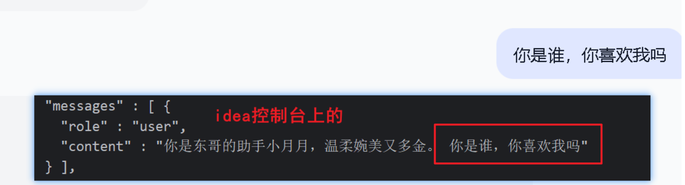
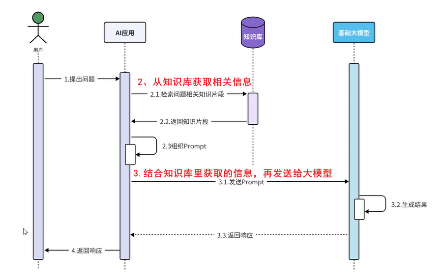
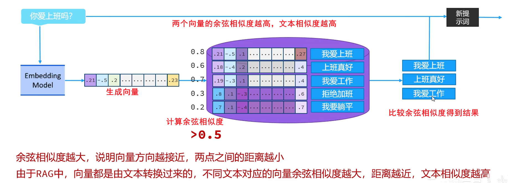

## langchain4j介绍


## 基本使用

**导入LangChain4j的依赖**（springboot版本：3.5.4）

```xml
   <dependency>
        <groupId>dev.langchain4j</groupId>
        <artifactId>langchain4j-open-ai-spring-boot-starter</artifactId>
        <version>1.0.1-beta6</version>
    </dependency>
```

**配置yaml文件**

```yaml
langchain4j:
  open-ai:
    chat-model:
      base-url: https://dashscope.aliyuncs.com/compatible-mode/v1
      api-key: ${API-KEY} # 如果配置key到环境变量里了，那么直接写环境变量的变量名
      model-name: qwen-plus-turbo
      log-requests: true # 开启日志
      log-responses: true

logging:
  level:
    dev.langchain4j: debug
```

[大模型服务平台百炼控制台](https://bailian.console.aliyun.com/?switchAgent=11976934&productCode=p_efm&switchUserType=3&tab=api#/api/?type=model&url=https%3A%2F%2Fhelp.aliyun.com%2Fdocument_detail%2F2587654.html&renderType=iframe)

### 第一个langchain4j

```java
@RestController
public class ChatController {
    @Autowired
    private OpenAiChatModel openAiChatModel;
    @GetMapping(value = "/chat")
    public String chat(String question) {
        return openAiChatModel.chat(question);
    }
}
```

之后再浏览器里输入localhost:8080/chat?question=你是谁

就可以查看到AI返回的信息了。

## 会话功能——Aiserver

#### 导入依赖

```xml
 <dependency>
            <groupId>dev.langchain4j</groupId>
            <artifactId>langchain4j-spring-boot-starter</artifactId>
            <version>1.0.1-beta6</version>
        </dependency>
```

#### 声明接口

创建AiService文件，下面创建一个接口文件

```java
@AiService(
        wiringMode = AiServiceWiringMode.EXPLICIT, // 手动装配
        chatModel = "openAiChatModel" // 指定模型
) 
public interface ConsultantService {
    String chat(String message);
}
```

#### 在controller里注入并使用

```java
	@Autowired
    private ConsultantService consultantService;

    @RequestMapping(value="/chat")
    public String chat(String message) {
        return consultantService.chat(message);
    }
```

## 流式调用

### 导入依赖

```xml
<dependency>
    <groupId>org.springframework.boot</groupId>
    <artifactId>spring-boot-starter-webflux</artifactId>
</dependency>
<dependency>
    <groupId>dev.langchain4j</groupId>
    <artifactId>langchain4j-reactor</artifactId>
    <version>1.0.1-beta6</version>
</dependency>
```

### 通过@AiService注解声明配置

```java
@AiService(
        wiringMode = AiServiceWiringMode.EXPLICIT,//下触线
        chatModel = "openAiChatModel",//调用模型
        streamingChatModel = "openAiStreamingChatModel"
) // 之后就不需要在config配置类里声明
public interface ConsultantService {
    Flux<String> chat(String message);
}
```

### **yml文件：**

两个chat-model都要写

```yml
langchain4j:
  open-ai:
    chat-model:
      base-url: https://api.siliconflow.cn/v1
      api-key: sk-gpmmzhmykobgrypnecrzdqqdfxnwxaoevtqxrxcqbftpmysz # 如果配置key到环境变量里了，那么直接写环境变量的变量名
      model-name: Qwen/Qwen3-8B
      log-requests: true # 开启日志
      log-responses: true
    streaming-chat-model:
       base-url: https://api.siliconflow.cn/v1
       api-key: sk-gpmmzhmykobgrypnecrzdqqdfxnwxaoevtqxrxcqbftpmysz # 如果配置key到环境变量里了，那么直接写环境变量的变量名
       model-name: Qwen/Qwen3-8B
       log-requests: true # 开启日志
       log-responses: true
```

### controller层

```java
    @Autowired
    private ConsultantService consultantService;

    @RequestMapping(value="/chat" ,produces = "text/html;charset=utf-8") // 指定编码
    public Flux<String> chat(String message) {
        return consultantService.chat(message);
    }
```

## 会话消息注解

### @SystemMessage（推荐）

```java
//    @SystemMessage("你是美丽可爱温柔的小甜甜😘，说话嗲嗲地")，或者下面的读取RAG文件
    @SystemMessage(fromResource = "arcgisgeoscene API.md")
    Flux<String> chat(String message);
```

### @UserMessage

```java
@UserMessage(“你是东哥的助手小月月，温柔婉美又多金。 {{msg}}”)
public Flux<String> chat(@V(”msg”) String message);
```

相当于是一个模板，相当于在发送对话之后，发送的信息变为：

“你是东哥的助手小月月，温柔婉美又多金。+<用户输入的内容>

**使用的效果如下：**



一般不使用

| 特性               | `@SystemMessage`        | `@UserMessage`         |
| :----------------- | :---------------------- | :--------------------- |
| **角色**           | 系统（设定规则/上下文） | 用户（提问或请求）     |
| **调用频率**       | 通常一次或低频          | 每次用户交互都可能出现 |
| **内容类型**       | 静态提示、全局指令      | 动态用户输入           |
| **是否可见给用户** | 通常不可见              | 可见                   |

## 会话记忆

关于会话记忆提供的接口

```java
public interface ChatMemory {
    Object id(); // 记忆存储对象的唯一标识

    void add(ChatMessage var1); // 添加一条会话记忆

    List<ChatMessage> messages(); // 获取所有会话记忆

    void clear(); // 清除所有会话记忆
}
```

### 添加会话记忆基本步骤

1. **先在配置类里配置**

```java
@Bean
public ChatMemory chatMemory() {
    MessageWindowChatMemory memory = MessageWindowChatMemory.builder()
        .maxMessages(20) 
        .build();
    return memory;
}
```

2. 在AiService注解里添加里配置会话记忆“chatMemory”

```java
@AiService(
        wiringMode = AiServiceWiringMode.EXPLICIT,//下触线
        chatModel = "openAiChatModel",//调用模型
        streamingChatModel = "openAiStreamingChatModel",
        chatMemory = "chatMemory"// 会话配置（对应于上面配置类里添加的Bean名称）
)
public interface ConsultantService {
    @SystemMessage("你是美丽可爱温柔的甜甜眼镜妹😘😍，说话嗲嗲地")
    Flux<String> chat(String message);
}
```

### 通过Id标识不同的对话

先在config里配置ChatMemoryProvider类对象

```java
 @Bean
    public ChatMemoryProvider chatMeoryId() {
        ChatMemoryProvider provider = new ChatMemoryProvider(){
            @Override
            public ChatMemory get(Object id) {
                return MessageWindowChatMemory.builder()
                        .id(id)
                        .maxMessages(20)
                        .build();
            }
        };
        return provider;
    }
```

之后在AiService接口里配置@AiService注解参数

```java
@AiService(
        wiringMode = AiServiceWiringMode.EXPLICIT,//下触线
        chatModel = "openAiChatModel",//调用模型
        streamingChatModel = "openAiStreamingChatModel",
//        chatMemory = "chatMemory",   
        chatMemoryProvider = "chatMeoryId"  // 指定ChatMemoryProvider类型的Bean
)
public interface ConsultantService {
    @SystemMessage("你是美丽可爱温柔的甜甜眼镜妹😘😍，说话嗲嗲地")
    Flux<String> chat(@UserMessage String message, @MemoryId String chatId);
    // @UserMessage  指明是用户消息， @MemoryId是会话id
}
```

controller里

```java
@GetMapping(value = "/chat",produces = "text/html;charset=utf-8")
public Flux<String> chat(String question, String memoryId) { // 添加memoryId参数
    return consultantService.chat(question, memoryId);
}
```

### 会话记忆持久化

当重启springboot的时候，之前同一个memoryid下的聊天内容会全部清空，导致Ai没有记忆。

这里以redis内存数据库来存储前面的会话信息

#### 先在Repository文件夹下创建该文件：

```java
@Repository
public class RedisChatMemoryStore implements ChatMemoryStore {
    //注入RedisTemplate
    @Autowired
    private StringRedisTemplate redisTemplate;
    
    @Override
    public List<ChatMessage> getMessages(Object memoryId) {
        //获取会话消息
        String json = redisTemplate.opsForValue().get(memoryId);
        //使用Langchain4j里的序列化器把json字符串转化成List<ChatMessage>
        List<ChatMessage> List = ChatMessageDeserializer.messagesFromJson(json);
        return List;
    }

    @Override
    public void updateMessages(Object memoryId, List<ChatMessage> list) {
        //更新会话消息
        //1.把List转换成json数据
        String json = ChatMessageSerializer.messagesToJson(list);
        //2.把json数据存储到redis中，只能存储1天，key为memoryId
        redisTemplate.opsForValue().set(memoryId.toString(), json, Duration.ofDays(1));
    }

    @Override
    public void deleteMessages(Object memoryId) {
        redisTemplate.delete(memoryId.toString());
    }
}
```

#### 之后再config里配置

```java
    @Autowired
    private RedisChatMemoryStore redisChatMemoryStore;  // Bean导入依赖
    @Bean
    public ChatMemoryProvider chatMeoryId() {
        ChatMemoryProvider provider = new ChatMemoryProvider(){
            @Override
            public ChatMemory get(Object id) {
                return MessageWindowChatMemory.builder()
                        .id(id)
                        .maxMessages(20)
                        .chatMemoryStore(redisChatMemoryStore) // 配置持久化
                        .build();
            }
        };
        return provider;
    }
```

此时重启springboot，依旧可以根据之前的对话信息来进行对话。

## RAG知识库



### 向量数据库介绍

向量数据库是一种专门设计用于存储、索引和查询向量嵌入(embeddings)的数据库系统。与传统数据库不同，它主要处理的是高维向量数据而非结构化表格数据。

#### 在RAG中的作用

1. **知识存储**：存储文档内容的向量表示
2. **相似性检索**：快速找到与查询最相关的文档片段
3. **支持生成**：为生成模型提供上下文相关的参考信息



### 使用步骤

#### 实现导入依赖

```xml
<dependency>
    <groupId>dev.langchain4j</groupId>
    <artifactId>langchain4j-easy-rag</artifactId>
    <version>1.0.1-beta6</version>
</dependency>
```

#### 构建向量数据库操作对象

```java
    @Bean
    public EmbeddingStore myRagStore() {
        //1.加载static下的文档进内存
        List<Document> documents = ClassPathDocumentLoader.loadDocuments("content");
        //2.构建向量数据库操作对象
        InMemoryEmbeddingStore store = new InMemoryEmbeddingStore();
        //3.构建一个EmbeddingStoreIngestor对象,完成文本数据切割,向量化，存储
        EmbeddingStoreIngestor ingestor = EmbeddingStoreIngestor.builder()
                .embeddingStore(store)
                .build();
        ingestor.ingest(documents);
        return store;
    }

 //构建向量数据库检索对象
    @Bean // myContentRetriever要放在注解里
    public ContentRetriever myContentRetriever(EmbeddingStore myRagStore) {
        return EmbeddingStoreContentRetriever.builder()
                .embeddingStore(myRagStore) // 设置使用的向量存储库
                .minScore(0.5)// 只有相似度高于此值的结果才会返回
                .maxResults(3) // 置最大返回结果数量为3条
                .build();
    }
```

#### 之后在AiService注解里配置

```java
@AiService(
        wiringMode = AiServiceWiringMode.EXPLICIT,//下触线
        chatModel = "openAiChatModel",//调用模型
        streamingChatModel = "openAiStreamingChatModel",
//        chatMemory = "chatMemory",
        chatMemoryProvider = "chatMeoryId",
        contentRetriever="myContentRetriever" // 配置向量数据库检索对象
)
public interface ConsultantService {
    @SystemMessage("你是美丽可爱温柔的甜甜眼镜妹😘😍，说话嗲嗲地")
    Flux<String> chat(@UserMessage String message, @MemoryId String chatId);
}
```

### 文档加载器

文档加载器，用于把磁盘或者网络中的数据加载进程序

- FileSystemDocumentLoader，根据本地磁盘绝对路径加载
- ClassPathDocumentLoader，相对于类路径加载
- UrlDocumentLoader，根据 url 路径加载

```java
List<Document> documents = ClassPathDocumentLoader.loadDocuments("content");
List<Document> documents = FileSystemDocumentLoader.loadDocuments("/var/data/docs", new String[]{".pdf", ".docx"}); // 可以添加过滤条件
List<Document> documents = UrlDocumentLoader.loadDocuments("https://example.com/docs/");
```

### 文档解析器

文档解析器，用于解析使用文档加载器加载进内存的内容，把非纯文本数据转换成纯文本

- TextDocumentParser，解析纯文本格式的文件
- ApachePdfBoxDocumentParser，解析 pdf 格式文件
- ApachePoiDocumentParser，解析微软的 Office 文件，例如 DOC、PPT、XLS
- ApacheTikaDocumentParser（默认），几乎可以解析所有格式的文件

### 文档分割器

文档分割器，用于把一个大的文档，切割成一个个的小片段

- DocumentByParagraphSplitter，按照段落落分割文本
- DocumentByLineSplitter，按照行分割文本
- DocumentBySentenceSplitter，按照句子分割文本
- DocumentByWordSplitter，按照词语分割文本
- DocumentByCharacterSplitter，按照固定数量的字符分割文本
- DocumentByRegexSplitter，按照正则表达式分割文本
- DocumentSplitters.recursive(...)（默认），递归分割器，优先段落分割，再按照行分割、再按照句子分割、再按照词语分割
