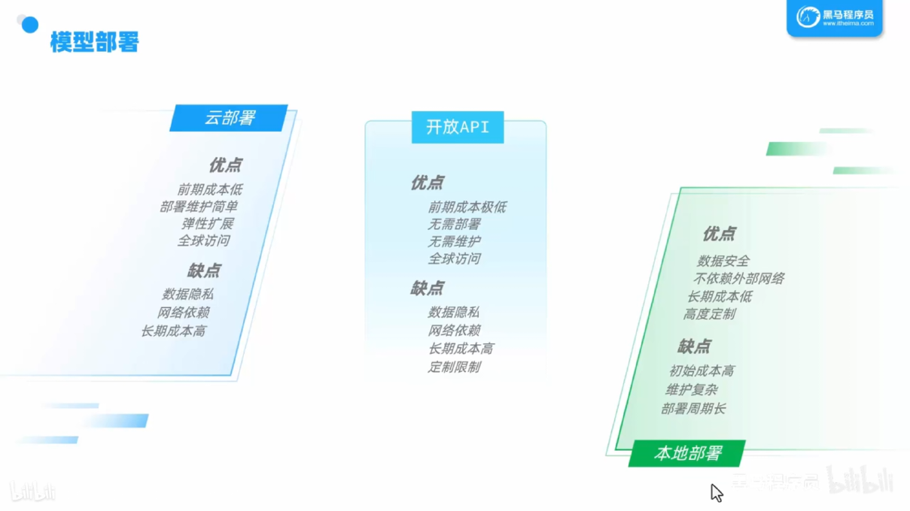

## 三种部署大模型的方式



| 大模型         | 对话产品  | 公司      | 地址                               |
| -------------- | --------- | --------- | ---------------------------------- |
| GPT-3.5, GPT-4 | ChatGPT   | OpenAI    | https://chatgpt.com/               |
| Claude 3.5     | Claude AI | Anthropic | https://claude.ai/chats            |
| DeepSeek-R1    | DeepSeek  | DeepSeek  | https://www.deepseek.com/          |
| 文心大模型3.5  | 文心一言  | 百度      | https://yiyan.baidu.com/           |
| 星火3.5        | 讯飞星火  | 科大讯飞  | https://xinghuo.xfyun.cn/desk      |
| Qwen-Max       | 通义千问  | 阿里巴巴  | https://tongyi.aliyun.com/qianwen/ |
| Moonshoot      | Kimi      | 月之暗面  | https://kimi.moonshot.cn/          |
| Yi-Large       | 零一万物  | 零一万物  | https://platform.lingyiwanwu.com/  |

# SpringAI

| 功能/模型类型 | Spring AI | LangChain4j |
| ------------- | --------- | ----------- |
| Chat          | 支持      | 支持        |
| Function      | 支持      | 支持        |
| RAG           | 支持      | 支持        |
| 对话模型      | 15+       | 15+         |
| 向量模型      | 10+       | 15+         |
| 向量数据库    | 15+       | 20+         |
| 多模态模型    | 5+        | 1           |
| JDK           | 17        | 8           |

## 对话机器人

### 导入依赖（千万别用idea创建项目时自动导入的依赖）

**主要导入spring-ai-openai-spring-boot-starter、spring-boot-starter-web这两个依赖**

**ollama依赖看是否要调用本地部署的大模型**

```xml
    <dependencies>
        <dependency>
            <groupId>org.springframework.boot</groupId>
            <artifactId>spring-boot-starter-web</artifactId>
        </dependency>
                <!-- 如果是调用第三方api可以不用导入ollama依赖 -->
        <dependency>
            <groupId>org.springframework.ai</groupId>
            <artifactId>spring-ai-ollama-spring-boot-starter</artifactId>
        </dependency>

        <dependency>
            <groupId>org.springframework.ai</groupId>
            <artifactId>spring-ai-openai-spring-boot-starter</artifactId>
        </dependency>
        <dependency>
            <groupId>org.springframework.boot</groupId>
            <artifactId>spring-boot-starter-test</artifactId>
            <scope>test</scope>
        </dependency>
    </dependencies>
    <dependencyManagement>
        <dependencies>
            <dependency>
                <groupId>org.springframework.ai</groupId>
                <artifactId>spring-ai-bom</artifactId>
                <version>${spring-ai.version}</version>
                <type>pom</type>
                <scope>import</scope>
            </dependency>
        </dependencies>
    </dependencyManagement>
```

### yaml的配置

[百炼控制台](https://bailian.console.aliyun.com/?tab=api#/api/?type=model&url=https%3A%2F%2Fhelp.aliyun.com%2Fdocument_detail%2F2833609.html&renderType=iframe)

```yaml
spring:
  ai:
    openai: # openai都可以适配
      api-key: {阿里云平台上创建key}
      base-url: https://dashscope.aliyuncs.com/compatible-mode
      chat:
        options:
          model: qwen-max # 要选择模型
   # 响应文本输出日志       
logging:
  level:
    org.springframework.ai.chat.client.advisor: debug
    com.springai.aitest: debug
```

### 代码配置

```java
// 相关配置类
@Configuration
public class CommonConfiguration {
@Bean
    public ChatClient chatClient(OpenAiChatModel model) { // OllamaChatModel为调用本地模型
        return ChatClient.builder(model)
            	.defaultAdvisors(new SimpleLoggerAdvisor()) // 开启日志
                .defaultSystem("你是一名经验丰富的java程序员")
                .build();
    }
}

// controller层
@RestController
@RequestMapping("/ai")
public class DeepSeekController {
    @Resource
    private ChatClient chatClient;
    @RequestMapping("/chat")
    public String chat(String prompt) {
        return chatClient.prompt().user(prompt).call().content();
    }
}
```

**流式调用**

```java
@RequestMapping(value = "/chat", produces = "text/html;charset=utf-8")
public Flux<String> chat(String prompt) {
    return chatClient.prompt()
            .user(prompt)
            .stream()
            .content();
}   
```

访问：

```
http://localhost:8080/ai/chat?prompt=你是谁
```

### 会话记忆

默认没有会话记忆，所以每一次对话都是新的对话，没有记忆。

```java

@Configuration
public class CommonConfiguration {
    @Bean
    public ChatMemory chatMemory() {
        return new InMemoryChatMemory();
    }
    @Bean
    public ChatClient chatClient(OpenAiChatModel model, ChatMemory chatMemory) {
        return ChatClient
                .builder(model)
                .defaultSystem("你是一个热心、可爱的智能助手。你的名字叫小团团，请以小团团的身份和我回答问题。")
                .defaultAdvisors(new MessageChatMemoryAdvisor(chatMemory)) // 默认没有，所以每一次对话都是新的对话
                .build();
    }
}

// 传入会话id
@RequestMapping(value = "/chat", produces = "text/html;charset=utf-8")
    public Flux<String> chat(String prompt, Integer chatId) {
        return chatClient.prompt()
                .user(prompt)
                .advisors(a -> a.param(CHAT_MEMORY_CONVERSATION_ID_KEY, chatId))
                .stream()
                .content();
 }
```

### 会话历史功能

## 

