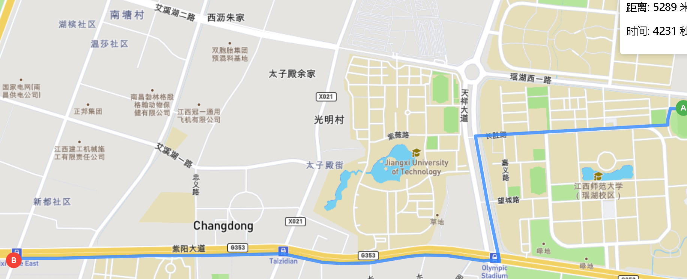

# 上代码

```html
<template>
  <div class="map-container">
    <!-- 地图容器 -->
    <div id="map" ref="mapContainer"></div>

    <!-- 控制面板 -->
    <div class="control-panel">
      <!-- 清除路径按钮 -->
      <button @click="clearPoints">清除路径</button>

      <!-- 路径信息显示 -->
      <div v-if="routeInfo">
        <p>距离: {{ routeInfo.distance }} 米</p>
        <p>时间: {{ routeInfo.duration }} 秒</p>
      </div>
    </div>
  </div>
</template>

<script setup>
import { ref, onMounted } from 'vue';
import L from 'leaflet'; // Leaflet地图库
import 'leaflet/dist/leaflet.css'; // Leaflet样式

// 地图和图层引用
const mapContainer = ref(null); // 地图容器引用
let map = null; // 地图实例
let startMarker = null; // 起点标记
let endMarker = null; // 终点标记
let routeLayer = null; // 路径图层
let clickCount = 0; // 点击计数器(用于区分起点和终点)
const routeInfo = ref(null); // 路径信息(距离和时间)

// 高德API Key
const AMAP_KEY = 'a42c844bdcd8035d9d308ba0187ff23c';

// 坐标系转换常量
const PI = Math.PI;
const AXIS = 6378245.0; // 克拉索夫斯基椭球参数长轴
const OFFSET = 0.00669342162296594323; // 克拉索夫斯基椭球参数偏心率平方

// GCJ-02转WGS84
function gcj02ToWgs84(lng, lat) {
  if (outOfChina(lng, lat)) {// 中国境外不转换
    return [lng, lat];
  }
  let dlat = transformLat(lng - 105.0, lat - 35.0);
  let dlng = transformLng(lng - 105.0, lat - 35.0);
  const radlat = lat / 180.0 * PI;
  let magic = Math.sin(radlat);
  magic = 1 - OFFSET * magic * magic;
  const sqrtmagic = Math.sqrt(magic);
  dlat = (dlat * 180.0) / ((AXIS * (1 - OFFSET)) / (magic * sqrtmagic) * PI);
  dlng = (dlng * 180.0) / (AXIS / sqrtmagic * Math.cos(radlat) * PI);
  const mglat = lat + dlat;
  const mglng = lng + dlng;
  return [lng * 2 - mglng, lat * 2 - mglat];
}

// WGS84转GCJ-02
function wgs84ToGcj02(lng, lat) {
  if (outOfChina(lng, lat)) {// 中国境外不转换
    return [lng, lat];
  }
  let dlat = transformLat(lng - 105.0, lat - 35.0);
  let dlng = transformLng(lng - 105.0, lat - 35.0);
  const radlat = lat / 180.0 * PI;
  let magic = Math.sin(radlat);
  magic = 1 - OFFSET * magic * magic;
  const sqrtmagic = Math.sqrt(magic);
  dlat = (dlat * 180.0) / ((AXIS * (1 - OFFSET)) / (magic * sqrtmagic) * PI);
  dlng = (dlng * 180.0) / (AXIS / sqrtmagic * Math.cos(radlat) * PI);
  return [lng + dlng, lat + dlat];
}
// 判断坐标是否在中国境外
function outOfChina(lng, lat) { // 是否超出中国
  return lng < 72.004 || lng > 137.8347 || lat < 0.8293 || lat > 55.8271;
}
// 纬度转换辅助函数
function transformLat(x, y) { //
  let ret = -100.0 + 2.0 * x + 3.0 * y + 0.2 * y * y + 0.1 * x * y + 0.2 * Math.sqrt(Math.abs(x));
  ret += (20.0 * Math.sin(6.0 * x * PI) + 20.0 * Math.sin(2.0 * x * PI)) * 2.0 / 3.0;
  ret += (20.0 * Math.sin(y * PI) + 40.0 * Math.sin(y / 3.0 * PI)) * 2.0 / 3.0;
  ret += (160.0 * Math.sin(y / 12.0 * PI) + 320 * Math.sin(y * PI / 30.0)) * 2.0 / 3.0;
  return ret;
}
// 经度转换辅助函数
function transformLng(x, y) {
  let ret = 300.0 + x + 2.0 * y + 0.1 * x * x + 0.1 * x * y + 0.1 * Math.sqrt(Math.abs(x));
  ret += (20.0 * Math.sin(6.0 * x * PI) + 20.0 * Math.sin(2.0 * x * PI)) * 2.0 / 3.0;
  ret += (20.0 * Math.sin(x * PI) + 40.0 * Math.sin(x / 3.0 * PI)) * 2.0 / 3.0;
  ret += (150.0 * Math.sin(x / 12.0 * PI) + 300.0 * Math.sin(x / 30.0 * PI)) * 2.0 / 3.0;
  return ret;
}

// 封装高德步行路径规划接口
async function getWalkingRoute(origin, destination) {
  const url = `https://restapi.amap.com/v3/direction/walking?origin=${origin[0]},${origin[1]}&destination=${destination[0]},${destination[1]}&key=${AMAP_KEY}`;

  try {
    const response = await fetch(url);
    const data = await response.json();

    if (data.status === '1') {
      return data.route.paths[0];
    } else {
      throw new Error(data.info || '路径规划失败');
    }
  } catch (error) {
    console.error('路径规划请求失败:', error);
    throw error;
  }
}

// 将高德路径转换为GeoJSON
function pathToGeoJSON(path) {
  const coordinates = [];

  // 遍历所有步骤
  path.steps.forEach(step => {
    // 解析折线点
    const points = step.polyline.split(';').map(point => {
      const [lng, lat] = point.split(',').map(Number);
      // 将GCJ-02转换为WGS84
      return gcj02ToWgs84(lng, lat);
    });

    coordinates.push(...points);
  });

  return {
    type: 'Feature',
    properties: {},
    geometry: {
      type: 'LineString',
      coordinates: coordinates
    }
  };
}

// 清除地图上的标记和路径
function clearPoints() {
  if (startMarker) {
    map.removeLayer(startMarker);
    startMarker = null;
  }
  if (endMarker) {
    map.removeLayer(endMarker);
    endMarker = null;
  }
  if (routeLayer) {
    map.removeLayer(routeLayer);
    routeLayer = null;
  }
  clickCount = 0;
  routeInfo.value = null;
}

// 初始化地图
onMounted(() => {
  map = L.map(mapContainer.value).setView([28.68407, 115.846296], 16);

  // 添加OSM底图
  L.tileLayer("https://api.mapbox.com/styles/v1/mapbox/streets-v10/tiles/256/{z}/{x}/{y}?access_token=pk.eyJ1IjoiaGdjb2RlNTk2OSIsImEiOiJjbTE3ejh6Zm0weGprMmpxeDhha3dxMzYyIn0.73jueC5DbqxUWlI9XbOiGQ").addTo(map);

  // 点击事件处理
  map.on('click', async (e) => {
    const { lat, lng } = e.latlng;

    if (clickCount === 0) {
      // 第一个点 - 起点
      clearPoints();
      startMarker = L.marker([lat, lng], {
        icon: L.divIcon({
          className: 'start-marker',
          html: 'A',
          iconSize: [24, 24]
        })
      }).addTo(map);
      clickCount = 1;
    } else {
      // 第二个点 - 终点
      endMarker = L.marker([lat, lng], {
        icon: L.divIcon({
          className: 'end-marker',
          html: 'B',
          iconSize: [24, 24]
        })
      }).addTo(map);
      clickCount = 0;

      try {
        // 将WGS84坐标转换为GCJ-02坐标
        const startGcj02 = wgs84ToGcj02(startMarker.getLatLng().lng, startMarker.getLatLng().lat);
        const endGcj02 = wgs84ToGcj02(endMarker.getLatLng().lng, endMarker.getLatLng().lat);

        // 获取路径规划
        const path = await getWalkingRoute(startGcj02, endGcj02);

        // 转换为GeoJSON并显示
        const geoJSON = pathToGeoJSON(path);

        // 移除旧路径
        if (routeLayer) {
          map.removeLayer(routeLayer);
        }

        // 添加新路径
        routeLayer = L.geoJSON(geoJSON, {
          style: {
            color: '#3388ff',
            weight: 5,
            opacity: 0.8
          }
        }).addTo(map);

        // 更新路径信息
        routeInfo.value = {
          distance: path.distance,
          duration: path.duration
        };

        // 调整地图视图以显示完整路径
        map.fitBounds(routeLayer.getBounds());
      } catch (error) {
        console.error('路径规划或显示失败:', error);
        alert('路径规划失败: ' + error.message);
      }
    }
  });
});
</script>

<style>
.map-container {
  position: relative;
  width: 100%;
  height: 100vh;
}

#map {
  width: 100%;
  height: 100%;
}

.control-panel {
  position: absolute;
  top: 10px;
  right: 10px;
  background: white;
  padding: 10px;
  border-radius: 5px;
  box-shadow: 0 0 10px rgba(0, 0, 0, 0.2);
  z-index: 1000;
}

.start-marker {
  background-color: #4CAF50;
  color: white;
  border-radius: 50%;
  text-align: center;
  line-height: 24px;
  font-weight: bold;
}

.end-marker {
  background-color: #F44336;
  color: white;
  border-radius: 50%;
  text-align: center;
  line-height: 24px;
  font-weight: bold;
}
</style>
```



# 将坐标替换为你的目标值（X=经度，Y=纬度）
