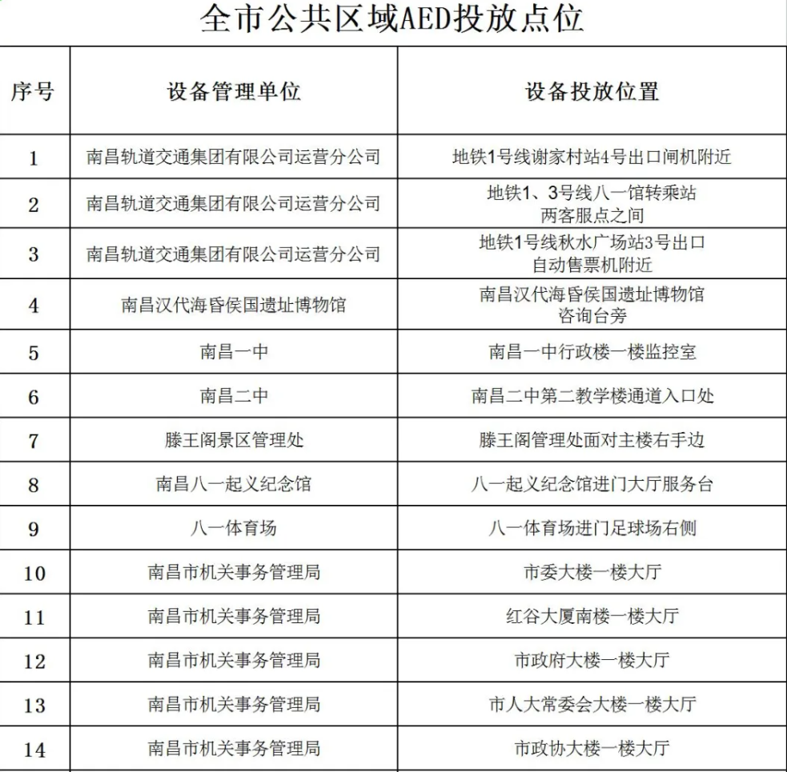
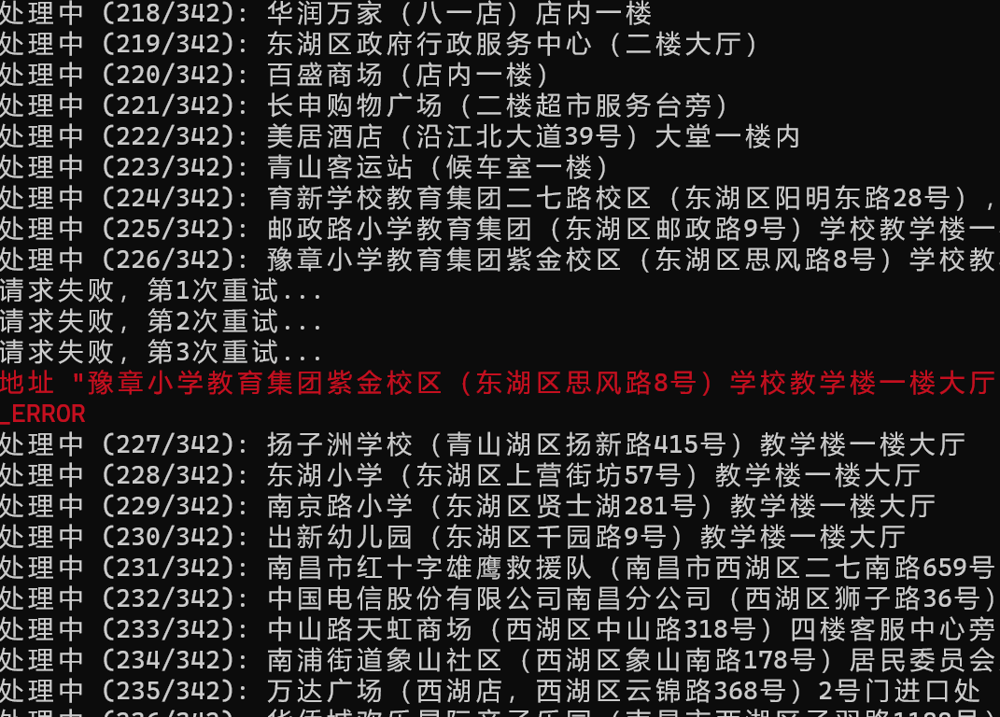
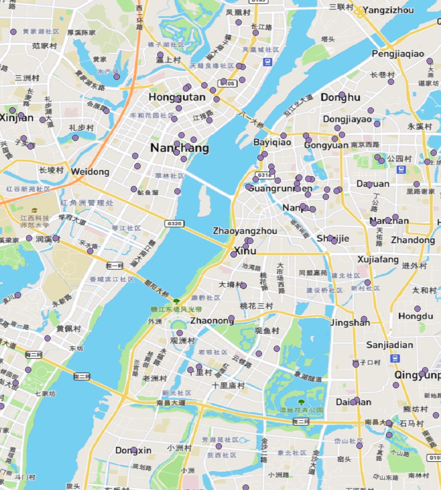

## 源数据获取地址

[196台！南昌公布这款“救命神器”投放点位](https://mp.weixin.qq.com/s/_YHQv4BLB6ON9pvBNAJWnA)

[“救”在身边，2024年南昌市新增159台“救命神器”](https://mp.weixin.qq.com/s/InenDuk4zBBMxXjXVD_5MA)

通过OCR识别下面的图片，得到excel数据



## 使用脚本步骤

```
npm install xlsx axios gcoord
```

完整JavaScript代码如下：

```javascript
const fs = require('fs');
const path = require('path');
const xlsx = require('xlsx');
const axios = require('axios');
const { transform } = require('gcoord'); // 用于坐标转换

// 配置参数
const config = {
    excelPath: 'D:\\Mycode\\vue_basic\\getAED\\NCACDaddress.xlsx',
    outputGeoJSONPath: 'output.geojson',
    gaodeAPIKey: 'a42c844bdcd8035d9d308ba0187ff23c', // 替换为你自己的高德API key
    batchDelay: 500, // 批次延迟，避免触发API限制
    maxRetries: 3, // 最大重试次数
};

// 初始化GeoJSON结构
const geojson = {
    type: 'FeatureCollection',
    features: [],
};

// 坐标转换函数 - 使用gcoord库的高精度算法
function convertCoordGCJ02ToWGS84(lng, lat) {
    // gcoord的transform函数会自动处理精度问题
    const [wgs84Lng, wgs84Lat] = transform([lng, lat], 'GCJ02', 'WGS84');
    return [wgs84Lng, wgs84Lat];
}

// 调用高德地理编码API
async function geocodeAddress(address, retryCount = 0) {
    const fullAddress = `江西省南昌市${address}`;
    const url = `https://restapi.amap.com/v3/geocode/geo?address=${encodeURIComponent(fullAddress)}&output=json&key=${config.gaodeAPIKey}`;
    
    try {
        const response = await axios.get(url);
        const data = response.data;
        
        if (data.status === '1' && data.geocodes && data.geocodes.length > 0) {
            const location = data.geocodes[0].location;
            const [lng, lat] = location.split(',').map(Number);
            
            // 转换为WGS84坐标系
            const [wgs84Lng, wgs84Lat] = convertCoordGCJ02ToWGS84(lng, lat);
            
            return {
                originalAddress: address,
                formattedAddress: data.geocodes[0].formatted_address,
                location: [wgs84Lng, wgs84Lat],
                rawData: data
            };
        } else {
            throw new Error(`API返回无效数据: ${data.info}`);
        }
    } catch (error) {
        if (retryCount < config.maxRetries) {
            console.log(`请求失败，第${retryCount + 1}次重试...`);
            await new Promise(resolve => setTimeout(resolve, config.batchDelay * (retryCount + 1)));
            return geocodeAddress(address, retryCount + 1);
        } else {
            console.error(`地址 "${address}" 地理编码失败:`, error.message);
            return null;
        }
    }
}

// 主处理函数
async function processExcelToGeoJSON() {
    try {
        // 读取Excel文件
        const workbook = xlsx.readFile(config.excelPath);
        const firstSheetName = workbook.SheetNames[0];
        const worksheet = workbook.Sheets[firstSheetName];
        
        // 获取第一列数据
        const columnA = xlsx.utils.sheet_to_json(worksheet, { header: 'A' }).map(row => row.A).filter(Boolean);
        
        console.log(`共找到 ${columnA.length} 条地址数据`);
        
        // 分批处理，避免触发API限制
        for (let i = 0; i < columnA.length; i++) {
            const address = columnA[i];
            console.log(`处理中 (${i + 1}/${columnA.length}): ${address}`);
            
            const result = await geocodeAddress(address);
            
            if (result) {
                // 添加到GeoJSON
                geojson.features.push({
                    type: 'Feature',
                    properties: {
                        address: result.originalAddress,
                        formattedAddress: result.formattedAddress
                    },
                    geometry: {
                        type: 'Point',
                        coordinates: result.location
                    }
                });
            }
            
            // 延迟以避免触发API限制
            if (i < columnA.length - 1) {
                await new Promise(resolve => setTimeout(resolve, config.batchDelay));
            }
        }
        
        // 保存GeoJSON文件
        fs.writeFileSync(config.outputGeoJSONPath, JSON.stringify(geojson, null, 2));
        console.log(`处理完成，结果已保存到 ${config.outputGeoJSONPath}`);
        
    } catch (error) {
        console.error('处理过程中发生错误:', error);
    }
}

// 执行主函数
processExcelToGeoJSON();
```

开始执行代码的指令

```
node getAEDadderss.js
```

#### 处理过程



## 数据效果

