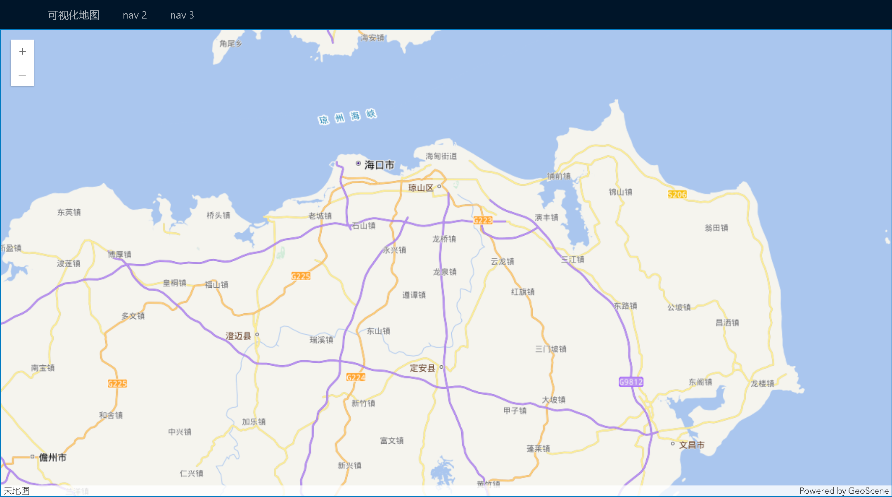

## 安装依赖

(一般是pnpm或yarn或者是ui界面，这样快一点)

```
npm install @geoscene/core
```

## 创建第一个地图

### 设置布局

我的布局基本为下面的这样，所以要设置一下排版（以ant-design为例）



**app.vue里的布局**

```vue
<template>
  <a-layout id="components-layout-demo-fixed" :style="{ 
    position: 'relative', 
    minHeight: '100vh' 
  }">
    <a-layout-header :style="{ 
      position: 'fixed', 
      zIndex: 1000,
      width: '100%', 
      height: '40px',
      top: 0,
      left: 0
    }">
      <a-menu
        theme="dark"
        mode="horizontal"
        :default-selected-keys="[currentRoute]"
        :style="{ lineHeight: '40px' }"
        @select="handleMenuSelect"
      >
        <a-menu-item key="map">
          <router-link to="/">可视化地图</router-link>
        </a-menu-item>
        <a-menu-item key="nav2">
          <router-link to="/nav2">nav 2</router-link>
        </a-menu-item>
        <a-menu-item key="nav3">
          <router-link to="/nav3">nav 3</router-link>
        </a-menu-item>
      </a-menu>
    </a-layout-header>
    <a-layout-content :style="{ 
      position: 'absolute', // 确保地图可以独占余下的页面空间
      top: '40px', 
      bottom: '0', 
      left: '0', 
      right: '0', 
      overflow: 'auto' // 确保内容可滚动
    }">
      <router-view />
    </a-layout-content>
  </a-layout>
</template>
```

### 加载地图

在全局的那个index.html文件里添加全局的css样式

```
  <link rel="stylesheet" href="\node_modules\@geoscene\core\assets\geoscene\themes\light\main.css">
```

当然也可以将light改为dark，这样就是夜间模式了

如果要去除地图外边框的蓝色线条，可以在light\main.css文件里geoscene-view-outline将其改为0。

**具体导入什么文件看视频或者官方文档，或者去文件夹里找**

```vue
<template>
    <div id="viewDiv"></div>
</template>
<script setup>
import { onMounted } from 'vue' // 导入钩子函数
    // 具体导入什么文件看视频或者官方文档，或者去文件夹里找
import Map from '@geoscene/core/Map' // 导入Map类
import MapView from '@geoscene/core/views/MapView' 
onMounted(() => { // 生命周期函数
    const map = new Map({ // 创建Map实例
        basemap: 'tianditu-vector' // 设置底图为混合
    })
    const view = new MapView({ // 创建MapView实例
        container: 'viewDiv', // 绑定dom节点
        map: map, // 指定地图
        center: [115.9, 28.5], // 设置中心点坐标
        zoom: 10 // 缩放等级
    })
    view.ui.remove("attribution")  // 移除相关控件
})
</script>
<style scoped>
#viewDiv {
    height: 100%;
    width: 100%;
    padding: 0;
    margin: 0;
    /* filter: brightness(0.88) contrast(0.95) grayscale(0) hue-rotate(180deg) opacity(1) saturate(2.5) sepia(0.5) invert(1); */
}
</style>
```

**如果要求是3D视图，那么**

```javascript
<script setup>
import { onMounted } from 'vue'
import Map from '@geoscene/core/Map'
import SceneView from '@geoscene/core/views/SceneView' // 导入SceneView类

onMounted(() => {
    const map = new Map({
        basemap: 'tianditu-vector',
        ground: 'world-elevation' // 3D场景通常需要设置地面
    })
    
    const view = new SceneView({
        container: 'viewDiv',
        map: map,
        camera: { // 3D场景使用camera而不是center/zoom
            position: {
                x: 115.9, // 经度
                y: 28.65,  // 纬度
                z: 90000   // 高度，单位米
            },
            tilt: 0,     // 倾斜角度(0-90)
            heading: 0    // 方向角(0-360)
        }
    })
    view.ui.remove("attribution")
})
</script>
```

以上代码确保浏览器开启硬件加速。

### 添加控件

```js
import Fullscreen from '@geoscene/core/widgets/Fullscreen'
const fullscreen = new Fullscreen({
	view: view
})
view.ui.add(fullscreen, "top-right") // 将控件添加到地图右上角
```

**通过css加控件**

```html
<div id="viewDiv">  
 <!-- 地图里加控件，geoscene-icon-applications是控件类型；map-icon是控件的统一样式-->
      <button class="geoscene-icon-applications map-icon" type="button" title="跳转"></button>
</div>
```

```css
/* 控件位置 */
#viewDiv button.geoscene-icon-applications {
  left: 15px;
  top: 150px;
}
/* 默认状态 */
#viewDiv button.map-icon {
  position: absolute;
  padding: 8px;
  background-color: #ffffff;
  cursor: pointer; /* 鼠标悬停时变手掌 */
  border: none; /* 默认无边框 */
  box-shadow:  0 2px 4px#b8b8b8; /* 默认阴影 */

}

/* 鼠标悬停状态 */
#viewDiv button.map-icon:hover {
  background-color: #f3f3f3; /* 可选：悬停时轻微变暗 */
}

/* 选中（聚焦）状态 */
#viewDiv button.map-icon:focus {
  background-color: #f3f3f3; /* 选中时背景变浅灰 */
  border: 2px solid #007ac2; /* 选中时边框变蓝色 */
  padding: 6px;
}
```


### 地图点击事件

```javascript
    /* 点击地图事件 */
    view.on("click", function (event) {
        // 获取点击位置的坐标
        const point = event.mapPoint;
        console.log("经度:", point.longitude.toFixed(6)); // 注意不是x
        console.log("纬度:", point.latitude.toFixed(6));
        console.log("高程:", point.z.toFixed(2));
        console.log("空间参考:", point.spatialReference.wkid);

        // 也可以直接打印整个点对象
        console.log("完整的点对象:", point);
    });
```

### 一个完整的底图设计（底图切换+pinia存储相机位置+防抖函数读取相机位置）

```vue
<template>
  <div id="viewDivContainer" :class="{ 'dark-mode': MapLayerStore.isDarkMode }">
    <div id="viewDiv"></div> <!-- 用于控制底图颜色，所以viewDiv放在viewDivContainer容器内 -->
  </div>
</template>
<script setup>
import {onMounted, onUnmounted, ref, watch} from 'vue'
import Map from '@geoscene/core/Map'
import SceneView from '@geoscene/core/views/SceneView'
import Fullscreen from '@geoscene/core/widgets/Fullscreen'
// MapStore 用于获取底图信息
import {useMapLayerStore} from '@/store/MapLayers.js'

const MapLayerStore = useMapLayerStore()

let map = null // 用于存储地图对象
let view = null // 用于存储视图对象
const cameraWatchHandle = ref(null) // 用于存储相机变化的值


// 防抖函数
function debounce(func, delay) {
  let timer = null;
  return function (...args) {
    if (timer) {
      clearTimeout(timer);
    }
    timer = setTimeout(() => {
      func.apply(this, args);
    }, delay);
  };
}

// 防抖后的回调函数
const debouncedCallback = debounce((camera) => {
  console.log('Camera changed:', camera);
  cameraWatchHandle.value = {
    x: camera.position.longitude,
    y: camera.position.latitude,
    z: camera.position.z,
    tilt: camera.tilt,
    heading: camera.heading
  };
}, 300); // 设置延迟时间为 200 毫秒


// 监听底图的变化
watch(() => MapLayerStore.isImageBasemap, (newValue) => {
  if (map) {
    map.basemap = newValue ? "tianditu-image" : "tianditu-vector";
  }
});

onMounted(() => {
  map = new Map({
    basemap: MapLayerStore.isImageBasemap ? "tianditu-image" : "tianditu-vector",
  })

  view = new SceneView({
    container: 'viewDiv',
    map: map,
    camera: {
      position: {
        x: MapLayerStore.mapX,
        y: MapLayerStore.mapY,
        z: MapLayerStore.mapZ
      },
      tilt: MapLayerStore.mapTilt,
      heading: MapLayerStore.mapHeading
    }
  });

  // 监听 camera 变化，添加防抖
  view.watch('camera', debouncedCallback);

  // 控件管理
  view.ui.remove(["attribution", "navigation-toggle"])
  const fullscreen = new Fullscreen({
    view: view
  })
  view.ui.add(fullscreen, "top-right")
})

onUnmounted(() => {
  // 最后切换页面的时候将相机位置更新到store中
  MapLayerStore.updateCameraPosition(cameraWatchHandle.value)

  // 清理view和map
  if (view) {
    view.destroy()
    view = null
  }
  if (map) {
    map.destroy()
    map = null
  }
})
</script>

<style scoped>
#viewDivContainer {
  height: 100%;
  width: 100%;
  position: relative;
}

#viewDivContainer.dark-mode #viewDiv {
  filter: brightness(0.7) contrast(1.4) hue-rotate(180deg) opacity(1) saturate(3) sepia(0.5) invert(1);
}

#viewDiv {
  height: 100%;
  width: 100%;
  padding: 0;
  margin: 0;
}

.geoscene-view {
  --geoscene-view-outline: none !important;
}
</style>
```

**切换底图和底图颜色的开关**

```vue
 <div class="switch-container">
      <label>底图颜色：</label>
      <a-switch :disabled="MapLayerStore.isImageBasemap" v-model:checked="MapLayerStore.isDarkMode" checked-children="暗色" un-checked-children="亮色"/>
      <label>底图类型：</label>
      <a-switch
          v-model:checked="MapLayerStore.isImageBasemap"
          :disabled="MapLayerStore.isDarkMode"
          checked-children="影像底图"
          un-checked-children="矢量底图"
      />
    </div>
```

**底图全局的状态管理**

```javascript
export const useMapLayerStore = defineStore('MapLayers', () => {
    const isDarkMode = ref(false);
    const isImageBasemap = ref(false);
    const mapX = ref(115.9);
    const mapY = ref(28.65);
    const mapZ = ref(90000);
    const mapTilt = ref(0);
    const mapHeading = ref(0);
    // Action to update all camera properties at once
    function updateCameraPosition(position) {
        console.log("updateCameraPosition", position)
        mapX.value = position.x;
        mapY.value = position.y;
        mapZ.value = position.z;
        mapTilt.value = position.tilt;
        mapHeading.value = position.heading;
    }
    return {
        isDarkMode,
        isImageBasemap,
        mapX,
        mapY,
        mapZ,
        mapTilt,
        mapHeading,
        updateCameraPosition
    }
});
```

## 移动视点

```javascript
// 视图跳转
const flyToCenter = () => {
  view.goTo({
        center: [115.9, 28.65],
        zoom: 12,
        heading: 0,
        tilt: 0
      },
      {
        duration: 3000,  // 2秒动画
        easing: "ease-in-out"
      })
}

onMounted(() => {
view = new SceneView({
    container: 'viewDiv',
    map: map,
    camera: {
      position: {
        x: MapLayerStore.mapX,
        y: MapLayerStore.mapY,
        z: MapLayerStore.mapZ
      },
      tilt: MapLayerStore.mapTilt,
      heading: MapLayerStore.mapHeading
    }
  });


  // 当地图视图（view）加载完成后，将地图视角定位到指定位置
  view.when(() => {
    if (!MapLayerStore.isFly) {
      flyToCenter()
      MapLayerStore.isFly = true // 只能刷新完执行
    }

  })
})
```

## 加载Geojson图层

### 基本加载

```
    const geoJSONLayer = new GeoJSONLayer({
        url: "你的geojson文件或服务地址", // 可以是本地文件或网络URL
        copyright: "数据来源说明",
        renderer: {
            type: "simple",
            symbol: {
                type: "simple-marker",
                color: [226, 119, 40],
                outline: {
                    color: [255, 255, 255],
                    width: 2
                }
            }
        },
        // 可选：设置弹出窗口
        popupTemplate: {
            title: "{name}", // 使用name字段作为标题
            content: [{
                type: "fields",
                fieldInfos: [
                    { fieldName: "id", label: "ID" },
                    { fieldName: "name", label: "名称" },
                    { fieldName: "address", label: "地址" },
                    { fieldName: "pickup_location", label: "领取地点" },
                    { fieldName: "picture", label: "图片" },
                    { fieldName: "description", label: "描述" },
                    { fieldName: "user_id", label: "用户ID" },
                    { fieldName: "time", label: "时间" },
                    { fieldName: "area", label: "区域" }
                ]
            }]
        }
    })
```

### Pinia统一管理图层以及图层切换相关函数

GeojsonLayers.js里

```js
import GeoJSONLayer from '@geoscene/core/layers/GeoJSONLayer';
import { defineStore } from 'pinia';
import { markRaw } from 'vue'; // 声明非响应式

export const useGeojsonLayers = defineStore('GeojsonLayers', () => {
    const geoJSONLayer1 = markRaw(new GeoJSONLayer({
        url: "dound.geojson",
        copyright: "数据来源说明",
        renderer: {
            type: "simple",
            symbol: {
                type: "simple-fill",
                color: [0, 0, 0, 0],
                outline: {
                    color: [224, 108, 117],
                    width: 3
                }
            }
        },
    }));

    const geoJSONLayer2 = markRaw(new GeoJSONLayer({
        url: "http://localhost:8080/geoserver/Taxi/ows?service=WFS&version=1.0.0&request=GetFeature&typeName=Taxi%3Afind&outputFormat=application%2Fjson&maxFeatures=50",
        copyright: "数据来源说明",
        renderer: {
            type: "simple",
            symbol: {
                type: "simple-marker",
                color: [226, 119, 40],
                outline: {
                    color: [255, 255, 255],
                    width: 2
                }
            }
        },
        popupTemplate: {
            title: "{name}",
            content: [{
                type: "fields",
                fieldInfos: [
                    { fieldName: "id", label: "ID" },
                    // 其他字段...
                ]
            }]
        }
    }));

    const addAllLayersToMap = (map) => {
        map.addMany([geoJSONLayer1, geoJSONLayer2]);
    }
    // 返回所有图层，方便在其他组件中使用
    return {
        geoJSONLayer1,
        geoJSONLayer2,
        // 也可以提供一个方法一次性添加所有图层
        addAllLayersToMap
    };
});

// Map.vue组件里
geojsonLayersStore.addAllLayersToMap(map)
```

### 事件总线触发加载图层的方法

```
npm install mitt
```

**创建事件总线文件**（**`src/eventBus.js`**）

```js
import mitt from 'mitt'
const emitter = mitt()
export default emitter
```

**定义要跨组件调用的函数同时开启监听和移除**

```js
const manageGeojsonLayer = ({layerName, action}) => {
  console.log('layerName:', layerName, 'action:', action)
  switch (action) {
    case 'add':
      geojsonLayersStore.addLayerToMap(map, layerName);
      break;
    case 'remove':
      geojsonLayersStore.removeLayerFromMap(map, layerName);
      break;
    default:
      console.warn('未知的操作类型:', action);
      break;
  }
};

// 组件挂载时监听
onMounted(() => {
  eventBus.on('manage_geojson_layer', manageGeojsonLayer)
})

// 组件卸载时取消监听
onUnmounted(() => {
  eventBus.off('manage_geojson_layer', manageGeojsonLayer)
})
```

**另外一个组件传参调用**

```js
<button @click="manageMapGeojsonLayer('boundary', 'remove')">添加图层</button>
const manageMapGeojsonLayer = (layerName, action) => {
  eventBus.emit('manage_geojson_layer', {layerName, action})
};
```

## 自定义控件

**以全屏控件为例**（基于React）

**相关配套的图标：**[使用 Esri 图标字体 (Calcite 主题) | GeoScene Maps SDK for JavaScript](https://doc.geoscene.cn/javascript/4.29/icon-font/)

```tsx
 useEffect(() => {
        if (mapDiv.current) {
            // 初始化地图
          
            // 初始化地图视图
        
        	// 创建控件
            const fullscreenBtn = document.createElement("button");
            fullscreenBtn.className = "geoscene-icon-zoom-out-fixed map-icon"; // 声明控件类型
            view.ui.add(fullscreenBtn, "top-right"); // 将控件放到右上方
            fullscreenBtn.addEventListener("click", () => { // 点击控件
                if (!document.fullscreenElement) {
                    // 进入全屏
                    if (mapDiv.current) {
                        (mapDiv.current as HTMLElement).requestFullscreen().catch(err => {
                            console.error('Error attempting to enable fullscreen:', err);
                        });
                    }
                } else {
                    // 退出全屏
                    document.exitFullscreen()
                }
            });

			// 监听是否进入全屏的变化（包括可以监听esc按键）
            document.addEventListener('fullscreenchange', function() {
                if (document.fullscreenElement) {
                    // 进入全屏
                    fullscreenBtn.className = "geoscene-icon-zoom-in-fixed map-icon";
                    view.ui.add(fullscreenBtn, "top-right"); // 修改全屏控件样式
                } else {
                    // 退出全屏
                    fullscreenBtn.className = "geoscene-icon-zoom-out-fixed map-icon";
                    view.ui.add(fullscreenBtn, "top-right");
                }
            });
        }
    }, []);
    
    
    
     return (
        <div id="viewDivContainer" style={{
            height: '100%',
            width: '100%',
            position: 'relative',
        }}>
            <div
                className="mapDiv"
                ref={mapDiv}
                style={{
                    position: 'relative',
                    height: '100%',
                    width: '100%',
                    padding: '0',
                    margin: '0',
                }}
            ></div>
        </div>
```

### 控件通用样式

```less
/* mapButtons.css */
.map-icon {
  position: absolute;
  padding: 8px;
  background-color: #ffffff;
  cursor: pointer;
  border: none;
  box-shadow: 0 2px 4px #b8b8b8;

}

.map-icon:hover {
  background-color: #f3f3f3;
}

.map-icon:focus {
  background-color: #f3f3f3;
  border: 2px solid #007ac2;
  padding: 6px;
}
```
