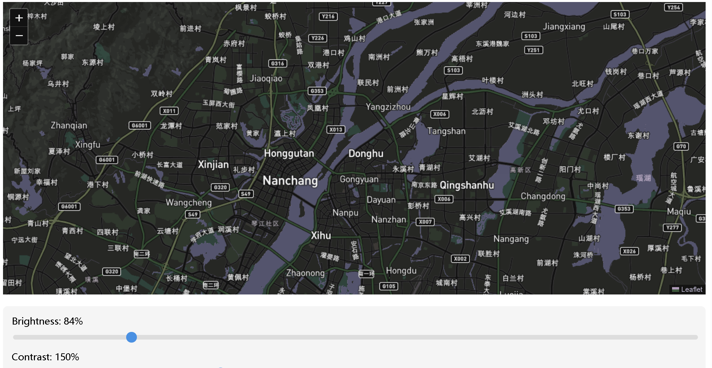
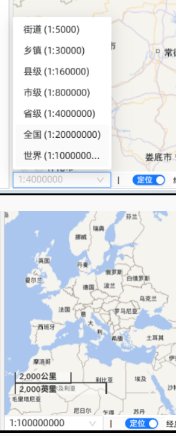

```javascript
<template>
  <div>
    <div id="map" class="map-container" :style="filterStyle"></div>

    <div class="controls">
      <div class="control-item">
        <label>Brightness: {{ filters.brightness }}%</label>
        <input
          type="range"
          min="0"
          max="500"
          v-model="filters.brightness"
          @input="updateFilter"
        >
      </div>

      <div class="control-item">
        <label>Contrast: {{ filters.contrast }}%</label>
        <input
          type="range"
          min="0"
          max="500"
          v-model="filters.contrast"
          @input="updateFilter"
        >
      </div>

      <div class="control-item">
        <label>Invert: {{ filters.invert }}%</label>
        <input
          type="range"
          min="0"
          max="100"
          v-model="filters.invert"
          @input="updateFilter"
        >
      </div>

      <div class="control-item">
        <label>Hue Rotate: {{ filters.hueRotate }}deg</label>
        <input
          type="range"
          min="0"
          max="360"
          v-model="filters.hueRotate"
          @input="updateFilter"
        >
      </div>

      <div class="control-item">
        <label>Saturate: {{ filters.saturate }}%</label>
        <input
          type="range"
          min="0"
          max="500"
          v-model="filters.saturate"
          @input="updateFilter"
        >
      </div>
    </div>
  </div>
</template>

<script setup>
import { ref, computed } from 'vue';
import { onMounted } from 'vue';
import L from 'leaflet';
import 'leaflet/dist/leaflet.css';

const filters = ref({
  brightness: 100,
  contrast: 100,
  invert: 0,
  hueRotate: 0,
  saturate: 100
});

const filterStyle = computed(() => {
  return {
    filter: `
      brightness(${filters.value.brightness}%)
      contrast(${filters.value.contrast}%)
      invert(${filters.value.invert}%)
      hue-rotate(${filters.value.hueRotate}deg)
      saturate(${filters.value.saturate}%)
    `
  };
});

function updateFilter() {
  // 这个函数会在滑块值改变时自动触发
  // 由于我们使用了计算属性，样式会自动更新
}

onMounted(() => {
  // 初始化地图
  const map = L.map('map').setView([28.667836, 115.868642], 10);
  const gaodeLayer = L.tileLayer("https://api.mapbox.com/styles/v1/mapbox/streets-v10/tiles/256/{z}/{x}/{y}?access_token=pk.eyJ1IjoiaGdjb2RlNTk2OSIsImEiOiJjbTE3ejh6Zm0weGprMmpxeDhha3dxMzYyIn0.73jueC5DbqxUWlI9XbOiGQ");
  gaodeLayer.addTo(map);
});
</script>

<style scoped>
.map-container {
  width: 100%;
  height: 500px;
  margin-bottom: 20px;
}

.controls {
  padding: 15px;
  background: #f5f5f5;
  border-radius: 8px;
  margin-top: 10px;
}

.control-item {
  margin-bottom: 15px;
}

.control-item label {
  display: block;
  margin-bottom: 5px;
  font-weight: 500;
}

.control-item input[type="range"] {
  width: 100%;
  height: 8px;
  border-radius: 4px;
  background: #ddd;
  outline: none;
  -webkit-appearance: none;
}

.control-item input[type="range"]::-webkit-slider-thumb {
  -webkit-appearance: none;
  width: 18px;
  height: 18px;
  border-radius: 50%;
  background: #4a90e2;
  cursor: pointer;
}
</style>

```

推荐配色：   filter: brightness(0.88) contrast(0.95) grayscale(0) hue-rotate(180deg) opacity(1) saturate(2.5) sepia(0.5) invert(1);

地图比例尺


