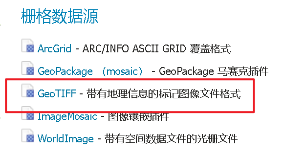
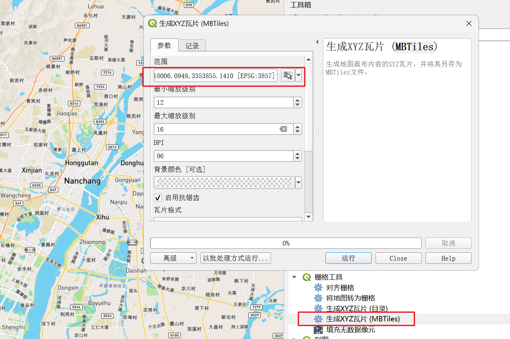
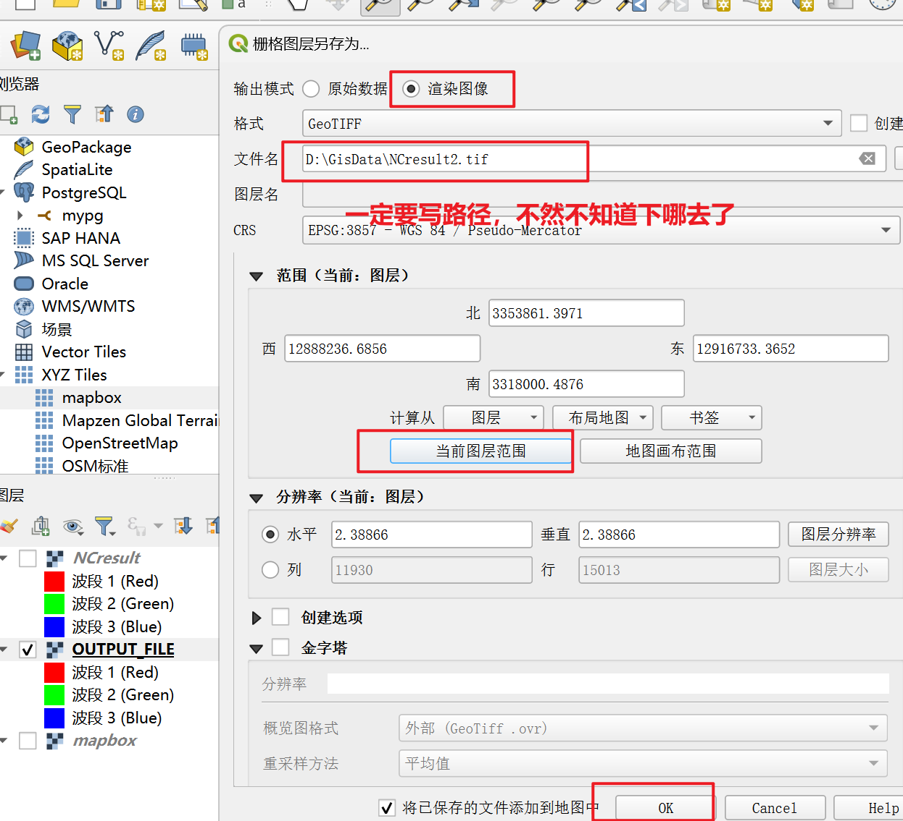
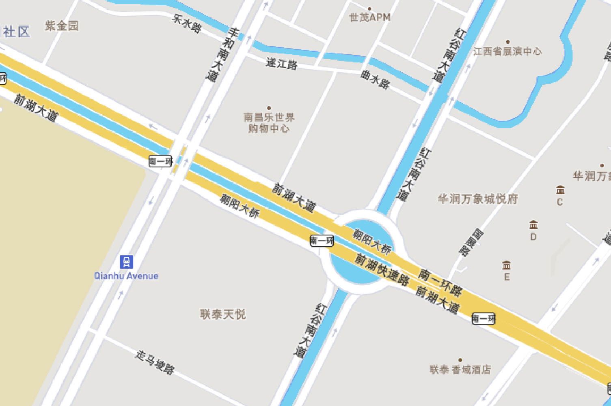

# Geoserver解决跨域问题
**跨域问题往往报错：**
>Access to fetch at 'http://localhost:8080/geoserver/NanChang/ows?service=WFS&version=1.0.0&request=GetFeature&typeName=NanChang:find&outputFormat=application/json' from origin 'http://localhost:5173' has been blocked by CORS policy: No 'Access-Control-Allow-Origin' header is present on the requested resource. If an opaque response serves your needs, set the request's mode to 'no-cors' to fetch the resource with CORS disabled.
#### 配置GeoServer启用CORS解决跨域问题
**找到GeoServer的webapps/geoserver/WEB-INF/web.xml文件，**
**取消注释或添加以下CORS过滤器配置：**
```xml
<filter>
  <filter-name>cross-origin</filter-name>
  <filter-class>org.eclipse.jetty.servlets.CrossOriginFilter</filter-class>
  <init-param>
    <param-name>allowedOrigins</param-name>
    <param-value>*</param-value>
  </init-param>
  <init-param>
    <param-name>allowedMethods</param-name>
    <param-value>GET,POST,PUT,DELETE,HEAD,OPTIONS</param-value>
  </init-param>
  <init-param>
    <param-name>allowedHeaders</param-name>
    <param-value>*</param-value>
  </init-param>
</filter>

<filter-mapping>
  <filter-name>cross-origin</filter-name>
  <url-pattern>/*</url-pattern>
</filter-mapping>
```
**之后重启geoserver即可**
# wms,wmts,wfs对比于区分
### WMS和WMTS的区别
| **特性**          | **WMS（动态地图服务）**                | **WMTS（瓦片地图服务）**               |
|-------------------|--------------------------------------|--------------------------------------|
| **数据返回形式**  | **动态生成的地图图片**（每次请求渲染，**可以通过修改请求参数来实现不同的渲染效果**） | **预切好的地图瓦片**（静态缓存图片）  |
| **性能**          | 较低（需实时渲染）                   | 较高（直接返回缓存瓦片，加载快）     |
| **灵活性**        | 高（可动态调整样式、范围、图层）      | 低（瓦片固定，无法动态修改）         |
| **适用场景**      | **需要动态交互的地图（如GIS分析）**       | **高并发、快速加载的地图（如底图）**     |
| **缓存机制**      | 无（除非额外配置GeoWebCache）         | 内置瓦片缓存（无需实时计算）         |
| **请求参数**      | 可动态修改（`LAYERS`、`STYLES`等）    | 固定（`TileMatrix`、`TileRow`等）    |

---
### WMS和WFS的区别
| **特性**          | **WMS（Web Map Service）**               | **WFS（Web Feature Service）**          |
|-------------------|-----------------------------------------|-----------------------------------------|
| **返回数据类型**  | **图片（PNG/JPEG/SVG等）**              | **矢量数据（GML/GeoJSON等）**           |
| **交互性**        | 仅能查看地图，无法直接操作要素          | 可查询、编辑、删除地理要素              |
| **数据操作**      | 不支持修改数据                          | 支持增删改查（Transaction WFS-T）       |
| **查询能力**      | 只能通过 `GetFeatureInfo` 查询像素属性  | 支持复杂空间查询（如 `CQL_FILTER`）     |
| **适用场景**      | 地图可视化（如底图、专题图）            | GIS 分析、数据编辑、空间查询            |
| **性能**          | 适合渲染大量数据（图片缓存优化）        | 适合少量数据交互（需传输完整矢量数据）  |

### **WFS和自研Java后端返回Geojson数据两种方式对比**
| **对比维度**       | **WFS服务**                     | **自研Java后端+GeoJSON**       |
|--------------------|--------------------------------|-------------------------------|
| **使用频率**       | 较高（传统GIS领域）           | 更高（互联网/Web开发）        |
| **性能**           | 中等（依赖GeoServer优化）      | 较高（可针对性优化）          |
| **开发成本**       | 低（GeoServer开箱即用）        | 较高（需编码）                |
| **灵活性**         | 较低（受OGC标准限制）          | 极高（完全自定义）            |
| **典型用户**       | 政府、测绘、企业GIS系统        | 互联网公司、初创企业、LBS应用 |
# Geoserver发布wmts
## 获取网页地图区域瓦片的方法（基于QGIS，目的是将这个地图下载到本地然后通过geoserver发布wmts服务）
由下图可知，需要一个tiff格式的栅格数据。


1. **第一步：通过QGIS加载高德(或mapbox、osm)底图，选定好区域**
2. **第二步：先生成MBTiles格式的文件**

3. **第三步：将MBtiles转为tiff格式的栅格数据**

4.**此时加载tiff数据可以看到，质量还是非常不错的。之后就可以通过geoserver发布了**

## leaflet加载WMTS服务
**先下载leaflet加载wmts的依赖：**
```
npm install leaflet-wmts
```
**之后使用leaflet代码调用wmts服务**

```javascript
<script setup>
import { onMounted } from 'vue';
import L, { Layer } from 'leaflet';
import 'leaflet/dist/leaflet.css'; // 引入 Leaflet 的默认样式
import 'leaflet.wmts'

onMounted(() => {
  // 初始化地图
  const map = L.map('map').setView([28.667836, 115.868642], 13); // 设置中心点，缩放级别为13

  // 创建 WMTS 图层
  const wmtsLayer = new L.TileLayer.WMTS('http://localhost:8080/geoserver/NanChang/gwc/service/wmts', // url，{}里的是url携带的必要参数
    {
      layer: "NanChang:NCresult2",
      tilematrixSet: "EPSG:900913", // GeoServer使用的网格名称
      format: 'image/png',
      maxZoom: 16,
      minZoom: 13,
    }
  ).addTo(map);

    // 添加缩放控件到左上角
  const zoomControl = L.control.zoom({
    position: 'topleft' // 设置位置为左上角
  });
  map.addControl(zoomControl);

  // 添加点击事件弹窗监听
  map.on('click', function (e) {
    const lat = e.latlng.lat.toFixed(6);
    const lng = e.latlng.lng.toFixed(6);
    console.log(`点击位置坐标: 纬度 ${lat}, 经度 ${lng}`);
    L.popup()
      .setLatLng(e.latlng)
      .setContent(`坐标: ${lat}, ${lng}`)
      .openOn(map);
  });
});
</script>
```
# WFS服务的发布
发布WFS之前要先解决geoserver的跨域问题
### wfs发布加载geojson的url
**下面的是获取某个矢量地图的所有数据的url**
```JavaScript
http://localhost:8080/geoserver/{工作空间}/ows?service=WFS&version=2.0.0&request=GetFeature&typeNames={工作空间}:{图层}&outputFormat=application/json
```
如果wfs要实现查询功能，那么添加的参数如下
- **返回特定的字段**
```
propertyName=name,population,geom&
```
- **分页查询：从索引1开始之后的3个对象**
```
startIndex=1&
count=3
```
- **按照某个字段查询**
```
CQL_FILTER=name='北京市'
```
- **空间查询**
```
&CQL_FILTER=INTERSECTS(geom,POINT(116.404 39.915))
```
- **组合查询**
```
CQL_FILTER=population>1000000 AND name LIKE '%市'&
```
- **范围查询**
```
bbox=116.3,39.8,116.5,40.0&
```
- **排序查询**
```
sortBy=population+D&  // +D表示降序，+A或不写表示升序
```

http://localhost:8080/geoserver/Taxi/ows?service=WFS&version=2.0.0&request=GetFeature&typeNames=Taxi:order_form&outputFormat=application/json&propertyName=status

