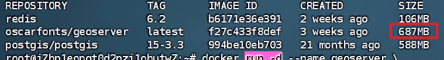
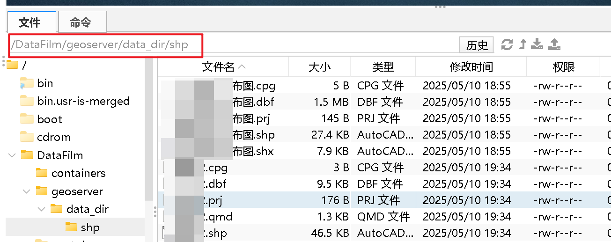
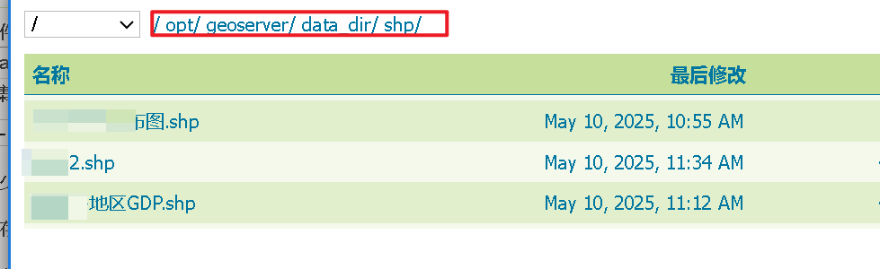

# Dockers部署oscarfonts/geoserver镜像的Geoserver

说实话，一开始把我搞疯了，最后发现要选择合适的Geoserver镜像才是关键，所以所以所以......

推荐oscarfonts/geoserver的镜像！

一开始用什么kartoza/geoserver镜像把我搞疯😣，不过还好用的是阿里云的虚拟机😀。

**先介绍一下这个镜像**

- `oscarfonts/geoserver` 镜像相对较轻量级，而 `kartoza/geoserver` 镜像较大，约为 1.4G。

- `kartoza/geoserver` 提供了更丰富的配置选项，例如可以通过环境变量设置管理员用户名和密码等，而 `oscarfonts/geoserver` 更注重基础功能的优化和稳定性。

  

#### **1. 拉取镜像**

```
docker pull oscarfonts/geoserver:2.27.0
```

#### 2.创建容器

```
docker run -d --name geoserver \
  -p 8080:8080 \
  -e GEOSERVER_ADMIN_PASSWORD=myadminpassword \
  -e GEOSERVER_ADMIN_TOKEN=mytoken123 \  
  -v /DataFilm/geoserver/data_dir:/opt/geoserver/data_dir \
  oscarfonts/geoserver
```

**说明一下`/DataFilm/geoserver/data_dir:/opt/geoserver/data_dir`这个路径：**

/DataFilm/geoserver/data_dir这个路径是说挂载数据的路径，就是到时候我们就是把矢量图层或一些源数据放在这个路径下，之后就可以在geoserver里的路径（`/opt/geoserver/data_dir`）下找到滴。

**之后启动容器**

#### 3.放置地图数据



#### 4.打开geoserver

x.x.x.x:8080/geoserver

默认用户名/密码是：admin/geoserver

发布地图



## 注意事项

geoserver加载矢量数据可以会出现乱码等相关问题，对此保险的做法就是先将源数据图层在GIS软件里转为GBK编码，然后再在Geoserver里也使用GBK编码

