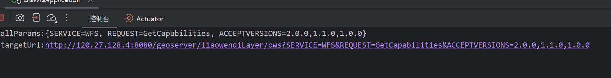

```java

@RestController
@RequestMapping("/lwq/ogc/wfs")
public class GeoServerGatewayController {
    
    private static final String TARGET_SERVER = "http://120.27.128.4:8080/geoserver";
    
    @GetMapping("/{workspace}")
    public String forwardWfsRequest(
            @PathVariable String workspace,
            @RequestParam Map<String, String> allParams,
            HttpServletRequest request) throws IOException {
        
        // 构建目标URL
        String targetUrl = TARGET_SERVER + "/" + workspace + "/ows";
        
        // 添加查询参数
        if (!allParams.isEmpty()) {
            targetUrl += "?" + buildQueryString(allParams);
        }
        
        // 使用HttpClient转发请求
        try (CloseableHttpClient httpClient = HttpClients.createDefault()) {
            HttpGet httpGet = new HttpGet(targetUrl);
            
            // 可以添加必要的请求头
            Enumeration<String> headerNames = request.getHeaderNames();
            while (headerNames.hasMoreElements()) {
                String headerName = headerNames.nextElement();
                if (!headerName.equalsIgnoreCase("host")) { // 跳过Host头
                    httpGet.addHeader(headerName, request.getHeader(headerName));
                }
            }
            
            try (CloseableHttpResponse response = httpClient.execute(httpGet)) {
                return EntityUtils.toString(response.getEntity());
            }
        }
    }
    
    private String buildQueryString(Map<String, String> params) {
        StringBuilder queryString = new StringBuilder();
        for (Map.Entry<String, String> entry : params.entrySet()) {
            if (queryString.length() > 0) {
                queryString.append("&");
            }
            queryString.append(entry.getKey()).append("=").append(entry.getValue());
        }
        return queryString.toString();
    }
}
```

allParams:{SERVICE=WFS, REQUEST=GetCapabilities, ACCEPTVERSIONS=2.0.0,1.1.0,1.0.0}

targetUrl:http://120.27.128.4:8080/geoserver/liaowenqiLayer/ows?SERVICE=WFS&REQUEST=GetCapabilities&ACCEPTVERSIONS=2.0.0,1.1.0,1.0.0



```
http://120.27.128.4:8080/geoserver/schemas/wfs/2.0/wfs.xsd
```

```
120.27.128.4:8080/geoserver/liaowenqiLayer/wfs
```

| id   | indicator\_category | performance\_requirement   | implementation\_scheme   | remarks                  |
| ---- | ------------------- | -------------------------- | ------------------------ | ------------------------ |
| 1    | 并发处理            | ≥10,000 QPS                | Spring Cloud Gateway集群 | 用于处理高并发请求       |
| 2    | 空间查询            | 千万级POI≤1秒              | R树+四叉树混合索引       | 优化空间数据查询效率     |
| 3    | 实时处理            | 数据延迟≤30秒              | Flink+Kafka流处理        | 实时数据处理框架         |
| 4    | 数据承载            | 5TB空间数据+100GB/日流数据 | PostGIS分片+ES时空索引   | 支持大规模数据存储和索引 |
