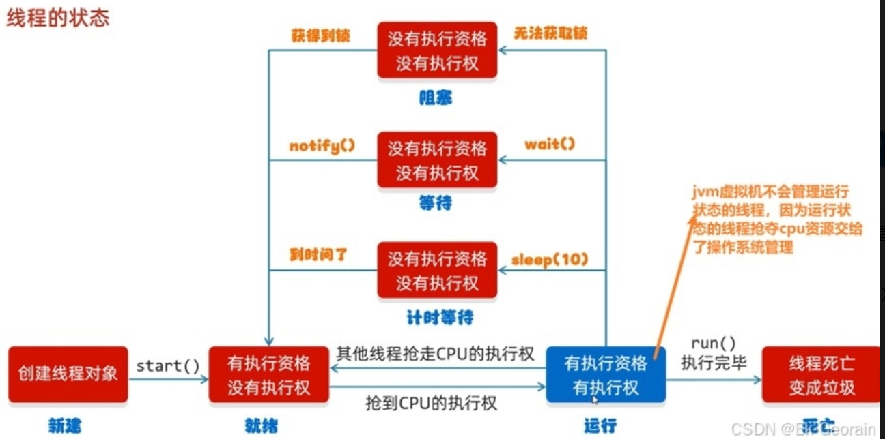
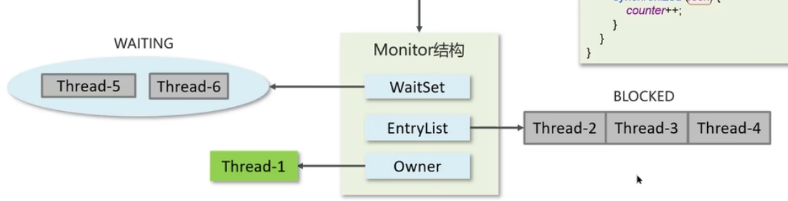
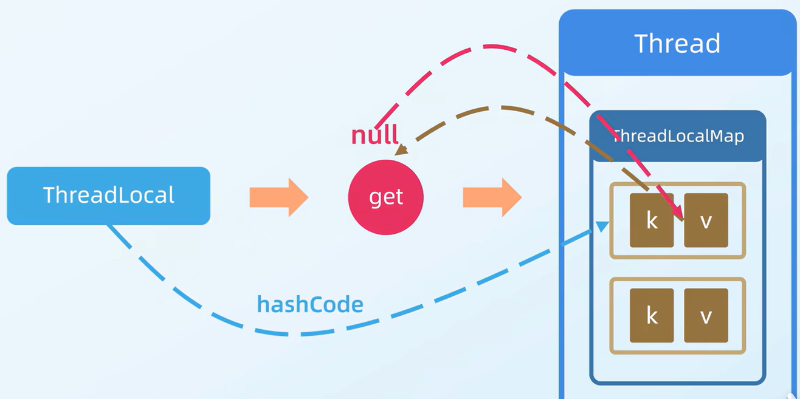
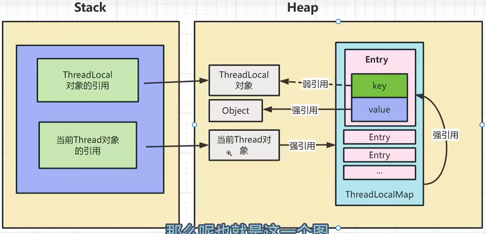
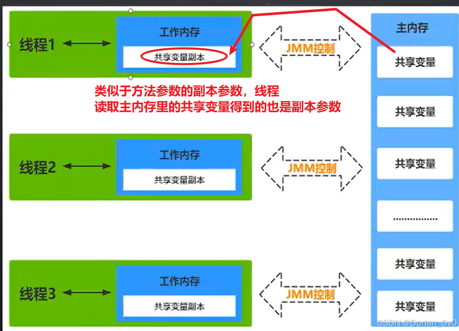

## 导致并发程序出现问题的根本原因是什么（怎么解决并发问题）

导致并发程序出现问题的根本原因就是不满足下面的这些条件。

### **Java并发编程三大特性**

#### ● 原子性

一个线程在CPU中操作不可暂停，也不可中断，要不执行完，要不不执行

**这意味着某个线程在操作一个变量时，其他线程不能同时干扰或中断该操作**

不是原子性操作怎么保证原子性操作：加锁（Lock锁或synchronized）、**使用原子类**、**使用同步原语**

#### ● 可见性

 一个线程的共享变量另外一个线程可以看到**（volatile关键字保证）**

#### ● 有序性

处理器为了提高程序运行效率，可能会对输入代码进行优化，**它不保证程序中各个语句的执行先后顺序同代码中的顺序一致**，**但是==有序性==就保证程序最终执行结果和代码顺序执行的结果是一致的。**

## 线程运行状态



## **synchronized**关键字

java里的对象锁，采用互斥的方式让同一时刻至多只有一个线程持有【对象锁】，其它线程再想获取这个【对象锁】时就会阻塞。

底层是Monitor锁监视器实现，Monitor又是由jvm底层的C++实现的。

使用synchronized的时候，在字节码里会出现一次上锁，之后出现两次解锁，第二次解锁是放在代码执行异常而不能释放锁，相当于finally语句里执行。



- Owner：存储当前获取锁的线程的，只能有一个线程可以获取
- EntryList：关联没有抢到锁的线程，处于Blocked状态的线程
- WaitSet：关联调用了**wait方法**的线程，处于Waiting状态的线程

**`EntryList` 是一个竞争锁的阻塞队列**，但它和 `java.util.concurrent` 包里的 `BlockingQueue` 不同,**不是 FIFO 严格公平的**，锁释放时竞争，所以synchronized是非公平锁。


## notify和notifyall 

notify唤起随机的一个等待的线程，让它去执行任务 

notifyall唤醒所有等待的线程，让他们竞争执行任务

## wait和sleep的区别

| 特性         | sleep (Thread.sleep()) | wait (Object.wait())                                         |
| ------------ | ---------------------- | ------------------------------------------------------------ |
| **所属类**   | Thread类的静态方法     | Object类的实例方法                                           |
| **锁释放  ** | 不释放任何锁           | 释放当前持有的锁                                             |
| **唤醒方式** | 超时自动唤醒或中断     | notify()/notifyAll()或超时或中断                             |
| **调用位置** | 任何地方               | 必须在同步块(synchronized)内，调用时会释放锁，允许其他线程获取锁 |
| **用途**     | 单纯暂停线程执行       | 线程间协调/通信                                              |

wait方法的调用必须先获取wait对象的锁，而sleep不需要

``` java
synchronized(lockObject) {
    while(conditionNotMet) {
        lockObject.wait();  // 释放lockObject锁
    }
    // 条件满足后的处理
}
```

使用wait()缺点：就是==**使用时容易忘记notify就会一直等待**==

## 线程阻塞(Blocking)和等待(Waiting)的区别 


Blocking是锁竞争失败后被被动触发的状态，Waiting是人为的主动触发的状态 

Blocking的唤醒时自动触发的，而Waiting状态是必须要通过特定的方法(notify()`/`notifyAll())来主动唤醒

```java
// 阻塞例子
synchronized(lock) {  // 如果其他线程持有lock，当前线程会BLOCKED
    // 临界区代码
}

// 等待例子
synchronized(lock) {
    while(!condition) {
        lock.wait();  // 释放锁并进入WAITING状态
    }
}
```


## 线程池

#### 线程池的种类

1. **固定线程数的线程池:核心线程就是总线程数**，阻塞队列为linkedblockingqueue，适用于任务量已知，相对耗时的任务
2. **单线程线程池:适用于按顺序执行**
3. **可缓存线程池:无核心线程，==都是使用临时线程==**，有时间限制，适用于任务密集，且执行时间短
4. **可以延迟和周期执行任务**的线程池，

#### 核心参数（7个）

1核心线程数 

2最大线程数 

3非核心线程可以使用的时间 

4第三点对应的参数 

5阻塞任务队列（等待空闲的线程执行队列里的任务） 

6线程工厂 

7拒绝策略

```java
ThreadPoolExecutor(
int corePoolSize,  // 核心线程数
int maximumPoolSize, // 最大线程数
long keepAliveTime, // 非核心线程的线程允许使用的时间
TimeUnit unit,  // 上面参数对应的单位
BlockingQueue<Runnable> workQueue,  // 阻塞队列，排队要获取执行机会的线程
ThreadFactory threadFactory,  // 创建线程的工厂，用于创建线程
RejectedExecutionHandler handler)  // 任务拒绝策略，如果阻塞队列满了那么采取的策略
 //用于指定的参数创建新的 ThreadPoolExecutor。
 
    // 建造者模式
ThreadPoolExecutor executor = new ThreadPoolExecutorBuilder()
    .setCorePoolSize(5)
    .setMaximumPoolSize(10)
    .setKeepAliveTime(60)
    .setTimeUnit(TimeUnit.SECONDS)
    .setWorkQueue(new LinkedBlockingQueue<>(100))
    .setThreadFactory(new CustomThreadFactory())
    .setHandler(new ThreadPoolExecutor.CallerRunsPolicy())
    .build();
 
// 具体创建一个线程池的案例
/**ThreadPoolExecutor threadPoolExecutor = new ThreadPoolExecutor  
(核心线程数，最大线程数，线程存活时间，任务队列，创建线程工厂，任务的拒绝策略);  
参   数： 核心线程数    不能小于0  
参   数： 最大线程数    不能小于0，最大数值 >= 核心线程数  
参   数： 时间，单位    用TimeUnit指定  
参   数： 任务队列       不能为null  
参   数： 创建线程工厂    不能为null  
参   数： 任务的拒绝策略    不能为null  
*/  
```

#### **不断的提交任务，会有以下三个临界点：**

**① 当核心线程满时，再提交任务就会排队**

**② 当核心线程满，队伍满时，会创建临时线程，这些临时线程会从任务队列中获取任务并执行，临时线程和核心线程一样，都会从任务队列中获取任务。**

**③ 当核心线程满，队伍满，临时线程满时，会触发任务==拒绝策略==**

- **AbortPolicy**：抛出`RejectedExecutionException`，阻止任务提交（默认行为）。
- **CallerRunsPolicy**：让调用者线程自己执行任务，减缓提交速度。**由提交任务的线程（即调用 `execute()` 或 `submit()` 方法的线程）自己执行被拒绝的任务**。
- **DiscardPolicy**：直接丢弃任务，不做任何处理。
- **DiscardOldestPolicy**：当队列已满，新的任务到来时，会丢弃队列中**最旧的任务**（不是新的任务），然后将新任务加入队列。

#### 阻塞队列的类型

1. ArrayBlockingQueue：基于数组结构的有界阻塞队列，FIFO。

2. LinkedBlockingQueue：基于链表结构的有界阻塞队列，FIFO。

   由于LinkedBlockingQueue是两把锁，ArrayBlockingQueue是一把锁，两把锁的各种负责对头和队尾，一把锁同时负责队头和队尾，所以两把锁的效率高适合高并发情况下。

   | LinkedBlockingQueue              | ArrayBlockingQueue      |
   | -------------------------------- | ----------------------- |
   | 默认无界，支持有界               | 强制有界                |
   | 底层是链表                       | 底层是数组              |
   | 是懒惰的，创建节点的时候添加数据 | 提前初始化 Node 数组    |
   | 入队会生成新 Node                | Node 需要是提前创建好的 |
   | 两把锁（头尾）                   | 一把锁                  |

#### **线程池关闭**：

- **当调用 `shutdown` 方法时，线程池会等待已提交的任务执行完成，然后关闭，如果再次向线程池提交任务，这个任务将不会被执行，并且会触发线程池的拒绝策略**
- **当调用 `shutdownNow` 方法时，线程池会尝试立即关闭所有线程(调用Thread.interrupt），可能有些中断不了，并返回尚未执行的任务列表。**

**如果提交的任务里有异常，不会影响线程池中其他任务的执行。线程池的设计保证了任务的独立性，一个任务的异常不会影响其他任务的执行。**

#### 为什么不建议用Executors创建线程池

1. **隐藏了关键参数配置**：Executors方法隐藏了ThreadPoolExecutor的构造参数，开发者无法根据实际场景调整
2. 都有OOM的风险。

```java
// 使用无界队列（LinkedBlockingQueue），队列会无限堆积，导致OOM（内存溢出）,且没有提供自定义拒绝策略的能力
ExecutorService fixedThreadPool = Executors.newFixedThreadPool(10);

// 最大线程数为Integer.MAX_VALUE，可能会创建过多线程
ExecutorService cachedThreadPool = Executors.newCachedThreadPool();

// 同样使用无界队列（LinkedBlockingQueue），有OOM风险
ExecutorService singleThreadExecutor = Executors.newSingleThreadExecutor();  
```

#### 使用线程池的场景

##### 1. ==异步任务处理==

- **@Async 注解**：Spring 提供的异步执行方法注解，底层使用线程池
- **耗时操作异步化**：如发送邮件、短信通知等
- **日志记录**：将日志写入操作放到线程池中异步执行

##### 2. 批量任务处理

- **批量数据处理**：如大批量数据导入/导出
- **并行计算**：需要同时处理多个独立计算任务时
- **文件处理**：批量文件压缩、解压或格式转换

##### 3. 提高接口响应速度

- **聚合接口**：并行调用多个外部服务然后合并结果
- **非关键路径异步化**：==主流程完成后，非关键操作放入线程池异步执行==

##### 4. 定时任务

- **@Scheduled 注解**：定时任务执行，特别是需要并行执行的任务
- **周期性批量作业**：如每天凌晨的数据统计任务

##### 5. 消息队列消费

- **消息监听**：高效消费 RabbitMQ、Kafka 等消息
- **消息批量处理**：将消息批量提交到线程池处理

##### 6. 高并发请求处理

- **请求分流**：高并发请求时分发到不同线程处理
- **请求缓冲**：突发流量时使用线程池缓冲请求

##### 7. 微服务调用

- **并行服务调用**：同时调用多个微服务接口
- **服务降级处理**：将降级逻辑放入线程池执行

##### 8. 其他场景

- **缓存预热**：==系统启动时使用线程池并行预热缓存==
- **资源清理**：后台资源清理任务

## Java里实现多线程几种方法

1 线程池 

2 thread：继承thread类重写run方法调用start方法 

3 runnable：实现runnable接口重写run方法调用start（）

### start方法和run方法运行线程

**start方法**会创建一个新的线程，且异步调用，主线程不会等待新线程是否执行完，且只能调用一次。 

**run方法**不会创建新的线程，为同步调用，按照代码顺序执行，可以多次调用（像调用函数一样）。

## 如何控制某个方法允许并发访问线线程的数量

#### ①使用Spring的`@Async`注解 + 自定义线程池

```java
@Configuration
@EnableAsync
public class AsyncConfig {
    
    @Bean("methodExecutor")
    public Executor asyncExecutor() {
        ThreadPoolTaskExecutor executor = new ThreadPoolTaskExecutor();
        executor.setCorePoolSize(5);       // 核心线程数
        executor.setMaxPoolSize(10);       // 最大线程数
        executor.setQueueCapacity(100);    // 队列容量
        executor.setThreadNamePrefix("MethodAsync-");
        executor.initialize();
        return executor;
    }
}

@Service
public class MyService {
    
    @Async("methodExecutor")  // 指定使用上面的线程池
    public void myConcurrentMethod() {
        // 方法实现
    }
}
```

#### ②使用信号量(Semaphore)控制（AQS）

```java
import java.util.concurrent.Semaphore;

@Service
public class MyService {
    private final Semaphore semaphore = new Semaphore(5); // 允许5个并发
    
    public void myConcurrentMethod() {
        try {
            semaphore.acquire();  // 获取许可
            // 方法实现
        } catch (InterruptedException e) {
            Thread.currentThread().interrupt();
        } finally {
            semaphore.release();  // 释放许可
        }
    }
}
```

## **强引用、软引用、弱引用、虚引用**

### **强引用**

最为普通的引用方式，表示一个对象处于有用且必须的状态，如果一个对象具有强引用，则GC并不会回收它。 即便堆中存在不足了，宁可出现内存溢出，也不会对其进行回收

```java
User user = new User();
```

### **弱引用**

表示一个对象处于可能有用且非必须的状态。**在GC线程扫描内存区域时，一旦发现弱引用，就会回收到弱引用相关联的对象**。对于弱引用的回收，无关内存区域是否足够，一旦发现则会被回收(**ThreadLocal就是使用弱引用**)

```java
User user = new User();
WeakReference weakReference = new WeakReference(user);
```

### **软引用**

软引用是通过 `java.lang.ref.SoftReference` 类来实现的。它允许**在内存不足的情况下，对象被垃圾回收器回收**。例如：

```
SoftReference<Object> softRef = new SoftReference<>(new Object());
```

### **虚引用**

虚引用是通过 `java.lang.ref.PhantomReference` 类来实现的。例如：

```
PhantomReference<Object> phantomRef = new PhantomReference<>(new Object(), referenceQueue);
```

虚引用不能单独使用，它必须和引用队列配合使用。垃圾回收器回收对象时，会将虚引用加入到与之关联的引用队列中。虚引用无法通过引用获取对象，它的作用主要是用于在对象被回收时得到一个通知。也就是说，当垃圾回收器回收对象时，我们可以通过检查引用队列来得知对象已经被回收了。

## **ThreadLocal**

ThreadLocal通常用来存储单个线程的私有信息而不被其它的线程得到，比如用户信息、会话信息、事务对象。

相当于是值被当前线程绑定了。

### 作用

1. 实现**线程安全**，使得线程私有变量和线程绑定，使其不会被其它变量看见。
2. 线程执行期间可以方便地获取线程私有的值。

### 原理

**每个Thread对象内部有一个`ThreadLocalMap`结构，存放的值就是向这个map里存入，而key就是当前的ThreadLocal对象。**

当调用ThreadLocal的get方法的时候，就会通过ThreadLocal获取当前Thread，然后获取ThreadLocalMap这个map集合，再通过当前线程的ThreadLocal作为key（钥匙🔑）然后得到hashcode最后获取对应的值value。如果得到的是null那么就设置ThreadLocal键对应的值为null。





### ThreadLocal内存泄漏问题

**内存泄漏**指的是程序中的对象不再被需要，但由于某些引用依然存在，导致这些**不再使用的对象无法被垃圾回收（GC）从堆内存中释放**，从而造成内存不必要的持续占用。

#### 产生原因

1. **ThreadLocal的Key弱引用问题**：

   - ThreadLocalMap中的Entry的**key使用弱引用（WeakReference）指向ThreadLocal对象**，由于是弱引用，所以再GC的时候ThreadLocal对象就会被回收，那么key指向的就是null。此外由于指向ThreadLocalMap的Entry的引用是强引用，所以Entry里的value就不会被回收，这时就会出现key为空的value。value和Thread绑定，只有线程销毁时value才会被回收。

2. **线程池场景下的长期存活线程**：

   - 线程池中的**核心线程**用完之后又会放入线程池，通常是会长期存活的，直到shutdown方法被调用。
   - 这样的这些线程的ThreadLocalMap会一直存在
   - 所以如果不通过remove方法移除，那么value会始终存储在ThreadLocalMap里，会导致Value对象积累，最终内存溢出。

   通常情况下要调用remove方法将value对象移除，在项目中的请求经过拦截器解析token里的用户id存入ThreadLocal，返回响应的时候再经过拦截器调用remove方法移除ThreadLocal里的值。

## 乐观锁和悲观锁比较

| 特性       | 悲观锁                      | 乐观锁                                 |
| :--------- | :-------------------------- | :------------------------------------- |
| 并发假设   | 冲突很可能发生              | 冲突不太可能发生                       |
| 加锁时机   | 操作前加锁                  | 操作后检查                             |
| 实现复杂度 | 简单                        | 较复杂                                 |
| 性能       | 较差(阻塞)                  | 较好(非阻塞)                           |
| 适用场景   | 写多读少                    | 读多写少                               |
| 典型实现   | synchronized, ReentrantLock | 版本号, CAS, Atomic类                  |
| 实现原理   | 加锁，比如synchronized      | 不加锁，在提交更新时检查数据是否被修改 |

## JMM内存模型（java内存模型）



## CAS乐观锁

CAS（比较再交换）它体现的是一种乐观锁的思想，可在无锁情况下保证线程操作共享数据的原子性（不会受别的线程的干扰而出现多种结果），用于在多线程环境下安全地更新变量，避免性能开销。

#### **具体实现原理：**

首先Java内存模型JMM它有主内存和工作内存，当一个线程要修改主内存的数据时，会将主内存复制到工作内存作为一个副本变量，修改前会判断副本变量里的值和主内存里的值是否相等，如果相等就可以修改成功，如果不相等再次将主内存的值复制到工作内存里然后进行之前的操作（这个过程叫做自旋），这就叫做比较比较并交换。

#### 应用场景

**实现计数器和计数器递增**

**原子变量**

**无锁数据结构（ConcurrentHashMap）**

## volatile关键字介绍

**可见性保证**：当一个线程修改了volatile变量的值，**新值会立即被刷新到主内存中**，其他线程**读取时会直接从主内存读取最新值**。

**禁止指令重排序**：防止 JVM 将`volatile`变量的读写指令与其他指令进行重排序

**局限性：不能实现原子性操作**，对`volatile`变量的操作（如自增）不是原子操作，仍需加锁或使用原子类。（就是这意味着如果多个线程同时 **读写** `volatile` 变量，仍然可能出现并发安全问题。）

```java
public class VolatileVisibilityDemo {
    private volatile boolean running = true; 
    public void start() {
        new Thread(() -> {
            while (running) {
                // System.out.println("工作中");
            }
            System.out.println("Thread stopped");
        }).start();
    }

    public void stop() {
        running = false;
    }

    public static void main(String[] args) throws InterruptedException {
        VolatileVisibilityDemo demo = new VolatileVisibilityDemo();
        demo.start();
        Thread.sleep(1000);
        demo.stop();
    }
}
```

为什么有的情况下无论是否给 `running` 变量添加 `volatile` 关键字，程序似乎都能正常停止?——**JVM 和硬件的优化**

## ConcurrenHashMap

ConcurrentHashMap是一种线程安全的高效Map集合

底层数据结构：

- JDK1.7底层采用分段的数组+链表实现，每一段数组有对应一个**分段锁**，锁的范围比较大，并且数组不能扩容。
- JDK1.8采用的数据结构跟HashMap1.8的结构一样，数组+链表/红黑树，同时放弃了JDK1.7里的分段锁，减少了锁的粒度。
  - CAS控制数组节点的添加
  - synchronized只锁定当前**链表或红黑二叉树**的首节点，只要hash不冲突,就不会产生并发的问题，效率得到提升

## AQS（**抽象队列同步器**）

AQS就是AbstractQueuedSynchronizer抽象类，AQS其实就是JUC包下的一个基类，JUC下的很多内容都是基于AQS实现了部分功能，比如**ReentrantLock，ThreadPoolExecutor，阻塞队列，CountDownLatch， Semaphore，CyclicBarrier等等都易基于AQS实现。**

**内部有一个volatile修饰的state变量，有线程持有锁的时候大于0，没有锁持有就为0。其他线程获取不到就去队列里排队。**

锁竞争激烈时可提供多种解决方案

基于 AQS 构建的大部分同步器（例如 `ReentrantLock`）是 **悲观锁的实现**

#### 多个线程操作如何保证原子性？

修改state值的时候加CAS原子锁，没抢到锁的到队列最后排队。

#### AQS公平与非公平

1. **关于非公平性：** 如果是队列的队头线程和一个新线程抢锁，那么不公平，因为队头线程如果失败就白等了这么久。

2. **关于公平**：如果新线程发现锁已经被其他线程获取，那么会排队到队尾，然后锁释放时唤醒队头线程去获取锁 

### ReentrantLock

ReentrantLock翻译过来是可重入锁，即同一个线程可以多次获取同一把锁，相对于synchronized它具备以下特点:

- 可中断
- 可以设置超时时间
- 可以设置公平锁
- 支持多个条件变量
- 与synchronized一样,都支持重入

实现原理：**CAS＋AQS**

#### 同时支持公平锁和非公平锁

无参构造器默认为非公平锁，传参构造器为公平锁。

## Synchronized锁和Lock锁的区别

- 区别1：Synchronized 是Java的一个关键字，而Lock是java.util.concurrent.Locks 包下的一个接口；
- 区别2：Synchronized 使用过后，会自动释放锁，而Lock需要手动上锁、手动释放锁。（在 finally 块中）
- 区别3：Lock提供了更多的实现方法，而且可响应中断、可定时， 而synchronized 关键字不能响应中断；
- 区别4：==**没获取到Synchronized锁会阻塞所有线程，当释放Synchronized锁时这些线程会去争夺Synchronized锁，所以说Synchronized是非公平锁，而Lock底层基于aqs，内部有一个队列，可以设置其为公平锁。**==
- 区别6：二者的底层实现不一样：synchronized是同步阻塞，采用的是悲观并发策略；Lock是同步非阻塞，采用的是乐观并发策略（底层基于volatile关键字和CAS算法实现）

## 并发工具类简介

Java并发包(java.util.concurrent)提供了一系列强大的并发工具类，用于简化多线程编程。以下是主要的并发工具类及其用途：

#### 1. 同步工具类

- **CountDownLatch**：允许一个或多个线程等待，直到在其他线程中执行的一组操作完成
  ```java
  CountDownLatch latch = new CountDownLatch(3);
  // 线程调用 latch.await() 等待
  // 其他线程完成工作后调用 latch.countDown()
  ```

- **CyclicBarrier**：让一组线程到达一个屏障时被阻塞，直到最后一个线程到达屏障时，屏障才会打开
  ```java
  CyclicBarrier barrier = new CyclicBarrier(3);
  // 线程调用 barrier.await() 等待其他线程
  ```

- **Semaphore**：控制同时访问特定资源的线程数量
  ```java
  Semaphore semaphore = new Semaphore(5); // 允许5个线程同时访问
  semaphore.acquire(); // 获取许可
  semaphore.release(); // 释放许可
  ```

#### 2. 线程安全集合

- **ConcurrentHashMap**：线程安全的HashMap实现
- **CopyOnWriteArrayList**：线程安全的List，适合读多写少的场景
- **BlockingQueue**：阻塞队列接口，常用实现有：
  - ArrayBlockingQueue
  - LinkedBlockingQueue
  - PriorityBlockingQueue
  - SynchronousQueue

#### 3. 执行框架

- **ExecutorService**：线程池接口
- **ThreadPoolExecutor**：可配置的线程池实现
- **Executors**：工厂类，提供创建线程池的便捷方法
- **Future**和**Callable**：支持返回结果的异步任务

#### 4. 原子变量类

- **AtomicInteger**、**AtomicLong**等：提供原子操作的数值类
- **AtomicReference**：原子引用类型
- **LongAdder**：高并发下性能更好的累加器

#### 5. 锁相关

- **ReentrantLock**：可重入锁，比synchronized更灵活
- **ReadWriteLock**：读写锁，允许多个读操作同时进行
- **StampedLock**：Java8新增的锁，支持乐观读

这些并发工具类大大简化了Java多线程编程，提供了更高层次的抽象，帮助开发者编写高效且线程安全的并发程序。
