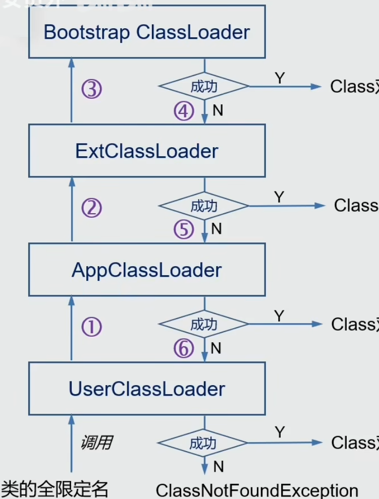
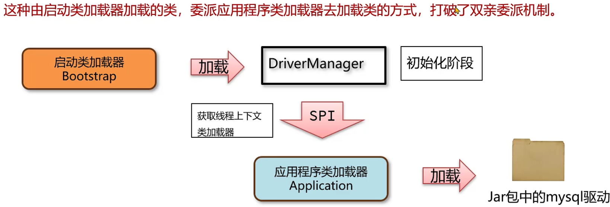
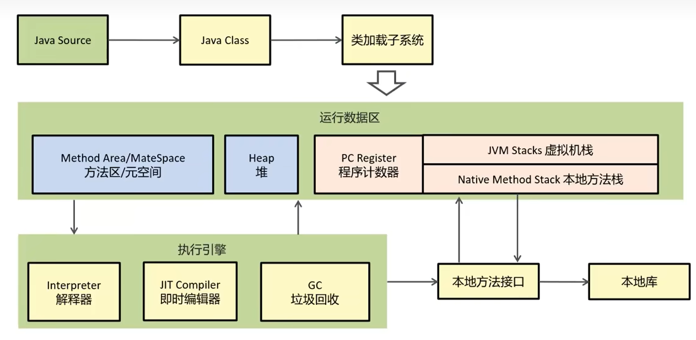

# JVM虚拟机介绍
JVM（Java Virtual Machine，Java虚拟机）是运行Java程序所必需的运行时环境，它为Java程序提供了**内存管理、垃圾回收、字节码执行**等功能
# 类的生命周期介绍（对象）
类的生命周期有以下的阶段
1. 加载
2. 连接（又包含验证、准备、解析阶段）
3. 初始化
4. 使用
5. 卸载
### 加载阶段
将类的 .class 文件中的二进制数据读取到 JVM 内存中，并将其转换为一个 java.lang.Class 对象，保存类的所有信息，存储在方法区中。
### 连接阶段
#### 验证
检验java字节码文件里有没有格式错误
#### 准备
**为类的静态变量（static）分配方法区里的内存，并设置默认初始值**。例如，对于 int 类型的静态变量，默认值为 0；对于 String 类型的静态变量，默认值为 null。如果是final修饰的，那么直接赋值到代码里。
#### 解析
将类、接口、字段和方法的符号引用转换为直接引用。符号引用是以字符串形式表示的，而直接引用是指向 JVM 内存中的具体位置的指针。解析的目的是将符号引用替换为直接引用，以便在运行时能够快速定位到目标对象。
### 初始化阶段
**执行静态代码块（static{...}）里的代码，同时为静态变量赋值。** 
初始化阶段是类加载过程中唯一一个可以由用户自定义的阶段，**用户可以通过编写静态初始化块来控制类的初始化逻辑**。

#### 触发类的初始化的情况
1. 访问一个类的静态变量和静态方法
2. 调用class.forName(String name)
3. new 一个对象
4. 执行main方法当前的类
# 类加载器
类加载器：用于实现类的加载的这一步，将字节码获取并加载到内存里。
## 类加载器的分类
### 启动类加载器bootstrap（处于虚拟机底层使用C＋＋实现，jdk8之后使用java编写）
- 加载jre/lib目录下的jar文件
- 由于该加载器处于底层，所以Java代码不能获取该加载器
- 如果开发底层，那么使用启动类加载器
### jdk提供的加载器
#### 拓展类加载器extension
加载Java的拓展类
#### 应用程序加载器（application）
加载应用使用的类（Java项目里创建和导入的所有类）
## 双亲委派机制

**该机制指的是：自下向上检查一个类有没有加载过，自上向下尝试加载类**
**加载一个类的时候先从下向上检查有没有加载过，如果没有就从上向下地加载这个类。** 
自定义的类加载器，处于类加载器的最底层，应用类加载器下面。通过继承ClassLoader这个抽象类来实现。
### 打破双亲委派机制的三种方法
1. #### **自定义类加载器并重写loadClass方法：**

  自定义特定类的类加载器，使得各个类的加载相互隔离，而且加载的两个类各不相同（tomcat通过这种方式实现线程隔离），具体步骤就是：**先检查类加载器有没有加载某个类，如果没加载，默认是委托给父类加载器，但是如果重写loadclass方法，那么直接尝试本类加载器加载这个类，如果加载不成功，那么又回到双亲委派机制，又父类加载器加载。**
2. #### **线程上下文类加载器** 

  为线程提供一个独立的类加载器环境。在多线程环境下，不同的线程可能需要加载不同的类，或者需要访问一些由其他线程加载的类。线程上下文类加载器可以用来解决这种类加载器之间的隔离和共享问题。

由上图可见，启动类加载器加载完JDBC的DriverManager类，DriverManager直接委托应用程序类加载器加载jar包里的Mysql驱动（或其它数据库驱动）

3. #### **osgi的类加载器**

- osgi可以使用类加载器实现热部署功能。

实现同级别之间的类加载器来委托加载。
 

### **jdk8之后的类加载器的与之前的区别**
1. jdk8之后引入了模块化的类加载器，每个模块都有自己的类加载器，并且它们之间是相互隔离的，避免了不同模块之间的类冲突。
2. jdk8之后的启动类加载器是java编写的，但为了与之前代码进行兼容，在尝试获取启动类加载器时仍然会返回null。
3. 扩展类加载器被移除并重命名为平台类加载器（Platform ClassLoader），用于加载系统范围的类。

## JVM内存模型

###  **程序计数器**

- **特点**：线程私有（不会出现线程安全问题），**记录当前线程执行的字节码指令的地址，并指向下一条将要执行的指令。**
- **作用**：CPU通过程序计数器知道下一条要执行的指令。
- **内存溢出**：几乎不会出现内存溢出，因为它的内存空间很小。

### 虚拟机栈

- **特点**：线程私有，每个线程都有自己的虚拟机栈。
- **作用**：
- **栈帧**：每次方法调用都会创建一个栈帧，方法执行完毕后栈帧出栈。
- **异常处理**：方法出现异常时，通过出栈顺序打印调用栈信息。
- **线程安全**：线程私有的，不存在线程安全问题。
- **内存溢出**：可能导致`StackOverflowError`（栈溢出）。

每个线程运行需要的内存，叫做虚拟机栈。 一个线程对应于一个虚拟机栈，每个栈帧对应每次方法调用所需的内存，栈内存不涉及垃圾回收 每一个方法的调用都使用一个栈帧存入栈内存，方法执行完就出栈。 如果哪个方法出现异常，那么在Java控制台会通过出栈的顺序打印出栈里的各个方法。 变量的线程安全 线程私有的变量就是线程安全的 如果方法内部局部变量没逃离方法，那么这个变量线程安全 如果局部变量引用了对象，同事逃离了方法，那么要考虑线程安全问题 栈内存溢出 本地方法栈 调用本地方法给本地内存提供的内存空间 堆（线程共享） 由于是内存共享，那么要考虑线程安全问题 new关键字创建的对象实例（包括成员变量）存储在堆内存里，但是对象引用存储在栈内存里。 有垃圾回收机制 方法区（线程共享） 方法区：主要用于存储已被虚拟机加载的类信息（类的字段、方法、接口等元数据。这些信息是JVM运行时对类进行操作和访问的基础）、常量、静态变量、即时编译器编译后的代码等数据。 常量池（存储在方法区） 常量池是类文件结构中的一部分，存储了类或接口中所用到的常量信息。这些常量包括： 字面量：如字符串常量、整数常量、浮点数常量等。 符号引用：如类名、字段名、方法名、方法签名等。 运行时常量池（方法区的一部分） 存储编译期生成的各种字面量（如字符串常量、整数常量等）和符号引用（如类和接口的全限定名、字段的名称和描述符、方法的名称和描述符等）。 类被加载到JVM中时，类的常量池（在.class文件中）会被转换为运行时常量池。 字符串常量池 直接内存（不属于jvm管理） JVM的直接内存（Direct Memory）是指JVM堆外的内存区域，向操作系统内存申请的内存。直接内存可以由Java程序直接使用，并且常常用于高性能的I/O操作（减少数据在堆和本地内存之间的拷贝，拷贝次数多CPU变态（运行状态）频繁）。直接内存的管理与JVM的垃圾回收机制无关，因此也不会被垃圾回收器回收（需要手动管理，会发生溢出）。
