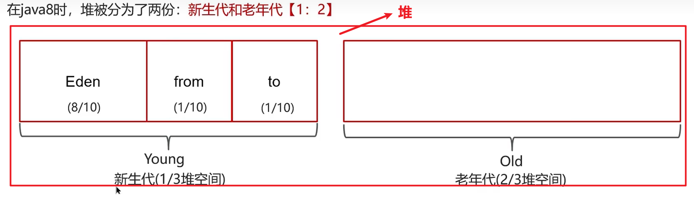

 自动垃圾回收机制 C/C＋＋里如果一个对象不使用，那么要手动释放内存，防止不释放对象的内存导致内存溢出。 哪些是可以回收的垃圾（垃圾判断算法——引用记数法和可达性分析法） 引用记数法 在这种算法中，假设堆中每个对象（不是引用）都有一个引用计数器。当一个对象被创建并且初始化赋值后，该对象的计数器的值就设置为 1，每当有一个地方引用它时，计数器的值就加 1，例如将对象 b 赋值给对象 a，那么 b 被引用，则将 b 引用对象的计数器累加 1。 反之，当引用失效时，例如一个对象的某个引用超过了生命周期（出作用域后）或者被设置为一个新值时，则之前被引用的对象的计数器的值就减 1。而那些引用计数为 0 的对象，就可以称之为垃圾，可以被收集。 引用记数法在出行循环引用的情况下会发生内存泄露 可达性分析法 扫描堆中的对象，看能否沿着GCroot（通常为方法里的变量以及类里的静态变量）为起点扫描得到该对象，找不到就回收 Gc算法有哪些 标记清除算法 先通过可达性分析找到不可回收的，再将剩下可回收的清除。 缺点就是会导致内存不连续（使其不能存储连续的数组） 标记整理算法 标记清除算法的最后会整理对象（移动效率低） 复制算法（内存使用率低） 将内存分为两半，一半里有存活的对象，一半里是空对象，最后将存活对象全复制到空对象里，然后清空另一半为空内存。

## jvm里的分代回收

**堆里分区：**分代垃圾回收器在堆里分为两个区：新生代、老生代。

**新生代里分区：**

- **Eden区**（伊甸园）：新对象优先分配在这里（默认占新生代的80%）。
- **Survivor区**（幸存者区）：分为 **From Survivor** 和 **To Survivor**（默认各占10%，总比例是 `8:1:1`）。

### **当Eden区满时，触发 Minor GC（只回收新生代），过程如下**

1. 把 Eden + From Survivor 存活的对象转移至 To Survivor 区。**【迁移】**
   - （**注意：**对象年龄达到阈值（默认15），或To Survivor空间不足，则直接晋升到**老年代**）
2. 清空 Eden 、 From Survivor 两个分区。**【清空】**
3. From Survivor 和 To Survivor 分区进行交换。**【交换】**
4. 存活的对象从 From Survivor 到 To Survivor ，每移动一次，年龄就自动加1岁，当年龄到达 15（默认配置是 15）时，升级为老生代；**大对象**（如超大数组）直接进入老年代（避免复制开销）。**【升级】**
5. 当老生代空间占用到达某个值时，即会触发**全局垃圾收回(Full GC)**，一般使用标记-整理算法执行垃圾回收**。**【全局GC】**
6. 以上流程循环往复，就构成了整个分代垃圾回收的整体执行流程。