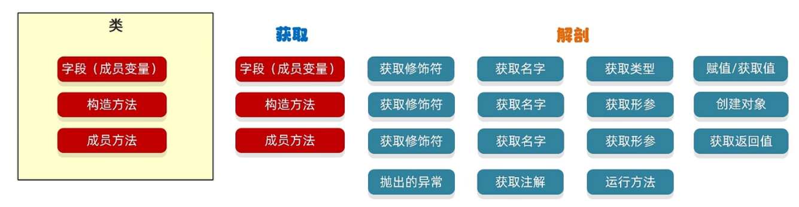

## Java相关规范

#### 命名规范 

1. **方法名和变量名采用小驼峰命名法** 

2. **类名采用大驼峰命名** 

3. **包名小写**

#### 代码格式 

1大括号不用像c#或cpp那样换行 

2注意一些缩进 

#### 异常捕获 

1先捕获具体的异常再捕获其他异常 

2异常处理不了就向上抛出

#### 重写了equals方法的同时还要重写hashCode方法

## ArrayList和LinkedList有什么区别

第一个底层是基于数组实现的，访问元素的效率高，插入效率不如链表（因为会移动元素），内存小

第二个底层是基于双向链表实现的，访问元素的效率低，头插入元素和尾插入元素的效率高，内存占用大（会存储指针）

## RestfulAPI风格 

优点：规定好前后端的交互规范，便于前端后端开展各自的业务，降低前后端的耦合度。

#### 请求方式：

- **GET**：获取资源信息
- **POST**：创建新资源
- **PUT**：更新已有资源
- **DELETE**：删除资源
- **PATCH**：部分更新资源

 **==每种请求方式对应不同的业务 API 的URL里不能有动词，要都是名词==** 

**响应里是一个封装好的对象**

都有类似于code，data，message的字段，我的项目了设计的是Result这个类。如果返回异常直接return Result.error(data)，这样就可以直接设置code为异常状态

## ==和equals的区别

#### ==

**基本数据类型**：比较两个变量的值是否相等。

**引用数据类型**：比较两个引用是否指向同一个对象。

#### **`equals()`**

**默认行为**：`equals()` 是 `Object` 类的方法，默认情况下，它和 `==` 的行为是一样的。

**重写后的行为**：在很多类中，`equals()` 方法会被重写，以便比较对象的内容是否相等。

- **字符串、包装类、自定义类、集合、许多Java标准库中类的比较也使用equals**

## 为什么重写equals方法的同时还要重写hashCode方法

在Java中，当重写`equals()`方法时，必须同时重写`hashCode()`方法，这主要是为了维护Java对象的一个基本契约：
#### 原因概述
1. **哈希契约**：Java规定，如果两个对象根据`equals()`方法是相等的，那么它们的`hashCode()`必须返回相同的值。如果hashcode不相同，那么两个对象一定不相同，hashcode相同，两个对象不一定相同，因为可能会有hash冲突，所以还要通过equals来对比。
2. **哈希集合的依赖**：`HashMap`、`HashSet`等基于哈希表的集合类依赖这个契约来正常工作。如果违反这个契约，这些集合可能无法正确存储或检索对象。
#### 重写的目的
##### 1. 集合类正常工作（都重写了equals和hashcode方法）
当对象被放入`HashSet`或作为`HashMap`的键时：
- 首先会调用`hashCode()`确定存储位置
- 如果位置（一个hash槽）上有其他对象，再调用`equals()`比较是否真正相等，相等就不会存储，不相等就开个链表或者红黑树存储

如果只重写`equals()`而不重写`hashCode()`，（获取对象的hashcode是通过对象的地址获取）可能导致：

- 两个"相等"的对象（**地址计算得到的hashcode对应的hash槽不一样，但equals对比是一样的**）被放入哈希表的不同位置

##### 2. 性能考虑
提高哈希表操作的效率，先通过计算hashcode来判断有没有不相等的，如果是通过equals来判断是否相等效率低。

## String的不可变性

- **一旦`String`对象被创建，它的内容就不能再改变（内部底层的字符数组被private和final修饰）。**
- **所有对`String`的“修改”操作实际上都是返回一个新对象。旧对象被垃圾回收掉了**

#### **不可变性的好处**

1. 相同字面量的string指向字符串常量池里的同一块位置，节省内存空间
2. 不可变对象的哈希值也永远不会变，那么在创建时计算并缓存，再次调用`hashCode()`直接读取，提高性能。
3. 线程安全：当前线程使用的对象不会被其它线程修改。

### 字符串常量池的作用

使用字面量创建字符串时，如果多个string类型字符串内容相同，那么引用值都相同，就是都指向常量池里的某个地址，避免重复创建相同内容的字符串对象。

池类技术都是节省内存和提升性能

## stringbuilder string stringbuffer

### **stringbuilder**：

**底层是用的char数组，没有其它的修饰，stringbuilder有许多操作字符串的方法，底层都是直接改变char数组，不会产生新对象。**

**而且string底层拼接字符串也是先转为stringbuilder，然后再操作字符串，最后toString返回string**

```java
String a = "Hello";
String b = "World";
String result = a + b; // 运行时经过StringBuilder拼接

String result = new StringBuilder().append(a).append(b).toString();
```

 **stringbuilder的缺点是线程不安全，对此，就有stringbuffer来解决。**

### stringbuffer

内部用synchronized修饰，线程安全，操作stringbuffer之前会进行加锁操作，性能就低一点。

例如：String result = "Hello" + "World";编译器会将其转换为：String result = new StringBuilder().append("Hello").append("World").toString();

## 反射

### 代理

代理（Proxy）是一种设计模式，主要用于在不修改原有代码的情况下，为对象提供额外的功能或控制访问。

为什么要代理：代理可以无侵入式的给对象增强其他的功能。

#### 代理实现的例子

##### 使用接口提取要代理的方法

```java
public interface Star {
    // 我们可以把所有想要被代理的方法定义在接口中
    // 叫做
    // 唱歌
    String sing(String name);
    // 跳舞
    void dance();
}
```

##### 实体类实现代理的接口

```java
public class BigStar implements Star {
    private String name;

    public BigStar() {
    }

    public BigStar(String name) {
        this.name = name;
    }

    @Override
    public String sing(String name) {
        System.out.println(this.name + " 正在唱歌");
        return "谢谢";
    }

    @Override
    public void dance() {
        System.out.println(this.name + " 正在跳舞");
    }
}
```

##### 创建一个代理的对象

```java
import java.lang.reflect.InvocationHandler;
import java.lang.reflect.Method;
import java.lang.reflect.Proxy;

public class ProxyFactory {
    private Object target;

    public ProxyFactory(Object target) {
        this.target = target;
    }

    public Object getProxyInstance() {
        return Proxy.newProxyInstance(
            target.getClass().getClassLoader(),
            target.getClass().getInterfaces(),
            new InvocationHandler() {
                @Override
                public Object invoke(Object proxy, Method method, Object[] args) throws Throwable {
                    if ("sing".equals(method.getName())) {
                        System.out.println("准备唱歌，收钱");
                    } else if ("dance".equals(method.getName())) {
                        System.out.println("准备跳舞，收钱");
                    }
                    // 调用目标对象的方法
                    Object returnValue = method.invoke(target, args);
                    System.out.println("代理结束，进行一些收尾工作...");
                    return returnValue;
                }
            }
        );
    }
}

// 使用示例
public class Main {
    public static void main(String[] args) {
        // 创建目标对象
        Star bigStar = new BigStar("周杰伦");
        
        // 创建代理工厂
        ProxyFactory proxyFactory = new ProxyFactory(bigStar);
        
        // 获取代理对象
        Star proxy = (Star) proxyFactory.getProxyInstance();
        
        // 通过代理对象调用方法
        proxy.sing("七里香");
        proxy.dance();
    }
}
```

由上面的代码可知，代理的话调用方法时可以指定调用方法前和方法结束后要执行的代码，类似于spring里的AOP。

### 反射介绍

在JVM底层通过native方法访问类的元数据。

在程序运行期间，对于任意一个类，都能够知道其所有属性和方法；对于任意一个对象，都能够调用其任意一个方法和属性。

反射允许对应成员变量，成员方法和构造方法的信息进行编程访问。



#### 获取类的信息

```java
//1. 第一种方式
//全类名：包名 + 类名
//最为常用的
Class claz1 = Class.forName("com.itheima.myreflect1.Student");

//2. 第二种方式
// 一般更的是当做参数进行传递,比如synchronied锁
Class claz2 = Student.class;

//3. 第三种方式
//当我们已经有了这个类的对象时，才可以使用。
Student s = new Student();
Class claz3 = s.getClass();

System.out.println(claz1 == claz2);
System.out.println(claz2 == claz3);
```

#### 反射的优缺点

**优点**：

- 增加灵活性，可以在运行时动态操作类和对象
- 可以访问私有成员，便于测试和特殊场景使用
- 是许多框架和工具实现的基础

**缺点**：

- 性能开销：反射操作比直接代码调用慢
- 安全问题：可以绕过权限检查，破坏封装性
- 代码复杂度：反射代码通常更复杂，难以理解和维护
