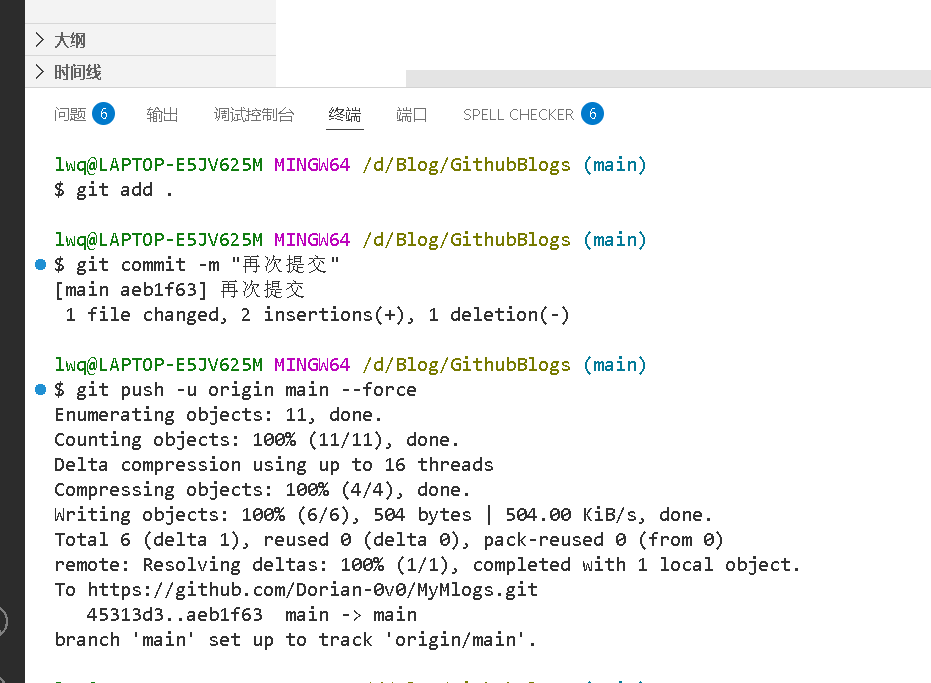
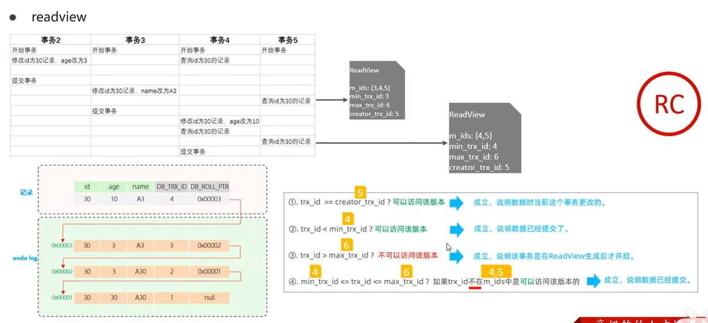

# innoDB存储引擎与MVCC
## innoDB引擎的存储结构
表空间->端->区->页->行
### 表空间
用于存储记录、索引等，所有表空间都由 **页(page)** 组成，
### 段
段是表空间的子结构，每个索引占用两个段：
- 叶子节点段(Leaf Segment)：存储B+树的叶子节点(**数据段**)
- 非叶子节点段(Non-Leaf Segment)：存储B+树的非叶子节点(**索引段**)
- 回滚段(Rollback Segment)：存储undo日志

 段是逻辑概念，不连续存储，段空间分配以区为单位
### 区
分配方式：
- **碎片页**(fragment page)：最初分配32个单独页给段
- **完整区**：当段超过32页后，改为按区分配

设计目的：
-    减少随机I/O(连续空间分配)
-    提高顺序访问性能
-    减少存储碎片
### 页
页(Page)
页是InnoDB的最小I/O单元，也是**管理存储空间的基本单位**：

- 默认大小：16KB(可通过innodb_page_size设置为4K/8K/16K/32K/64K)

 ### 行(Row)
行是实际存储数据的最终单元
## innoDB引擎的架构

### 内存结构
#### **缓冲池：** 
缓冲池是主内存中的一个区域，里面可以存储磁盘上经常操作的真实数据。在执行增删改查操作时，先操作缓冲池中的数据（若缓冲池没有数据，则从磁盘加载到缓冲区），然后再以一定频率刷新到磁盘，从而**减少磁盘I/O，提高处理速度**。 
缓冲池以Page页为单位，底层采用链表结构管理Page。根据状态，将Page分为三种类型：

- **free page**: 空闲页，未被使用。
- **clean page**: 被使用过，数据没有修改过。
- **dirty page**: 脏页，被使用过，数据被修改过，也就是说数据与磁盘的数据产生了不一致。

它是通过预读和延迟写技术来提升数据库性能的关键组件。
#### **更改缓冲区**
更改缓冲区是一种特殊的数据结构，**当相关页不在缓冲池时，用于缓存非唯一二级索引的变更操作(INSERT/UPDATE/DELETE)**，当对应的索引页被加载到缓冲池时（例如通过查询），**更改缓冲区中的相关更改会被合并（merge）到该页，合并后的页会被标记为脏页，随后由后台线程刷新到磁盘。** 
**更改缓冲区的意义：**减少操作磁盘的次数，减少io。

#### **自适应哈希索引**
InnoDB 存储引擎会监控对热表上的各类索引页的查询，**如果观察到某个索引的查询可以提升速度，则建立哈希索引，称之为自适应哈希索引**。用于优化对 Buffer Pool 数据的查询。 
自适应哈希索引，无需人工干预，是系统根据情况自动完成。
#### **日志缓冲区**
日志缓冲区，**用来保存要写入到磁盘中的 log 日志数据（redo log，undo log），默认为大小16MB。日志缓冲区的日志会定期刷新到磁盘中**。如果需要更新，插入或删除许多事务，增加日志缓冲区的大小可以节省磁盘 I/O。
### 磁盘结构
- 空间管理：表空间采用区分配策略减少碎片
- 崩溃恢复：通过redo log和doublewrite保证数据安全
- 版本控制：undo log支持MVCC实现
- 性能优化：预分配空间减少运行时分配开销
## 事务的原理
**实现ACID的原理**
- **原子性、一致性、持久性：都由redolog和undolog来保证**
- **隔离性：由锁机制和MVCC来保证**

---

### redo log和undo log

在innoDB的内存结构里，有缓冲池以及重做缓冲日志（redo log buffer，用于记录事务提交时数据页的变化），而在磁盘结构里有数据库文件以及重做日志文件（redo log file，重做缓冲日志持久化到磁盘的日志文件）。

**WAL：** 任何数据修改必须先写入日志，再写入数据文件，确保即使系统崩溃也能恢复数据。保证事务可以回滚。 

---

### undolog实现事务的原子性
undolog：回滚日志，**用于记录数据被修改前的信息，作用包含两个：提供回滚和 MVCC（多版本并发控制）。**

undo log 是逻辑日志。delete一条记录时，undo log 中会记录一条对应的 insert记录，反之亦然，当 update 一条记录时，它记录一条应对反的update记录。当回滚时，就通过undolog日志里的逻辑记录来读取到相应内容并进行回滚。

事务成功提交之后，不会立即删除undo log，因为可能还会用于MVCC（多版本并发控制）

---

### **redolog与undolog对事务持久性和一致性作用的执行流程：** 
**实现持久性就是将事务修改数据库后的数据存入磁盘，实现持久化。**
1. 开启事务
2. 更新某行数据：
   1. 生成 Undo Log 缓冲日志记录：**在 Undo Log Buffer 中生成记录，用于支持事务回滚和 MVCC**。
   2. 修改缓冲池里数据页的数据（内存里）
   3. 生成 Redo Log 缓冲日志记录：**将修改操作记录到 Redo Log Buffer 中。**
3. 提交事务时将log buffer和Undo Log Buffer刷盘
   1. Redo Log刷盘成功则事务提交成功。
   2. 失败则通过Undo Log Buffer里的undo log日志来实现回滚，回滚操作会生成新的 Redo Log 记录。
4. 异步将脏页写入数据库文件。失败则通过磁盘里的redo log来对磁盘里数据库文件修改。

由上面的执行流程可以看出：**redolog保证脏页刷新失败或系统崩溃时可以通过redolog来实现数据的恢复（redolog是顺序写入，）。undolog确保事务提交失败可以回滚。**

---

### MVCC
MVCC全称 Multi-Version Concurrency Control，多版本并发控制。指维护一个数据的多个版本，使得读写操作没有冲突。MVCC 的具体实现，还要依赖于记录中的**隐藏字段，undo log 日志、readView**。

首先清楚，innodb的默认隔离级别为：**可重复读（简称RR，就是在一个事务开始后，对同一行数据进行的所有读取操作都能看到相同的值，不受其他事务的影响。）**
#### 当前读和快照读
- **当前读：** 总是读取已提交数据的最新版本，并且在读取时会加锁以保证数据一致性。
- **快照读：** 读取的是数据的历史版本（快照，需要undo log），而不是最新数据，不会加锁（除非显式指定）

**快照**是 MySQL 实现 MVCC 提供了一个非阻塞特性。快照是数据库在某一时间点的数据状态视图，它允许：

- 读操作不阻塞写操作

- 写操作不阻塞读操作

- 提供事务隔离的基础
#### 行记录里的隐藏的三个字段
- **DB_TRX_ID**: 最近修改事务 ID，记录插入该条记录或最后一次修改该记录的事务 ID。
- **DB_ROLL_PTR**: 回滚指针，指向该条记录的上一个版本，用于配合 undo log，指向上一个版本。
- **DB_ROW_ID**: 隐藏主键，如果表结构没有指定主键，将会生成该隐藏字段。

#### MVCC实现原理
**undo log版本链**
 

**readview** 
readview即读视图，记录并维护系统当前活跃的事务（未提交的）id。

- **m_ids**：当前活跃的事务ID集合
- **min_trx_id**：最小活跃事务ID
- **max_trx_id**：预分配事务ID，当前最大事务ID+1（因为事务ID是自增的）
- **creator_trx_id**：ReadView创建者的事务ID

**版本链数据访问规则**： 
（trx_id是当前事务ID）
1. **trx_id == creator_trx_id？**  
   可以访问该版本  
   成立，说明数据是当前事务更改的。

2. **trx_id < min_trx_id？**  
   可以访问该版本  
   成立，说明数据已提交了。

3. **trx_id > max_trx_id？**  
   不可以访问该版本  
   成立，说明该事务是在ReadView生成之后启动的。

4. **min_trx_id ≤ trx_id ≤ max_trx_id？**  
   如果trx_id不在m_ids中，是可以访问该版本的。  
   成立，说明数据已经提交。

**RC(读已提交)下的MVCC** 

**RR下的MVCC** 
RR隔离级别下，仅在事务中第一次执行快速读取时生成ReadView，之后继续使用该ReadView。

