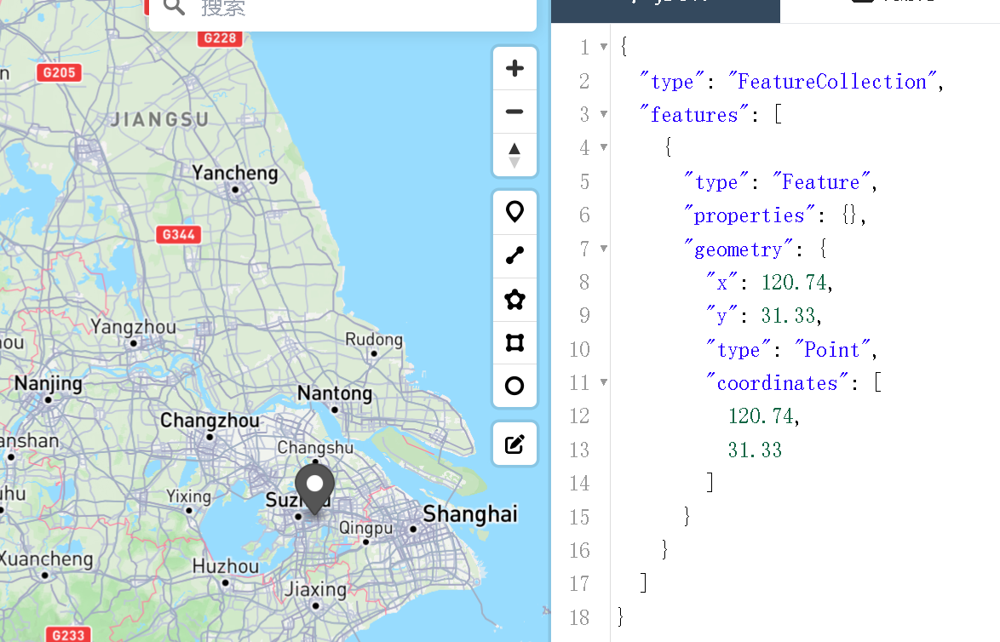

## **MongoDB简介**

MongoDB是一个**开源、高性能、无固定模式、高可用性**的文档型数据库。是NoSQL数据库产品中的一种，是最像关系型数据库（MySQL）的非关系型数据库。

它支持的数据结构非常灵活，是一种类似于JSON的格式叫BSON，所以它既可以存储结构化的数据类型，又相当的灵活。

MongoDB中的记录是一个文档，它是由字段和值（field:value）组成的数据结构。MongoDB文档类似于JSON对象，即一个文档将被认为是一个对象。字段的数据类型是丰富的，它的值可以使用基本的类型，也包括其他文档、普通数组和文档数组。

MongoDB支持丰富的査询语言，支持读和写操作（CRUD），比如数据聚合、文本搜索和地理空间查询等

### mongodb里的基本术语

- **数据库(Database）：** MongoDB 可以包含多个数据库，每个数据库都有自己的集合。数据库是数据的逻辑分组。

- **集合（Collection）**：相当于关系数据库中的表，包含多个文档。
- **文档（Document）**：相当于关系数据库中的行，使用BSON格式存储数据。
  - 文档的数据结构是灵活的，可以根据需要添加不同的字段。
- **键（Key）**：相当于数据库里的字段（区分大小写，不能重复）。

### 应用场景

- **社交场景**
  - 使用 MongoDB存储存储用户信息，以及用户发表的朋友圈信息，通过地理位置索引实现附近的人、地点等功能。
- **游戏场景**
  - 使用 MongoDB存储游戏用户信息，用户的装备、积分等直接以内嵌文档的形式存储，方便查询、高效率存储和访问。

- **物流场景**
  - 使用 MongoDB存储订单信息，订单状态在运送过程中会不断更新，以 MongoDB内嵌数组的形式来存储，一次查询就能将订单所有的变更读取出来

- **物联网场景**

  - 使用 MongoDB存储所有接入的智能设备信息，以及设备汇报的日志信息，并对这些信息进行多维度的分析。

  - 视频直播，使用 MongoDB存储用户信息、点赞互动信息等。

### **不适用场景**

1. **需要复杂事务的金融系统**（尽管支持事务，但不如关系型数据库成熟）。
2. **高度规范化的数据**（如会计系统，多表关联查询频繁）。
3. **对JOIN操作依赖极强的场景**（MongoDB需通过应用层或嵌入文档替代）。

### 这些应用场景中的共同特点是：

**（1）数据量大**

**（2）读写频繁**

**（3）价值较低的数据，对事务性要求不高**

**（4）数据模型多变**

### 高性能与高可用性的实现

MongoDB 通过 **内存加速访问** + **磁盘保障持久化**，实现了高性能与可靠性的平衡。

| **场景**             | **存储位置** | **说明**                              |
| :------------------- | :----------- | :------------------------------------ |
| 正常读写             | 内存 + 磁盘  | 热数据在内存，冷数据在磁盘。          |
| 重启后数据           | 磁盘         | 依赖持久化存储引擎（如 WiredTiger）。 |
| 纯内存模式（企业版） | 仅内存       | 高性能但非持久化，重启后数据丢失。    |

## 安装和配置

下载地址：https://fastdl.mongodb.org/windows/mongodb-windows-x86_64-6.0.22.zip

之后创建mongod.conf文件："...\MongoDB\mongodb-win32-x86_64-windows-6.0.22\conf\mongod.conf"以及存储目录："...\MongoDB\mongodb-win32-x86_64-windows-6.0.22\data\db"，并在内写入：

```bash
storage:
  dbPath: C:\data\db #你的db地址
net:
  port: 27017
  bindIp: 127.0.0.1
```

最后写一个`.bat`的执行脚本

```bat
@echo off  
D:\nacos\MongoDB\mongodb-win32-x86_64-windows-6.0.22\bin\mongod.exe --config=D:\nacos\MongoDB\mongodb-win32-x86_64-windows-6.0.22\conf\mongod.conf  
pause  
```

点击执行这个脚本文件就可以执行了。

最后在浏览器里输入：[localhost:27017](http://localhost:27017/)，看有没有显示如下文本：

```
It looks like you are trying to access MongoDB over HTTP on the native driver port.
```

### idea连接mongodb

如果有一个idea就不要下载别了MongoDb图形化工具，idea内集成了各种数据库图形化工具，只需要安装插件即可。

## 命令操作mongodb（了解）

### 主要特点：

- 一个集合可以包含多个文档，但一个文档只能属于一个集合。
- 文档的数据结构是灵活的，可以根据需要添加不同的字段。

### 数据库操作

- `show dbs` - 显示所有数据库
- `use <db_name>` - 切换到指定数据库（如果不存在则创建）
- `db` - 显示当前使用的数据库
- `db.dropDatabase()` - 删除当前数据库

### 集合操作

- `show collections` - 显示当前数据库中的所有集合
- `db.createCollection("collection_name")` - 创建新集合
- `db.collection_name.drop()` - 删除集合

### CRUD 操作

#### 插入文档

```java
// 插入单个
db.collection_name.insertOne({
  field1: "value1",
  field2: "value2",
  ...
})
//插入多个
db.collection_name.insertMany([
  {field1: "value1", field2: "value2"},
  {field1: "value3", field2: "value4"},
  ...
])
```

#### 查询文档

javascript

```
db.collection_name.find()  // 查询所有文档
db.collection_name.findOne({document})  // 查询单个文档
db.collection_name.find({key: value})  // 条件查询
db.collection_name.find().pretty()  // 格式化输出
```

#### 更新文档

```
// 更新单个文档
db.collection_name.updateOne(
  {filter_field: "filter_value"},  // 筛选条件
  {$set: {field1: "new_value"}}    // 更新操作
)  
// 更新多个文档
db.collection_name.updateMany(
  {filter_field: "filter_value"},
  {$set: {field1: "new_value"}}
) 
 // 替换文档
db.collection_name.replaceOne(
  {filter_field: "filter_value"},
  {new_document}
)
```

#### 删除文档

```
db.collection_name.deleteOne({field: "value"})  // 删除单个文档
db.collection_name.deleteMany({field: "value"})  // 删除多个文档
```

## springboot操作mongodb

#### 先导入依赖

```xml
<dependency> 
	    <groupId>org.springframework.boot</groupId>
	    <artifactId>spring-boot-starter-data-mongodb</artifactId>
	</dependency>
```

#### 在application.yaml里配置

```yaml
# application.yml
spring:
  data:
    mongodb:
      host: localhost
      port: 27017
      database: testdb
      username: user
      password: pass
```

#### 创建实体类

```java
@Document(collection = "users")
@CompoundIndex(def = "{'name': 1, 'age': -1}") //在实体类上定义复合索引：name升序age降序
@Data
public class User {
    @Id // 标记主键
    private String id;
    private String name;
    private Integer age;
    private String email;
     @GeoSpatialIndexed(type = GeoSpatialIndexType.GEO_2DSPHERE)
    private GeoJsonPoint location;  // 使用 Spring Data 的 GeoJsonPoint
}
```

#### 创建 Repository 接口

Spring Data MongoDB 提供了Repository接口：

```java
import org.springframework.data.mongodb.repository.MongoRepository;
// MongoRepository<mongodb集合的实体类, 主键的类型>
public interface UserRepository extends MongoRepository<User, String> {
    // 自定义查询方法
//    User findByName(String name);
//    List<User> findByAgeGreaterThan(int age);
}
```

#### 通过MongoTemplate 进行复杂操作

```java
@Service
public class UserService {
     @Autowired
    private MongoTemplate mongoTemplate;
        // 插入文档
    public User addUser(User user) {
        return mongoTemplate.insert(user);
    }
        // 查询所有
    public List<User> findAll() {
        return mongoTemplate.findAll(User.class);
    }
        // 条件查询
    public List<User> findUsersByName(String name) {
        Query query = new Query(Criteria.where("name").is(name));
        return mongoTemplate.find(query, User.class);
    }
        // 更新文档
    public void updateUserEmail(String name, String newEmail) {
        Query query = new Query(Criteria.where("name").is(name));
        Update update = new Update().set("email", newEmail);
        mongoTemplate.updateFirst(query, update, User.class);
    }
        // 删除文档
    public void deleteUser(String id) {
        Query query = new Query(Criteria.where("id").is(id));
        mongoTemplate.remove(query, User.class);
    }
    // 范围查询
    public List<Place> findNearbyPlaces(double longitude, double latitude, double distanceInMeters) {
    // 1. 构造中心点
    Point center = new Point(longitude, latitude);
        // 2. 构造距离范围
    Distance radius = new Distance(distanceInMeters, Metrics.METERS);
        // 3. 创建查询条件
    Query query = Query.query(
        Criteria.where("location")
               .nearSphere(center)  // 球面距离计算
               .maxDistance(radius.getNormalizedValue())  // 转换为弧度
    ); 
        // 4. 执行查询
    return mongoTemplate.find(query, Place.class);
    }
}
```

## Mongodb操作Geojson格式的数据

```java
@GetMapping("/quary")
    public GeoJsonPoint quaryDriver() {
        Driver driver = new Driver();
        GeoJsonPoint location = new GeoJsonPoint(120.74, 31.33); // 经度和纬度
        driver.setLocation(location);
        driver.setPlateNumber("浙A12345");
        driver.setAcceptCustomerDistance(5f);
        driver.setAcceptOrderDistance(20f);
        driver.setStatus(1);
        System.out.println(driver.getLocation());
        return driver.getLocation();
    }
```

首先要认识到，springboot操作Mongodb里的地理空间数据虽然**使用sout打印**出来的结果类似于下面的情况：

```
Point [x=120.740000, y=31.330000]
```

但是如果是前端请求得到的响应里的数据是下面这样:

```
{"x":120.74,"y":31.33,"type":"Point","coordinates":[120.74,31.33]}
```

**上面的这个是一个geojson格式的的数据（虽然前面有x和y，但依旧可以渲染在地图上）**，这是Spring Data MongoDB 的序列化行为

Geojson网页在线加载：https://geojson.io/


