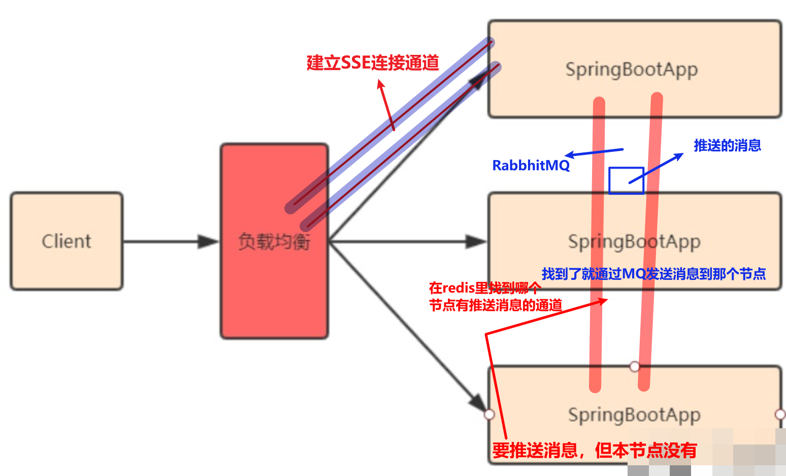
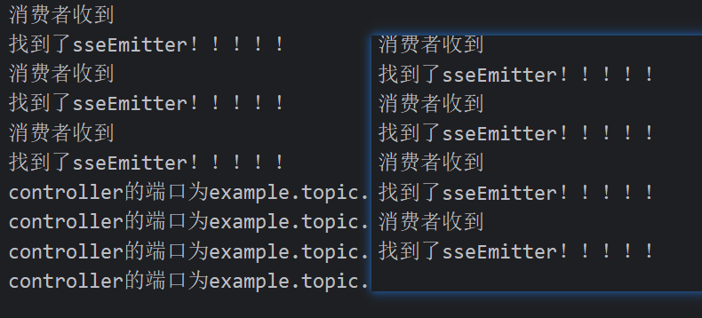
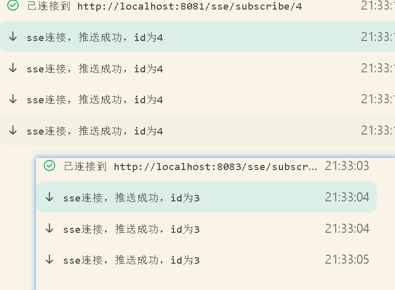

## SSE连接介绍，SSE对比WebSocket

**Server-Sent Events (SSE)** 是一种基于 HTTP 协议的轻量级实时通信技术，允许服务器向客户端推送数据。以下是 SSE 的主要特点：

- **单向通信**：SSE 仅支持服务器向客户端推送数据，客户端不能通过同一连接向服务器发送数据。
- **简单易用**：基于 HTTP 协议，浏览器原生支持，无需额外库或插件。
- **持久连接**：采用 HTTP 长连接，服务器可以持续向客户端发送数据流。
- **纯文本传输**：数据以纯文本格式传输，消息之间以换行符分隔，便于解析和调试。
- **自动重连机制**：连接断开时，浏览器会自动尝试重新连接。
- **轻量级协议**：相比 WebSocket，SSE 更轻量，实现简单。


| 特性             | SSE                        | WebSocket                    |
| ---------------- | -------------------------- | ---------------------------- |
| **通信方向**     | 单向（服务器 → 客户端）    | 全双工（服务器 ↔ 客户端）    |
| **协议基础**     | 基于 HTTP                  | 独立协议（ws:// 或 wss://）  |
| **数据格式**     | 纯文本                     | 二进制或文本                 |
| **自动重连**     | 内置支持                   | 需手动实现                   |
| **浏览器兼容性** | 除 IE 外主流浏览器支持     | 所有现代浏览器支持           |
| **适用场景**     | 服务器向客户端推送实时数据 | 双向交互场景（如聊天、游戏） |
| **连接管理**     | 简单（HTTP 状态码控制）    | 复杂（需处理多种帧类型）     |
| **数据传输速度** | 较高（依赖 HTTP 层）       | 低延迟（二进制帧）           |
| **跨域支持**     | 需通过 CORS 配置           | 支持跨域                     |

- **SSE**：适用于服务器向客户端单向推送数据的场景，如实时新闻、股票行情、日志更新等。它简单、轻量，适合已有 HTTP 架构的项目。
- **WebSocket**：适用于需要双向实时通信的场景，如聊天应用、多人协作、在线游戏等。虽然实现复杂度较高，但功能更强大，延迟更低。

## 代码实现SSE

#### 后端springboot实现

```java
@RestController
@RequestMapping("/sse")
@Slf4j
public class SseController {
    // 发送sse消息的发送器
    private final Map<Long, SseEmitter> driverEmitters = new ConcurrentHashMap<>();
 @GetMapping("/{id}")
    public String publisher(@PathVariable("id") Long id) { // 消息发布
        SseEmitter sseEmitter = driverEmitters.get(id);
        if (Objects.isNull(sseEmitter)) {
            return "id不存在";
        }
        try {
            SseEmitter.SseEventBuilder event = SseEmitter.event()
                    .id(UUID.randomUUID().toString()) // 每个事件都有唯一ID
                    .name("message") // 事件名称，与前端对应
                    .data("sse连接，推送成功，id为"+id)
                    .reconnectTime(30000); // 重连时间
            sseEmitter.send(event);
        } catch (IOException e) {
            throw new RuntimeException(e);
        }
        return "发送了消息";
    }

    // 订阅消息，消息通道使用这个接口建立连接，同时
    // 消息也是通过这个通道传输，消息的传输依赖于那
    // 个map里的发送器SseEmitter，发送器SseEmitter
    // 可以在别的方法里（只要是存入了map里的就可以）
 	@GetMapping("/subscribe/{id}")
    public SseEmitter subscribe(@PathVariable("id") Long id, HttpServletResponse response) {
        // 设置响应头
        response.setContentType("text/event-stream");
        response.setCharacterEncoding("UTF-8");
        // 检查是否已存在该ID的Emitter
        SseEmitter sseEmitter = driverEmitters.get(id);

        // 如果不存在则创建新的Emitter
        if (Objects.isNull(sseEmitter)) {
            // 创建新的SseEmitter实例，设置超时时间为1小时（3600000毫秒）
            sseEmitter = new SseEmitter(3600000L);

            // 设置完成回调：当客户端断开连接时自动清理Map中的Emitter
            sseEmitter.onCompletion(() -> {
                driverEmitters.remove(id);
                log.info("SSE连接已完成/关闭，ID: {}", id);
            });

            // 设置超时回调：当连接超时时自动清理Map中的Emitter
            sseEmitter.onTimeout(() -> {
                driverEmitters.remove(id);
                log.warn("SSE连接超时，ID: {}", id);
            });

            // 设置错误处理
            sseEmitter.onError((ex) -> {
                driverEmitters.remove(id);
                log.error("SSE连接发生错误，ID: {}，错误信息: {}", id, ex.getMessage());
            });

            // 将新创建的Emitter存入Map
            driverEmitters.put(id, sseEmitter);
            log.info("创建新的SSE连接，ID: {}", id);
        }

        return sseEmitter;
    }
}
```

SSE (Server-Sent Events) 的**超时时间是指服务器端连接客户端发送消息的通道保持打开的最长时间**。如果在这个时间内没有任何数据传输或客户端没有保持连接，服务器会自动关闭连接并触发超时回调。**如果有消息发送但还是不会自动重置超时时间**。

**默认的超时时间通常较短（如30秒左右）**，对于实际应用来说可能不够，特别是需要长时间保持连接的场景。

#### 前端发送请求

```javascript
import { ref, onMounted ,onBeforeUnmount} from 'vue';

// 模拟发送请求到后端
import { MqService } from "@/api/order"
const msg = ref("")
const result = ref("")
const send = async () => {
  let res = await MqService(); // 发送请求
  msg.value = res.data // 接收到的响应
}
let eventSource = null;

// 组件卸载时关闭连接
onBeforeUnmount(() => {
  if (eventSource) {
    eventSource.close();
    eventSource = null;
    console.log('SSE连接已关闭');
  }
});

// 连接SSE
const connectSSE = async() => {
  const id = 3

  // 先关闭已有连接
  if (eventSource) {
    eventSource.close();
    eventSource = null;
  }

  // 监听
  eventSource = new EventSource(`http://localhost:8082/simulate/sse/subscribe/${id}`);

  eventSource.addEventListener('message', (e) => {
    showMessageBox(e.data); // 监听事件名称，与后端对应
    console.log('收到消息:', e.data);
    });

  eventSource.onopen = () => {
    console.log('SSE连接已建立');
  };

  eventSource.onerror = (error) => {
    console.error('SSE连接错误:', error);
  };
};

onMounted(()=>{
    connectSSE() // 页面开始就建立连接
})
```

## 基于RabbitMQ+Redis解决后端集群情况下SSE通道的跨节点事件推送

如果是单个节点在后台运行，那么SSE通道始终连接这个节点和前端，但是由于实际项目需要集群部署，

#### **但是集群部署存在下面的问题：**

**就是前端（用户id为1）发送的请求被负载均衡到各个节点，如果是建立SSE连接的请求发送到某个节点（8081），那么这个节点（8081）收到请求后会和前端（用户id为1）建立SSE连接通道。**

**这时前端（用户id为1）发送请求到另一个节点（8083），这个节点处理请求的方法里还包括通过SSE通道推送消息最后返回响应的过程，但由于本节点（8083）没有SSE通道与前端（用户id为1）来推送消息。**

**所以就需要实现集群节点之间的通信，所以，需要用到集群之外的中间件——RabbitMQ和Redis**



**对此，每个节点的队列的名字和路由Key要唯一，且和集群的每个节点一一对应，对此，笔者采取了将springboot单节点的端口号为共同标识来命名路由key和队列。**

#### **但是实现该过程有一个非常不好解决的问题：**

就是这么在RabbitMQ相关的Bean对象注入到IOC容器前获得运行的springboot的端口号，对此，笔者试验了2天，最终通过Bean对象懒加载（**加上@Lazy注解，只有springboot启动阶段完成后需要此对象时才加载**）的方式来解决这个问题。

#### **最终代码如下**

##### 创建的以端口号（port）为共同标识的消息队列

```java
@Configuration
public class RabbitMQTopicConfig {
    // 定义Topic交换机名称
    public static final String TOPIC_EXCHANGE_NAME = "example.topic.exchange";

    // 定义队列名称
    public static final String TOPIC_QUEUE_NAME = "example.topic.queue.";

    // 定义路由键模式
    public static final String TOPIC_ROUTING_KEY = "example.topic.";

    public static Integer Port; // 端口号在springboot初始化阶段才会加载
    @Bean
    public ApplicationListener<WebServerInitializedEvent> portInitializer() {
        return event -> {
            Port = event.getWebServer().getPort();
            System.out.println("Application port is: " + Port);
        };
    }

    // 创建Topic交换机
    @Bean
    @Lazy
    @Order(1)
    public TopicExchange topicExchange() {
        return new TopicExchange(TOPIC_EXCHANGE_NAME);
    }

    // 创建队列
    @Bean
    @Lazy
    @Order(2)
    public Queue topicQueue() {
        System.out.println(TOPIC_QUEUE_NAME + Port + "=====");
        return new Queue(TOPIC_QUEUE_NAME + Port, true); // true表示持久化
    }
    
    @Bean
    @Lazy
    @Order(3)
    public Binding topicBinding(Queue topicQueue, TopicExchange topicExchange) {
        System.out.println(TOPIC_ROUTING_KEY + Port + "======");
        return BindingBuilder.bind(topicQueue)
                .to(topicExchange)
                .with(TOPIC_ROUTING_KEY + Port);
    }
}
```

##### controller层

```java
@RestController
@RequestMapping("/sse")
@Slf4j
@Lazy // 只有接收了一个请求该类才会创建加载到IOC容器
public class SseController {
    // 此虚拟机用于存储的SSE通道
    private final Map<Long, SseEmitter> driverEmitters = new ConcurrentHashMap<>();
    public static final String Driver_Emitters_Keys = "driver:Emitters";
    @Autowired
    private RabbitTemplate rabbitTemplate;
    @Autowired
    private RedisTemplate redisTemplate;

    @GetMapping("/{id}")
    public String publisher(@PathVariable("id") Long id) { // 消息发布
        Integer port = (Integer) redisTemplate.opsForHash().get(Driver_Emitters_Keys, id);
        if (port == null) {
            return id + "对应的通道没有找到";
        }
        String routingKey = TOPIC_ROUTING_KEY + port;
        System.out.println("controller的端口为" + routingKey);
        rabbitTemplate.convertAndSend(TOPIC_EXCHANGE_NAME, routingKey, id);
        return "发送了消息";
    }

    @RabbitListener(queues = "#{@topicQueue.name}") //监听该节点创建的队列
    public void sendSse(Long id) {
        System.out.println("消费者收到");
        SseEmitter sseEmitter = driverEmitters.get(id);
        if (Objects.isNull(sseEmitter)) {
            System.out.println("没有找到sseEmitter");
            return;
        }
        try {
            System.out.println("找到了sseEmitter！！！！！");
            SseEmitter.SseEventBuilder event = SseEmitter.event()
                    .data("sse连接，推送成功，id为" + id);
            sseEmitter.send(event);
        } catch (IOException e) {
            throw new RuntimeException(e);
        }
    }

    @GetMapping("/subscribe/{id}")
    public SseEmitter subscribe(@PathVariable("id") Long id, HttpServletResponse response) {
        response.setContentType("text/event-stream");
        response.setCharacterEncoding("UTF-8");
        // 检查是否已存在该ID的Emitter
        SseEmitter sseEmitter = driverEmitters.get(id);
        // 如果不存在则创建新的Emitter
        if (Objects.isNull(sseEmitter)) {
            // 创建新的SseEmitter实例，设置超时时间为1小时（3600000毫秒）
            sseEmitter = new SseEmitter(3600000L);

            // 设置完成回调：当客户端断开连接时自动清理Map中的Emitter
            sseEmitter.onCompletion(() -> {
                driverEmitters.remove(id);
                log.info("SSE连接已完成/关闭，ID: {}", id);
            });

            // 设置超时回调：当连接超时时自动清理Map中的Emitter
            sseEmitter.onTimeout(() -> {
                driverEmitters.remove(id);
                log.warn("SSE连接超时，ID: {}", id);
            });

            // 设置错误处理
            sseEmitter.onError((ex) -> {
                driverEmitters.remove(id);
                log.error("SSE连接发生错误，ID: {}，错误信息: {}", id, ex.getMessage());
            });


            // 将新创建的Emitter存入Map
            driverEmitters.put(id, sseEmitter);
            System.out.println("存入redis的端口号为" + RabbitMQTopicConfig.Port);
            redisTemplate.opsForHash().put(Driver_Emitters_Keys, id, RabbitMQTopicConfig.Port);
            log.info("创建新的SSE连接，ID: {}", id);
        }
        return sseEmitter;
    }
}
```

使用下面4个请求测试

http://localhost:8081/sse/3

http://localhost:8083/sse/4

http://localhost:8083/sse/subscribe/3

http://localhost:8081/sse/subscribe/4

可见两个消费者都接收到了消息



