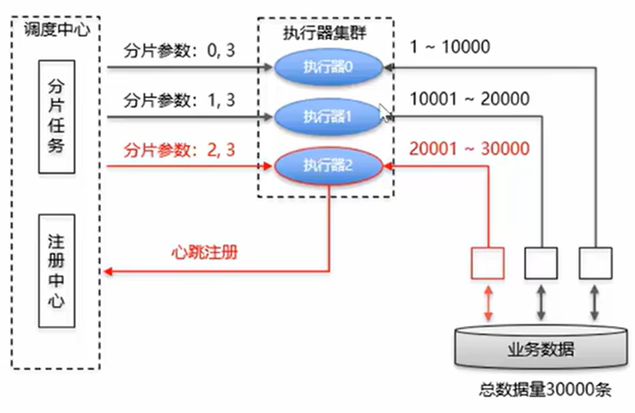
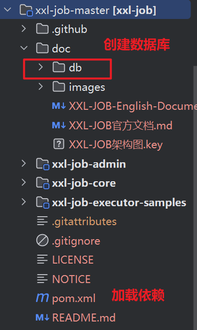
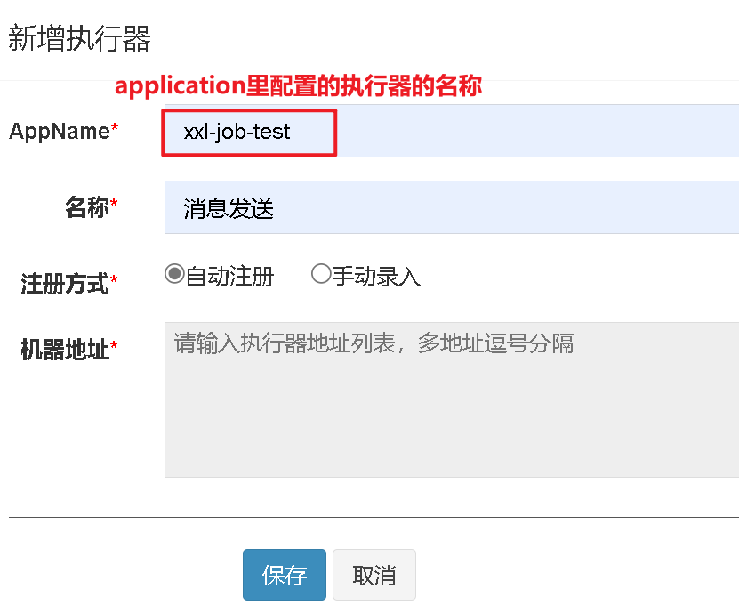
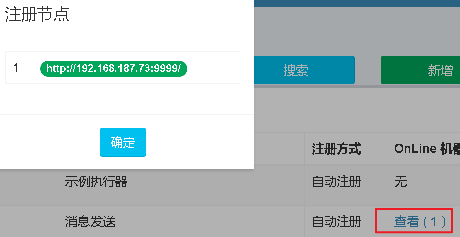
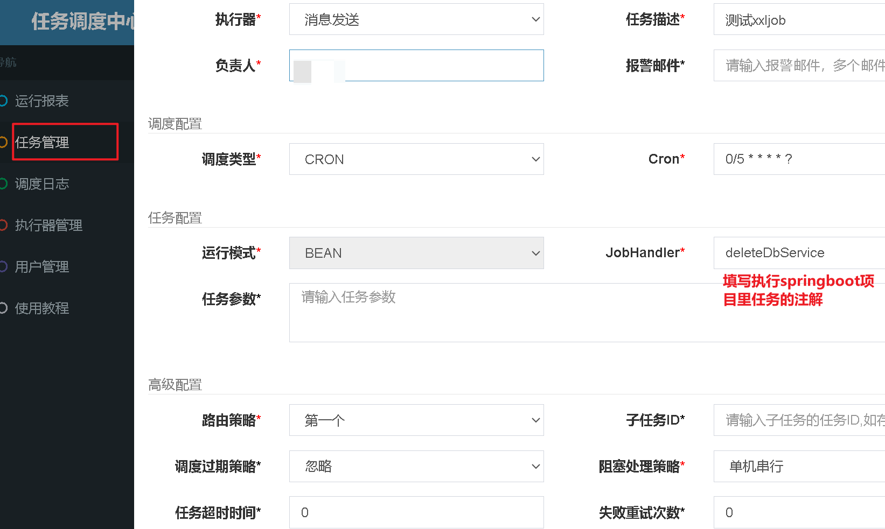
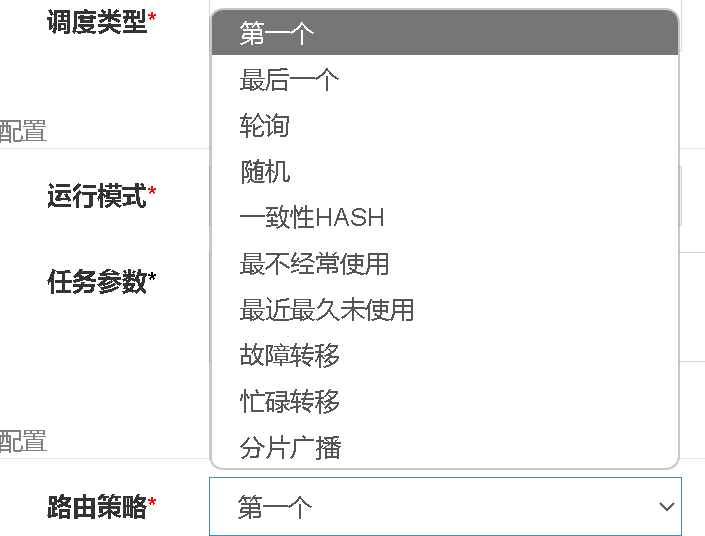

# XXL-job介绍

## 基本介绍和术语

XXL-JOB 是一个分布式任务调度平台，其核心设计目标是开发简单、易用、易扩展、分布式的任务调度解决方案。

1. **调度中心**：负责管理调度信息，发出调度请求（单独部署的服务）
2. **执行器**：负责接收调度请求并执行任务逻辑（集成到项目里的）

XXL-JOB 适用于各种定时任务场景，如：

- 数据同步
- 报表生成
- 数据清理
- 定时通知
- 其他需要定时或周期性执行的任务

XXL-JOB 因其轻量级、易扩展和丰富的功能，已成为国内广泛使用的开源任务调度框架之一。

## 分片原理



## 使用步骤

#### 一、下载源码

[xxl-job: 一个分布式任务调度平台，其核心设计目标是开发迅速、学习简单、轻量级、易扩展。现已开放源代码并接入多家公司线上产品线，开箱即用。](https://gitee.com/xuxueli0323/xxl-job/)

#### 二、创建数据库，加载pom文件里的依赖



运行admin项目

进入调度中心：[任务调度中心](http://localhost:8085/xxl-job-admin/toLogin)

登录的账号密码分别为：admin，123456

#### 三、现有的springboot项目整合XXL-job

##### 1. 导入依赖，本地的springboot项目要和xxljob独立项目的xxljob依赖的版本号相同

```xml
<dependency>
    <groupId>com.xuxueli</groupId>
    <artifactId>xxl-job-core</artifactId>
    <version>2.4.0</version>
</dependency>
```

##### 2.配置application文件

```yaml
xxl:
  job:
  	accessToken: default_token # 一定要指定token，不然发送不了http请求
    admin:
      addresses: http://127.0.0.1:8085/xxl-job-admin
    executor:
      appname: your-app-name
      port: 9999
      logpath: /data/applogs/xxl-job # 日志的路径
      logretentiondays: 30  # 默认保存30天
```

##### 3.配置config配置类

可以去拷贝xxljob的springboot实例代码：**com.xxl.job.executor.core.config.XxlJobConfig**

```java
@Configuration
public class XxlJobConfig {
    private Logger logger = LoggerFactory.getLogger(XxlJobConfig.class);

    @Value("${xxl.job.admin.addresses}")
    private String adminAddresses;

    @Value("${xxl.job.executor.appname}")
    private String appname;

    @Value("${xxl.job.executor.address}")
    private String address;

    @Value("${xxl.job.executor.ip}")
    private String ip;

    @Value("${xxl.job.executor.port}")
    private int port;

    @Value("${xxl.job.accessToken}")
    private String accessToken;

    @Bean
    public XxlJobSpringExecutor xxlJobExecutor() {
        logger.info(">>>>>>>>>>> xxl-job config init.");
        XxlJobSpringExecutor xxlJobSpringExecutor = new XxlJobSpringExecutor();
        xxlJobSpringExecutor.setAdminAddresses(adminAddresses);
        xxlJobSpringExecutor.setAppname(appname);
        xxlJobSpringExecutor.setAddress(address);
        xxlJobSpringExecutor.setIp(ip);
        xxlJobSpringExecutor.setAccessToken(accessToken);
        xxlJobSpringExecutor.setPort(port);
        return xxlJobSpringExecutor;
    }
    /**
     * 针对多网卡、容器内部署等情况，可借助 "spring-cloud-commons" 提供的 "InetUtils" 组件灵活定制注册IP；
     *
     *      1、引入依赖：
     *          <dependency>
     *             <groupId>org.springframework.cloud</groupId>
     *             <artifactId>spring-cloud-commons</artifactId>
     *             <version>${version}</version>
     *         </dependency>
     *
     *      2、配置文件，或者容器启动变量
     *          spring.cloud.inetutils.preferred-networks: 'xxx.xxx.xxx.'
     *
     *      3、获取IP
     *          String ip_ = inetUtils.findFirstNonLoopbackHostInfo().getIpAddress();
     */
}
```

##### 4.在任务调度中心创建执行器



创建执行器之后，分别运行XxlJobAdminApplication以及本地的springboot项目，就可以看到调度中心扫描到了执行器：



##### 5.创建一个job的包，里面存放要执行的任务

```java
@Slf4j
@Service
public class deleteDbService {
    @XxlJob("deleteDbService") // JobHandler
    public void deleteDb() {
        System.out.println("XXL-JOB, Hello World.");
    }
}  
```

##### 6.将执行的任务注册到调度中心



**之后就可以执行任务查看效果**

## 路由策略介绍




### 常见路由策略对比

| 策略名称       | 特点                                       | 适用场景                             |
| :------------- | :----------------------------------------- | :----------------------------------- |
| 第一个         | 固定选择第一个执行器                       | 测试环境、单机部署                   |
| 最后一个       | 固定选择最后一个执行器                     | 测试环境、特定节点执行               |
| **轮询**       | 依次选择集群中的每个执行器                 | **常规集群部署，均匀分配负载**       |
| 随机           | 随机选择集群中的一个执行器                 | 常规集群部署，简单负载均衡           |
| 一致性HASH     | 相同参数总是路由到同一台机器               | 需要保证相同参数由固定节点处理的场景 |
| 最不经常使用   | 选择使用频率最低的节点                     | 长期运行任务，避免单节点过载         |
| 最近最久未使用 | 选择最久未被调用的节点                     | 短期任务，避免热点节点               |
| 故障转移       | 失败后自动转移到其他节点重试               | 高可用要求高的场景                   |
| 忙碌转移       | 检测到节点忙碌时自动转移到其他空闲节点     | 任务执行时间不固定，避免任务堆积     |
| 分片广播       | **所有节点同时执行，每个节点处理部分数据** | 大数据处理、并行计算场景             |

### 分片广播相关代码介绍

```java
@XxlJob("shardingJobHandler")
public void shardingJobHandler() {
    // 获取分片参数
    int shardIndex = XxlJobHelper.getShardIndex();
    int shardTotal = XxlJobHelper.getShardTotal();
    
    XxlJobHelper.log("分片参数：当前分片序号={}, 总分片数={}", shardIndex, shardTotal);
}        
```

**分片总数等于当前集群中==注册的健康执行器节点总数==**

