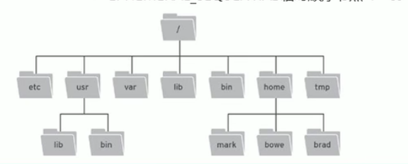

## 初始Zookeeper

zookeeper 是 Apache Hadoop 项目下的一个子项目，是一个树形目录服务。

zookeeper 翻译过来就是动物园管理员，他是用来管 Hadoop（大象）、Hive（蜜蜂）、Pig（小猪）的管理员。简称 zk。

Zookeeper 是一个分布式的、开源的分布式应用程序的协调服务。

提供的主要功能包括：

- 配置管理
- 分布式锁
- 集群管理

## Zookeeper 数据模型

- ZooKeeper 是一个树形目录服务，其数据模型和 Unix 的文件系统目录结构很类似，拥有一个层次化结构。
- 这里面的每一个节点都被称为：ZNode ，每个节点上都会保存自己数据和节点信息。
- 节点可以拥有子节点，同时也允许少量（1MB）数据存储在该节点之下。
- 节点可以分为四大类：
  - PERSISTENT 持久化节点
  - EPHEMERAL 临时节点：-e
  - PERSISTENT_SEQUENTIAL 持久化顺序节点：-s
  - EPHEMERAL_SEQUENTIAL 临时顺序节点：-es



## 安装与配置

相关的docker-compose.yaml文件

```yaml
version: '3.8'

services:
  zookeeper:
    image: zookeeper:3.8.1
    container_name: zookeeper
    ports:
      - "2181:2181"
    environment:
      ZOO_MY_ID: 1
      ZOO_SERVERS: server.1=zookeeper:2888:3888;2181
    volumes:
      - /DataFilm/zookeeper/data:/data
    restart: unless-stopped
```

```bash
# 创建并启动容器（后台运行）
docker-compose up -d
```

**进入容器执行命令**

```bash
docker exec -it zookeeper zkCli.sh

#查看子节点
ls /
- 连接ZooKeeper服务器端  
  `.zkCli.sh --server ip:port`

- 断开连接  
  `quit`

- 查看命令帮助  
  `help`

- 显示指定目录下节点  
  `ls 目录`

- 创建节点  
  `create /节点path value`

- 获取节点值  
  `get /节点path`

- 设置节点值  
  `set /节点path value`

- 删除单个节点  
  `delete /节点path`

- 删除带有子节点的节点  
  `deleteall /节点path`
```

## java的Zookeeper API

Curator 是 Apache ZooKeeper 的 Java 客户端库。

常见的 ZooKeeper Java API：

- 原生 Java API
- ZkClient
- Curator

Curator 项目的目标是简化 ZooKeeper 客户端的使用。

**Zookeeper API常用操作**

- 建立连接
- 添加节点
- 删除节点
- 修改节点
- 查询节点
- Watch事件监听
- 分布式锁实现

#### 第一步、配置依赖和环境

```xml
<dependency>
    <groupId>org.apache.curator</groupId>
    <artifactId>curator-framework</artifactId>
    <version>5.5.0</version>
</dependency>
<dependency>
    <groupId>org.apache.curator</groupId>
    <artifactId>curator-recipes</artifactId>
    <version>5.5.0</version>
</dependency>
<!-- 如果需要测试，可以添加curator-test -->
<dependency>
    <groupId>org.apache.curator</groupId>
    <artifactId>curator-test</artifactId>
    <version>5.5.0</version>
    <scope>test</scope>
</dependency>
```

application文件

```yaml
zookeeper:
  connect-string: server1:2181,server2:2181,server3:2181  # 多个地址用逗号分隔      
  session-timeout: 60000               # 会话超时时间（毫秒）
  connection-timeout: 15000            # 连接超时时间（毫秒）
  base-sleep-time: 1000                # 初始重试等待时间（毫秒）
  max-retries: 3                       # 最大重试次数
  can-be-read-only: false  # 集群特有配置
  default-acl: world:anyone:cdrwa  # ACL权限控制
```

#### 第二步、配置类

```java
@Configuration
public class ZookeeperConfig {

    @Value("${zookeeper.connect-string}")
    private String connectString;

    @Value("${zookeeper.session-timeout}")
    private int sessionTimeout;

    @Value("${zookeeper.connection-timeout}")
    private int connectionTimeout;

    @Value("${zookeeper.base-sleep-time}")
    private int baseSleepTime;

    @Value("${zookeeper.max-retries}")
    private int maxRetries;

    @Bean(destroyMethod = "close")
    public CuratorFramework curatorFramework() {
        RetryPolicy retryPolicy = new ExponentialBackoffRetry(baseSleepTime, maxRetries);
        CuratorFramework client = CuratorFrameworkFactory.builder()
                .connectString(connectString)
                .sessionTimeoutMs(sessionTimeout)
                .connectionTimeoutMs(connectionTimeout)
                .retryPolicy(retryPolicy)
                .namespace("myZookeeper")
                .build();
        client.start();
        System.out.println("启动zookeeper");
        return client;
    }
}
```

#### 其余：增删改查

```java
class ZookeeperTest {
    @Autowired
    private CuratorFramework curatorFramework;

    // 创建节点
    @Test
    void testGeoServerEndpoint() throws Exception {
        curatorFramework.create() // 创建一个新的 ZooKeeper 节点
                .creatingParentsIfNeeded()  // 如果父节点不存在，会自动创建所需的父节点（在这里如果/app1的父节点/不存在，会自动创建）
                .withMode(CreateMode.PERSISTENT)  // 创建持久节点,节点在客户端断开连接后仍然存在
                .forPath("/app1", "hello".getBytes());  // 节点路径和数据
    }
    
    // 获取节点的值
    @Test
    void getNodeData() throws Exception { // 路径注意加‘/’
byte[] data = curatorFramework.getData().forPath("/app2"); // 相当于访问myZookeeper/app2节点
        System.out.println(new String(data));
    }

    // 更新节点
    @Test
    void updateNodeData() throws Exception {
        curatorFramework.setData().forPath("/app2", "pppppp".getBytes());
    }
    
    // 获取某个节点的所有儿子节点名称
    @Test
    public void testGet1() throws Exception {
        List<String> strings = curatorFramework.getChildren().forPath("/");
        System.out.println(strings);
    }
    
    //递归删除指定节点及其所有子节点
    @Test
    void deleteNode() throws Exception {
        curatorFramework.delete()
                .guaranteed()
                .deletingChildrenIfNeeded()
                .forPath("/app2");
    }
    /*
1. 删除单个节点: delete().forPath("/app1");
2. 删除所有子节点的节点: delete().deletingChildrenIfNeeded().forPath("/app1");
3. 必须成功删除:为了防止网格抖动。本质是client.delete().guaranteed().forPath("/app2");
4. 回滚: inBackground
#throws Exception
*/
    
    @Test
void deleteNode() throws Exception {
    curatorFramework.delete()
            .guaranteed()
            .deletingChildrenIfNeeded()
            .inBackground((client, event) -> {
                if (event.getResultCode() == KeeperException.Code.OK.intValue()) {
                    System.out.println("节点删除成功: " + event.getPath());
                    // 这里添加你的成功回调逻辑
                } else {
                    System.err.println("节点删除失败: " + event.getPath());
                    // 这里添加你的失败处理逻辑
                }
            })
            .forPath("/app2");
    
    // 由于是异步操作，可能需要等待一下
    Thread.sleep(1000);
}
    
}
```

## Watch事件监听

 ZooKeeper 允许用户在指定节点上注册一些 Watcher，并在一些特定事件触发的时候，ZooKeeper 服务器端将事件通知到感兴趣的客户端上去，该机制是 ZooKeeper 实现分布式协调服务的重要特性。

**ZooKeeper 提供了三种Watcher：** 

- NodeCache：只是监听某一个特定的节点 
- PathChildrenCache：监控一个ZNode的子节点
- TreeCache：可以监控整个树上的所有节点，类似于PathChildrenCache和NodeCache的组合

```java
@Component
public class ZkNodeListener {
    
    private final CuratorFramework curatorFramework;
    private NodeCache nodeCache;
    
    @Autowired
    public ZkNodeListener(CuratorFramework curatorFramework) {
        this.curatorFramework = curatorFramework;
    }
    
    // 节点数据变化监听
    @PostConstruct
    public void init() throws Exception {
        // 监听/app/config节点
        nodeCache = new NodeCache(curatorFramework, "/app/config");
        nodeCache.getListenable().addListener(() -> {
            ChildData currentData = nodeCache.getCurrentData();
            if (currentData != null) {
                String data = new String(currentData.getData());
                System.out.println("配置变更，新值: " + data);
                // 这里可以添加业务处理逻辑
            } else {
                System.out.println("配置节点被删除");
            }
        });
        nodeCache.start(true);
    }
    
    @PreDestroy
    public void destroy() {
        CloseableUtils.closeQuietly(nodeCache);
    }
}
```

## 常见的 ZooKeeper 使用场景

### 1.分布式锁

### 2.**配置管理**

**动态配置中心**：将全局配置（如数据库连接、服务参数）存储在 ZooKeeper 节点上，应用启动时拉取配置并监听变更，实现配置的实时更新。

1. **服务注册与发现**：让服务实例注册到Zookeeper，客户端可以动态发现并调用服务，支持微服务架构。
