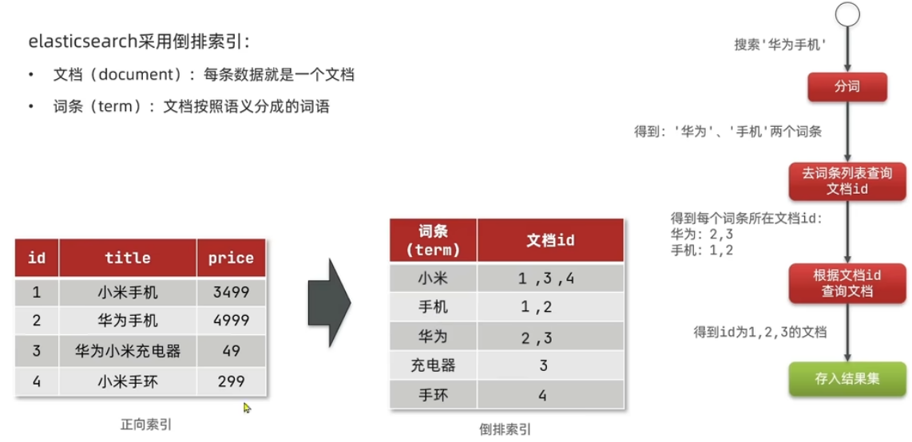
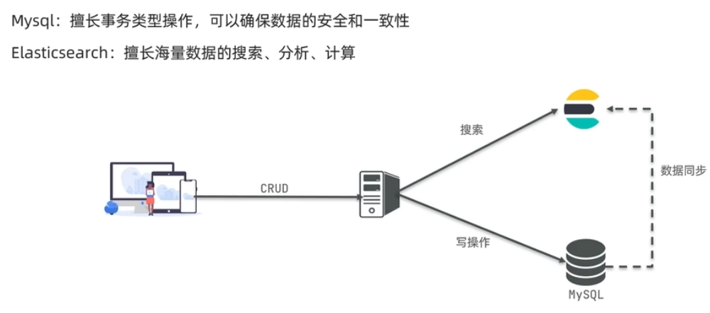
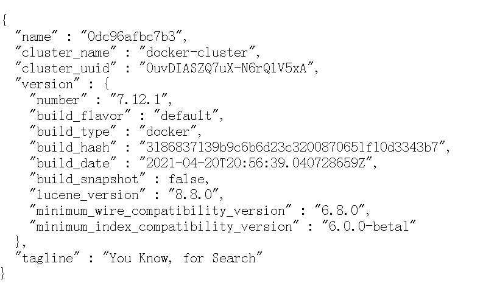

## Elasticsearch介绍

Elasticsearch 是一个基于开源的分布式搜索和分析引擎，旨在实现高速、实时的数据检索，特别适合处理大规模的文本和结构化数据。

### 正向索引

- **定义**：将文档中的所有词汇按照原始顺序存储，记录每个文档包含的所有词及其位置（如词频、位置等）。

```
Document 1: "搜索引擎技术的发展"
正向索引： {ID:1, 内容: ["搜索", "引擎", "技术", "的发展"]}
```

### 倒排索引

elasticsearch 采用倒排索引：

- 文档（document）：每条数据就是一个文档
- 词条（term）：文档按照语义分成的词语
- 索引：相同类型的文档集合


**倒排索引：** **对文档内容分词，对词条创建索引，并记录词条所在文档的信息。查询时先根据词条查询到文档id，后获取到文档**



### 架构



## 安装与配置

### elasticsearch安装配置

配置网络

```
docker network create es-net
```

拉取镜像

```
docker pull elasticsearch:7.12.1
```

运行容器

```
docker run -d \
  --name elasticsearch \
  -e "ES_JAVA_OPTS=-Xms512m -Xmx512m" \
  -e "discovery.type=single-node" \
  -v es-data:/DataFilm/elasticsearch/data \
  -v es-plugins:/DataFilm/elasticsearch/plugins \
  --privileged \
  --network es-net \
  -p 9200:9200 \
  -p 9300:9300 \
  elasticsearch:7.12.1
```

```
http://localhost:9200/
```

安装成功



### kibana安装配置

拉取镜像

```
docker pull kibana:7.12.1
```

运行镜像创建容器

```
docker run -d --name kibana -e ELASTICSEARCH_HOSTS=http://elasticsearch:9200 --network=es-net -p 5601:5601 kibana:7.12.1
```

访问

```
http://localhost:5601
```

选择：Explore on my own

### 分词器插件安装

安装地址：[索引： analysis-ik/stable/](https://release.infinilabs.com/analysis-ik/stable/)

[07-初识ES-安装IK分词器_哔哩哔哩_bilibili](https://www.bilibili.com/video/BV1b8411Z7w5?spm_id_from=333.788.player.switch&vd_source=3c46a0d84476a55380be0c2ddd012af1&p=7)

使用：

```
http://localhost:5601/app/dev_tools#/console
```

