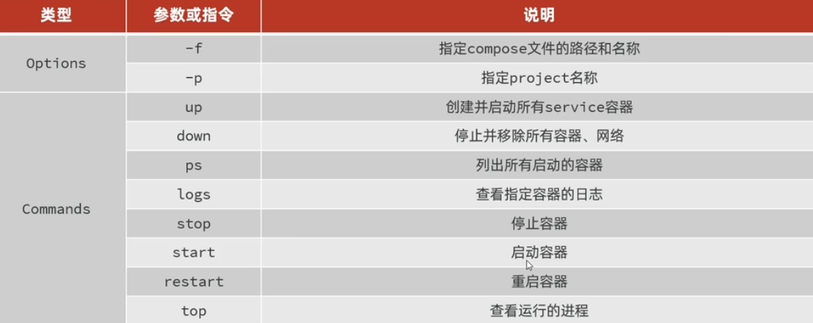

## Docker Compose介绍

Docker Compose 通过通过单独的 docker-compose.yml 模板文件（YAML 格式）来定义一组相关联的应用容器，帮助我们实现多个相互关联的 Docker 容器的快速部署。

Docker Compose的命令格式： `docker compose` [OPTIONS] [COMMAND]
选项参数说明：



## Docker Compose环境配置

```bash
sudo wget "https://github.com/docker/compose/releases/download/v2.23.0/docker-compose-$(uname -s)-$(uname -m)" -o /DataFilm/docker-compose
```

/DataFilm路径一定要存在。

## 关于数据卷：

```yaml
volumes:
      - /DataFilm/zookeeper/data:/data
      - /DataFilm/zookeeper/datalog:/datalog
```

以上的意思就是说：

- 将主机上的路径 `/DataFilm/zookeeper/data` 挂载到容器里的 `/data`
- 将主机上的路径 `/DataFilm/zookeeper/datalog` 挂载到容器里的 `/datalog`

**这样，容器内的 `/data` 和 `/datalog` 目录实际上对应主机上的两个路径。这可以实现数据的持久化，容器重启也不会丢失数据，也方便与主机共享数据。**

```bash
# 指定 Docker Compose 文件格式版本（3.8 支持大部分现代 Docker 功能）
version: '3.8'

# 定义服务列表
services:
  # 服务名称（用户自定义）
  zookeeper:
    # 使用官方 ZooKeeper 镜像，3.8.1 版本
    image: zookeeper:3.8.1
    
    # 指定容器名称（否则会自动生成）
    container_name: zookeeper
    
    # 端口映射配置
    ports:
      # 将宿主机的 2181 端口映射到容器的 2181 端口
      # 格式 - "宿主机端口:容器端口"
      - "2181:2181"
    
    # 环境变量配置（ZooKeeper 专用参数）
    environment:
      # 当前节点的唯一 ID（单机模式设为 1）
      ZOO_MY_ID: 1
      
      # 集群服务器列表配置（即使单机也需要）
      # 格式：server.[myid]=[hostname]:[peer端口]:[选举端口];[客户端端口]
      # 这里配置为单节点模式，指向自己
      ZOO_SERVERS: server.1=zookeeper:2888:3888;2181
    
    # 数据卷挂载配置
    volumes:
      # 将宿主机的 ./data 目录挂载到容器的 /data 目录
      # 用于保存 ZooKeeper 的快照数据（snapshot）
      - ./data:/data
      
      # 将宿主机的 ./datalog 目录挂载到容器的 /datalog 目录
      # 用于保存 ZooKeeper 的事务日志（transaction log）
      - ./datalog:/datalog
    
    # 容器重启策略
    restart: unless-stopped
    # 除非手动停止，否则总是自动重启（适合生产环境）
    # 其他可选值：
    #   no：不自动重启（默认）
    #   always：总是重启
    #   on-failure：非正常退出时重启
```

