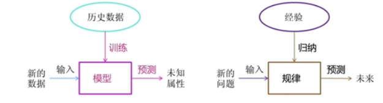
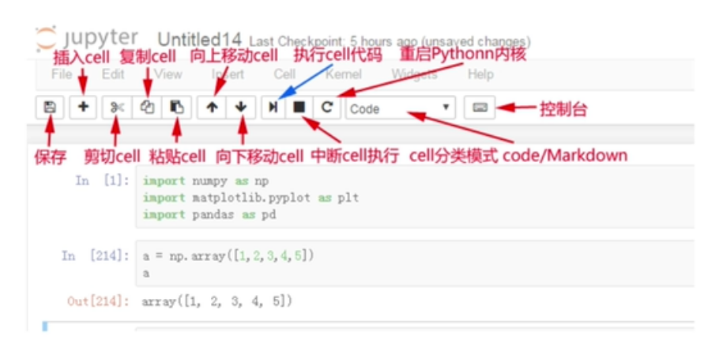

## 人工智能三要素

- 数据
- 算力（硬件支持）
- 算法

## 计算力之CPU、GPU 对比：

- CPU 主要适合**I\O密集型的任务**
- GPU 主要适合**计算型**任务

#### CPU 和 GPU 的区别：

| 特性     | CPU                                                          | GPU                                                          |
| -------- | ------------------------------------------------------------ | ------------------------------------------------------------ |
| 设计目的 | 处理广泛的任务，包括复杂的逻辑和控制任务。                   | 处理图形和图像相关的计算任务，如3D渲染、视频游戏等。         |
| 核心数量 | 较少的核心（如4、8、16等）                                   | 大量的核心（如几百甚至上千个）                               |
| 计算能力 | 单个任务或少量任务上具有较高的计算能力，适合执行复杂逻辑和决策的计算任务。 | 处理大量并行任务时表现出色，适合执行大量重复的、简单的计算任务。 |
| 内存访问 | 较小的缓存和较慢的内存访问速度，考虑到内存访问的延迟和带宽。 | 较大的缓存和较快的内存访问速度，需要快速访问大量数据以支持图形和图像处理。 |
| 功耗     | 通常功耗较低，设计用于在较低的功耗下运行，以延长电池寿命和减少热量产生。 | 通常功耗较高，需要处理大量的并行任务，这需要更多的能量。     |
| 应用领域 | 通用计算任务，如操作系统管理、文件处理、网络通信等。         | 图形和图像处理、科学计算、机器学习、数据分析等需要大量并行计算的任务。 |

#### 提问：什么类型的程序适合在 GPU 上运行？

**(1) 计算密集型的程序。**

所谓计算密集型(Compute-intensive)的程序，就是其大部分运行时间花在了寄存器运算上，寄存器的速度和处理器的速度相当，从**寄存器读写数据几乎没有延时**，可以做一下对比，读内存的延迟大概是几百个时钟周期；读硬盘的速度就不说了，即便是SSD，也实在是太慢了。

**(2) 易于并行的程序。**

GPU（图形处理器）擅长并行计算，适合处理**高并行性、计算密集、数据独立**的任务。比如**大规模并行计算**、 **图形渲染与处理**、**机器学习与深度学习**、**科学计算与高性能计算**、**密码学与哈希计算**、**数据库与数据分析**

## 人工智能、机器学习、深度学习

机器学习是人工智能的一个实现途径。深度学习是机器学习的一个方法发展而来的。

**机器学习**：从数据中自动分析获得模型, 并利用模型未知数据进行预测。



### 机器学习工作流程

#### **1. 问题定义（Problem Definition）**

- **目标**：明确业务需求，确定机器学习能否解决该问题。
- 关键问题：
  - 这是分类、回归、聚类还是其他任务？

#### **2. 数据收集（Data Collection）**

- **数据来源**：
  - 内部数据库、API、公开数据集（如Kaggle、UCI）、爬虫等。

#### **3. 数据预处理（Data Preprocessing）**

- **数据清洗**：
  - 处理缺失值（删除、填充、插值）。
  - 去除重复值、异常值（如3σ原则或IQR）。

#### **4. 数据分割（Data Splitting）**

- 按比例划分数据集：
  - 训练集（60-80%）、验证集（10-20%）、测试集（10-20%）。

#### **5. 模型选择（Model Selection）**

- **根据任务类型选择模型**：
  - **分类**：逻辑回归、随机森林、SVM、XGBoost、神经网络。
  - **回归**：线性回归、决策树回归、梯度提升树（GBRT）。
  - **聚类**：K-Means、DBSCAN、层次聚类。
- **复杂度权衡**：简单模型（易解释） vs 复杂模型（高精度）。

#### **6. 模型训练（Model Training）**

- **训练过程**：
  - 输入特征和标签，通过优化算法（如梯度下降）最小化损失函数。
- **超参数调优**：
  - 网格搜索（Grid Search）、随机搜索（Random Search）、贝叶斯优化（Bayesian Optimization）。
  - 自动化工具：Optuna、Hyperopt。

#### **7. 模型评估（Model Evaluation）**

- **评估指标**：
  - 分类：准确率、精确率、召回率、F1、AUC-ROC。
  - 回归：MSE、RMSE、MAE、R²。
  - 聚类：轮廓系数、Calinski-Harabasz指数。
- **验证方法**：
  - 测试集性能反映泛化能力。
  - 对比基线模型（如随机猜测或简单规则）。

#### **8. 模型部署（Model Deployment）**

- **部署方式**：
  - 云服务（AWS SageMaker、Google AI Platform）。
  - 嵌入式部署（移动端、IoT设备）。
  - API封装（Flask、FastAPI）。
- **监控与维护**：
  - 监控数据漂移（Data Drift）和模型性能下降。
  - 定期用新数据重新训练（在线学习或定时更新）。

#### **9. 迭代优化（Iteration）**

## 机器学习算法分类

#### **(1) 监督学习（Supervised Learning）**

- **特点**：数据带有标签（即已知输入输出的对应关系），模型通过学习映射关系进行预测。
- **常见任务**：
  - **分类（Classification）**：预测离散类别。
    - 算法：逻辑回归、决策树、随机森林、SVM、朴素贝叶斯、KNN、神经网络。
  - **回归（Regression）**：预测连续值。
    - 算法：线性回归、多项式回归、决策树回归、XGBoost/LightGBM、SVR。

#### **(2) 无监督学习（Unsupervised Learning）**

- **特点**：数据无标签，模型发现数据中的隐藏模式或结构。
- **常见任务**：
  - **聚类（Clustering）**：将相似数据分组。
    - 算法：K-Means、DBSCAN、层次聚类、高斯混合模型（GMM）。
  - **降维（Dimensionality Reduction）**：减少特征数量，保留关键信息。
    - 算法：PCA（主成分分析）、t-SNE、UMAP、Autoencoder。
  - **关联规则（Association Rules）**：发现变量间的关系（如购物篮分析）。
    - 算法：Apriori、FP-Growth。

#### **(3) 半监督学习（Semi-supervised Learning）**

- **特点**：部分数据有标签，部分无标签，结合监督与无监督学习。
- **算法**：标签传播（Label Propagation）、半监督SVM、自训练（Self-training）。

#### **(4) 强化学习（Reinforcement Learning）**

- **特点**：通过与环境交互的奖励信号学习最优策略，无显式标签。
- **算法**：Q-Learning、Deep Q-Network (DQN)、策略梯度（Policy Gradients）、PPO、A3C。

## 使用Jupyter Notebook

Jupyter Notebook是一个开源的交互式开发环境，广泛用于数据分析、机器学习和科学计算。

#### 通过pip安装

```
pip install notebook
```

#### 运行Jupyter

``` 
jupyter notebook
```



#### cell介绍

**Cell（单元格）** 是构成 Notebook 文档的基本单位，也是你与 Notebook 交互的主要界面。