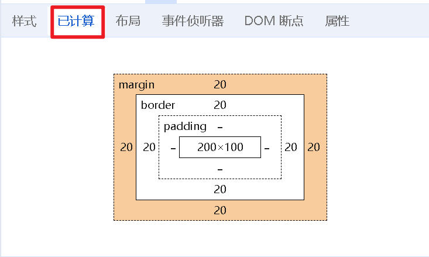
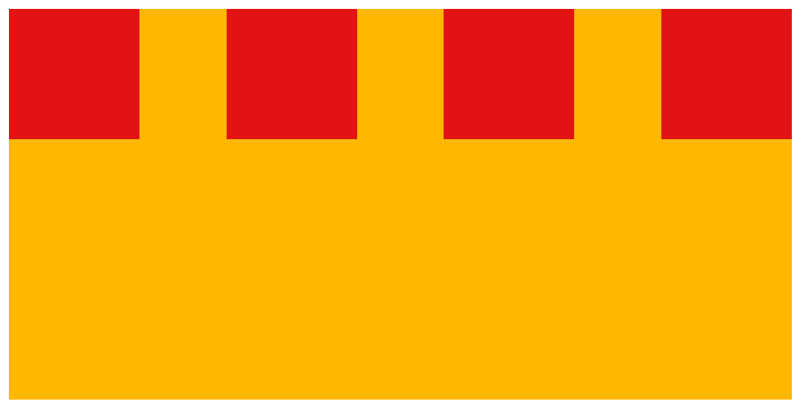

# div标签

### 性质：

默认独占一行
宽width默认为父级的100%，加宽高生效。

# span标签

用于为文档中的一部分文本应用样式或标记，而不会对页面的布局产生大的影响。

尺寸由内容撑开

# 显示模式的转换（display的属性值）

| 值                 | 作用说明                                                     | 作用示例                               |
| ------------------ | ------------------------------------------------------------ | -------------------------------------- |
| `none`             | 不显示元素，元素不会占据空间                                 | 隐藏元素，类似“隐藏”状态               |
| `block`            | 独占一行，**宽度默认为父元素宽度**                           | `<div>`、`<h1>`、`<p>`                 |
| `inline`（较少用） | 行内元素，不会换行，宽度由内容决定                           | `<span>`、`<a>`                        |
| `inline-block`     | 类似 `inline`，**不会换行**，同时可以设置宽高，但表现为块级容器 | 用于创建水平并列的块级布局             |
| `inline-flex`      | 行内弹性布局容器                                             | 适用于需要行内弹性盒模型的场景         |
| `flex`             | 弹性布局容器，块级元素，内部子元素可以灵活布局               | 常用于复杂的响应式布局                 |
| `grid`             | 网格布局容器                                                 | 更复杂的布局方式，类似于表格，但更强大 |
| `inline-grid`      | 行内网格布局，用于行内的多列布局                             | 实现行内的网格排布                     |
| `inherit`          | 继承父元素的 `display` 值                                    | 子元素会继承父元素的 `display` 设置    |
| `contents`         | 让元素的布局行为“消失”，只显示子元素                         | 用于隐藏元素本身但保留子元素的布局     |

# 伪类选择器（:）

## 1. 交互状态伪类

### 链接与用户交互

- `:hover` - 鼠标悬停在元素上时

  ```
  button:hover { 
  background-color: #f0f0f0; 
  cursor: pointer;
  /* 鼠标变成手势指针 */
  }
  ```

- `:active` - 元素被激活（如按钮被点击）时

  ```
  a:active { color: red; }
  ```

- `:focus` - 元素获得焦点时（如输入框被选中）

  ```
  input:focus { border-color: blue; }
  ```

### 链接特定状态

- `:link` - 未访问的链接

  ```
  a:link { color: #0066cc; }
  ```

- `:visited` - 已访问的链接

  ```
  a:visited { color: #6600cc; }
  ```

## 2. 结构位置伪类

### 子元素位置

- `:first-child` - 父元素的第一个子元素

  ```
  li:first-child { font-weight: bold; }
  ```

- `:last-child` - 父元素的最后一个子元素

  ```
  div:last-child { margin-bottom: 0; }
  ```

- `:nth-child(n)` - 父元素的第n个子元素

  ```
  tr:nth-child(2n) { background: #f5f5f5; } /* 偶数行 */
  ```

- `:nth-of-type(n)` - 同类型中的第n个元素

  ```
  p:nth-of-type(2) { color: green; }
  ```

### 特殊位置

- `:only-child` - 唯一子元素

  ```
  div:only-child { width: 100%; }
  ```

- `:empty` - 没有子元素的元素

  ```
  div:empty { display: none; }
  ```

## 3. 表单相关伪类

- `:checked` - 被选中的单选/复选框

  ```
  input[type="checkbox"]:checked + label {
    font-weight: bold;
  }
  ```

- `:disabled` - 被禁用的表单元素

  ```
  button:disabled { opacity: 0.6; }
  ```

- `:valid`/`:invalid` - 输入有效/无效时

  ```
  input:valid { border-color: green; }
  input:invalid { border-color: red; }
  ```

## 4. 其他实用伪类

- `:not(selector)` - 不匹配选择器的元素

  ```
  div:not(.special) { color: #333; }
  ```

- `:target` - URL片段标识符指向的元素

  ```
  :target { background: #ffffcc; }
  ```

# 伪元素选择器

#### ::before 和 ::after

- 在元素内容的前面或后面插入生成的内容
- 必须配合 `content` 属性使用

```css
.element::before {
  content: "前缀 ";
  color: red;
}

.element::after {
  content: " 后缀";
  font-weight: bold;
}
```

# Emmet写法 

```
div>ul>li → 
<div>
  <ul>
    <li></li>
  </ul>
</div>


div+p+span → 
<div></div>
<p></p>
<span></span>


div*5 →
<div></div>
<div></div>
<div></div>
<div></div>
<div></div>

div{这个是div标签}   →
<div>这个是div标签</div>
```

# 块状元素垂直居中的办法

```css
.div3 a{
    display: block; // 改变a标签默认的不换行布局为换行布局
    height: 100px;
    width: 200px;
    background-color: blueviolet;
    text-decoration: none; // a标签取消下划线
    color: white;
    text-align: center; // 水平居中
    line-height: 100px; // 垂直居中->line-height等于height
}
```

# 盒子模型

每个 HTML 元素都可以看作是一个矩形的盒子，这个盒子由以下部分组成（从内到外，看成一个**手机盒**）：

1. **内容区（Content→盒子里的手机）** - 显示实际内容（文本、图像等）

2. **内边距（Padding→手机盒里的泡（p开头）沫）** - 内容与边框之间的透明区域，（<span style="color: red">**加了会撑大盒子**</span>（如果不撑大就加**box-sizing: border-box;** ），比如原理20X20的加Padding：20px变为24X24，算到盒子的尺寸里去，四值：上右下左）

3. **边框（Border→手机纸盒）** - 围绕内容和内边距的边界线（border: 2p solid rgb(0, 0, 0); 算到div里面）

4. **外边距（Margin→手机盒外）** - 盒子与其他元素之间的透明区域（不算到div的盒子的尺寸里去）

   1. | 值数 | 代表的意义                           |
      | ---- | ------------------------------------ |
      | 1值  | 上下左右都相同                       |
      | 2值  | 第一个：上下，第二个：左右           |
      | 3值  | 第一个：上，第二个：左右，第三个：下 |
      | 4值  | 顺序：上 右 下 左                    |

      ==**通常是设置两值或者四值**==




## 元素溢出问题

即overflow

| 属性值 | 效果                       |
| ------ | -------------------------- |
| hidden | 溢出部分隐藏               |
| scroll | 无论是否溢出，都显示滚动条 |
| auto   | 溢出才出现滚动条           |

# 合并与塌陷问题

### 合并现象

场景：垂直排列的兄弟元素，上下 margin 会合并
现象结果：取两个 margin 中的较大值生效

### 塌陷现象

描述：子级的添加上外边距会产生坍塌问题，现象就是导致父级溢出。

#### 解决

- 取消子级 margin，父级设置 padding，box-sizing: border-box;
- 父级设置 overflow: hidden
- 父级设置 border-top

# 标准流与浮动

标准流：即块元素占一行，行内元素可以一行显示多个。

```css
.div1 {
    width: 300px;
    height: 300px;
    background-color: rgb(255, 183, 0);
    float: left;
}
.div2 {
    width: 100px;
    height: 100px;
    background-color: blue;
    float: left;
}
```

**注意：一个盒子浮动，另一个盒子最好也浮动。**

#### 浮动的盒子有以下特点：

- 顶端对齐。
- 行内块，不换行。
- 脱标

# flex布局

Flex 布局也叫弹性布局，是浏览器提倡的布局模型，非常适合结构化布局，提供了强大的空间分布和对齐能力。

Flex 模型不会产生浮动布局中脱标现象，布局网页更简单、更灵活。

**设置方式**：给父元素设置 **display: flex**，子元素可以 **自动挤压或拉伸**

```css
.out {
    width: 600px;
    height: 300px;
    background-color: rgb(255, 183, 0);
    margin: 20px auto;
    display: flex;
    justify-content: space-between;
}

.out div {
    width: 100px;
    height: 100px;
    background-color: #e31313;
}
```

**效果**



flex布局默认的主轴为**水平轴**

| 属性值            | 效果                                                         |
| ----------------- | ------------------------------------------------------------ |
| **flex-start**    | 默认值，弹性盒子从起点开始依次排列                           |
| **flex-end**      | 弹性盒子从终点开始依次排列                                   |
| **center**        | 弹性盒子沿主轴整体居中排列                                   |
| **space-between** | 弹性盒子沿主轴的排列，空白间距均匀分布在各元素之间，与盒子边框间没间距。 |
| **space-around**  | 弹性盒子沿主轴的排列，空白间距均匀分布在各元素两端以及子元素和父元素元素之间 |
| **space-evenly**  | 弹性盒子沿主轴的排列，弹性盒子与内容之间的**空白都相等**     |

**竖直轴对齐方式**

| 属性值     | 效果                         |
| ---------- | ---------------------------- |
| stretch    | 弹性盒子沿着伸缩拉伸到容器   |
| center     | 弹性盒子沿垂直中轴线对齐     |
| flex-start | 弹性盒子从起点开始沿次轴排列 |
| flex-end   | 弹性盒子从终点开始沿次轴排列 |

**修改主轴方向为垂直方向**

 flex-direction：column

# 定位

作用：灵活的改变盒子在网页中的位置（position属性）

### `relative`相对定位

- 可以使用 `top`, `right`, `bottom`, `left` 来偏移元素。
- 不脱离正常文档流，元素仍占空间(**别的元素不能和该元素重叠**)

### `absolute`（绝对定位）

一般遵循**子元素绝对，父元素相对。** <span style="color: red">**（子绝父相）**</span> 

### transform

`transform: translate(50%, 50%)` 会将元素：

1. 向右移动自身宽度的50%
2. 向下移动自身高度的50%

### fixed固定定位

让元素相对于**浏览器视口（viewport）**进行定位

1. **不继承父元素定位**：不受父元素的`position`属性影响（即使父元素是relative/absolute）
2. **可设置z-index**：可以控制元素的堆叠顺序（取值越大，越靠上）

# less

Less（Leaner Style Sheets）是一种 CSS 预处理器，它扩展了 CSS 语言，增加了变量、混合（mixins）、函数等特性，使 CSS 更易维护和扩展。

同时可以导入导出特定的less文件。

### 1. 变量（Variables）

Less允许定义变量，用于存储重复使用的值，比如颜色、字号等。

```
less@main-color: #4CAF50;
@font-size: 16px;

.header {
  color: @main-color;
  font-size: @font-size;
}
```

### 2. 嵌套（Nesting）

可以在一个选择器内部写入子选择器，代码结构更清晰。

```
less.nav {
  background-color: #333;
  ul {
    list-style: none;
    li {
      display: inline-block;
      
      a {
        color: #fff;
        text-decoration: none;
      }
    }
  }
}
```

### 3. 混合（Mixins）

类似函数，可以封装一组样式，方便多处复用。

```
less.rounded-corners(@radius: 5px) {
  border-radius: @radius;
  -webkit-border-radius: @radius;
  -moz-border-radius: @radius;
}

.box {
  width: 200px;
  height: 200px;
  .rounded-corners(10px);
}
```

### 4. 运算（Operations）

支持对数值进行加减乘除，实现动态计算。

```
less@base-padding: 10px;

.box {
  padding: @base-padding * 2;
}
```

### 5. 函数和内置函数

Less内置了多种函数，例如颜色处理、数学运算等。

```
less


@darken-color: darken(@main-color, 20%);
```

### 6. 代码复用

通过导入多个Less文件，增强模块化。

```
less// 在主文件中导入
@import "variables.less";
@import "mixins.less";
```

### 7. 继承（Extends）

实现样式的共享。

```
less.message {
  padding: 10px;
  border: 1px solid #ccc;
  color: #333;
}

.error {
  &:extend(.message);
  border-color: red;
  color: red;
}
```

# vw和vh

### 1. vw (Viewport Width)

- **1vw = 视窗宽度的1%**
- 如果浏览器视窗宽度是1200px，则 `1vw = 12px` (1200px × 1% = 12px)

### 2. vh (Viewport Height)

- **1vh = 视窗高度的1%**
- 如果浏览器视窗高度是800px，则 `1vh = 8px` (800px × 1% = 8px)

**与百分比的区别**：

- `%` 是基于父元素的尺寸
- `vw/vh` 始终基于视窗尺寸

如果要求某个容器独占一整个屏幕的高度，那么设置下面的属性

```
 <style>
        body {
            position: relative;
            /* 为absolute定位提供参照 */
            margin: 0;
            padding: 0;
        }
        .container {
            position: absolute;
            width: 110vh;
            height: 120vh;
            top: 0;
            left: 0;
            background-color: rgb(17, 0, 255);
        }
</style>

<body>
    <div class="container">
    </div>
</body>
```

