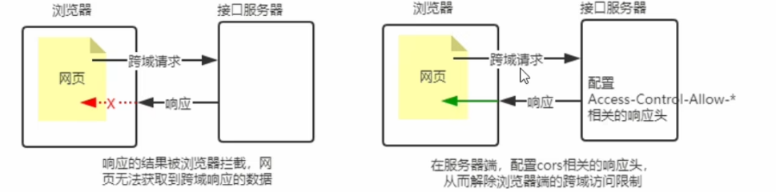

# 创建Express项目

### 1. 初始化项目

首先，创建一个新目录并初始化项目：

```
mkdir express-app
cd express-app
pnpm init
```

按照提示填写项目信息，或者直接使用默认值。

### 2. 安装 Express

使用 pnpm 安装 Express：

```
pnpm add express
```

### 3. 安装完之后使用vscode打开express-app项目

#### 第一个Express项目

```ts
// 第一个express
const express = require('express'); // 这样导入之后不容易出错

// 1. 创建应用对象
const app = express();
// 2. 创建路由规则
app.get('/', (req, res) => {
  res.send('Hello World!');
});

// 3. 监听端口，启动服务：node
app.listen(3000, function () {
  console.log('Example app listening on port 3000!');
});
```

启动项目：**node src\app.js**      或者

通过配置package.json文件来直接启动

```js
 "scripts": {
    "test": "echo \"Error: no test specified\" && exit 1",
    "start": "node src/app.js"
  },
```

#### express项目的大致目录

```
my-express-app/
├── node_modules/          # 项目依赖
├── public/                # 静态文件
│   ├── images/            # 图片资源
│   ├── css/               # CSS 样式表
│   └── js/                # 客户端 JavaScript
├── src/                   # 主要源代码
│   ├── Handlers/       # 控制器
│   ├── models/            # 数据模型
│   ├── routes/            # 路由
│   ├── services/          # 业务逻辑
│   ├── middlewares/       # 自定义中间件
│   ├── views/             # 视图模板 (如果使用模板引擎)
│   ├── utils/             # 工具函数
│   ├── config/            # 配置文件
│   └── app.js             # Express 应用配置
├── tests/                 # 测试文件
├── .env                   # 环境变量
├── .gitignore             # Git 忽略文件配置
├── package.json           # 项目配置和依赖
└── README.md              # 项目说明文档
```

### 安装和使用nodemon

#### **为什么要使用 nodemon**(支持热更新)

在编写调试 Node.js 项目的时候，如果修改了项目的代码，则需要频繁的手动 close 掉，然后重新启动，非常繁琐。
现在，我们可以使用 nodemon（https://www.npmjs.com/package/nodemon）这个工具，它能够监听项目文件的变化，当代码被修改后，nodemon 会自动帮助我们重新项目，极大方便了开发和调试。

1. **本地项目安装：npm install --save-dev nodemon**

2. **之后再package.json的script里配置**

```js
{
  "scripts": {
    "dev": "nodemon app.js"
  }
}
```


# 路由

## **路由的作用：**

根据前端发送的请求的路径来确定那个回调函数执行

## 怎么使用

确定好三个东西：**请求方法，请求路径，回调函数**

**处理多种RestFulApi**

```js
const express = require('express');
const app = express();
app.use(express.json()); // 用于解析 JSON 请求体
app.use(express.urlencoded({ extended: true })); // 解析 application/x-www-form-urlencoded

// 用户资源示例:GET /users/1?role=admin&active=true
app.get('/users/:id', (req, res) => {
  const userId = req.params.id; // "123"
  const role = req.query.role; // "admin"
  const active = req.query.active; // true
  const authToken = req.headers['authorization']; // 获取请求头里的参数
});

app.post('/users', (req, res) => {
  // 创建新用户
  const userData = req.body; // { name: "John", email: "john@example.com" }
});

app.get('/users/:id', (req, res) => {
  // 获取特定用户
});

app.put('/users/:id', (req, res) => {
  // 更新整个用户资源
});

app.patch('/users/:id', (req, res) => {
  // 部分更新用户资源
});

app.delete('/users/:id', (req, res) => {
  // 删除用户
});
```

#### 发送响应相关

# 响应设置

```js
app.get("/res", (req, res) => { 
  res.send("<h1>给前端的响应内容</h1>")
      .set({// 设置响应体
    "Content-Type": "text/plain; charset=utf-8",
    "Author": "springboot" 
  })
})
```

### 具体发送响应介绍

```js
   // 发送 JSON 响应(200)
   res.json({
    id: req.params.id,
    name: "John Doe",
    email: "john@example.com"
  });  
  
  // 创建成功，返回 201 Created
  res.status(201).json({ message: "User created", id: 123 });
  
  app.get('/users/:id', (req, res) => {
  const user = getUserById(req.params.id);
  if (!user) {
    return res.status(404).json({ error: "User not found" });
  }
  res.json(user);
});

// 匹配所有请求方法
app.all('/user', (req, res) => {
  res.send('User Page');
});
```

### 客户端重定向

```js
app.get('/blbl', (req, res) => {
  res.redirect(301, 'https://www.bilibili.com/') // 301重定向到blbl
})
```

### 其它类型的响应

```js
// 响应 文件(下载)
app.get('/dowmload', (req, res) => { 
  res.download(__dirname + '/app.js')
})

// 响应文件内容
app.get('/html', (req, res) => { 
  res.sendFile(__dirname + '/app.js')
})

// 响应404，直接使用use
app.use((req, res) => {
  res.status(404).send('404 Not Found');
});
```


# 中间件

### 概念

中间件本质就是一个回调函数，

####  <span style="background-color: yellow">**中间件于路由接收器在文件里位置的先后注意：**</span>

1. **处理404的使用app.use方法，放在**

   ```js
   app.listen(3000, () => {
     console.log('Example app listening on port 3000!');
   });
   ```

   **之前**

2. 中间件（相当于是拦截器作用的）放在路由接收器的最前面，**越靠近前面的中间件越先接收到请求**。

3. 一定要在路由之前注册中间件

4. 客户端发送过来的请求，可以连续调用多个中间件进行处理

5. 执行完中间件的业务代码之后，不要忘记调用 next() 函数

6. 为了防止代码逻辑混乱，调用 next() 函数后不要再额外的代码

7. 连续调用多个中间件时，多个中间件之间，共享 req 和 res 对象

### 全局中间件

```js
// 全局中间件:记录日志
function recordMiddleware(req, res, next) {
  // 获取 url 和 ip
  let { url, ip } = req;
  // 将信息保存到文件中 access.log
  console.log(url, ip);
  
  fs.appendFileSync(path.resolve(__dirname, '/access.log'), `${url} ${ip}\r\n`);
  // 调用 next,执行后续的代码，这样所有的请求都会经过这个中间件
  next();
  console.log("返回中间件！！！") // 最后响应的时候还会返回中间件
}

app.use(recordMiddleware);
```

### 特定路由中间件

```js
app.use('/user', (req, res, next) => { // 路径开头为user的请求都经过这个中间件
  console.log('Request Type:', req.method);
  next();
});

app.use('/user/po', (req, res, next) => { // 访问/user/po的请求都经过这个中间件
  console.log('Another Middleware');
  res.send('Hello World!');
});
```

### 局部路由的中间件

```js
// 定义一个局部中间件
function validateRequest(req, res, next) {
  if (!req.query.name) {
    return res.status(400).send('Name parameter is required');
  }
  next();
  console.log("返回中间件！！！") // 最后响应的时候还会返回中间件
}

// 将局部中间件绑定到特定路由
app.get('/user', validateRequest, (req, res) => {
  res.send(`Hello, ${req.query.name}!`);
});
```

定义多个局部生效的中间件

```js
app.get('/', mw1, mw2, (req, res) => { res.send('Home page.') })

app.get('/', [mw1, mw2], (req, res) => { res.send('Home page.') })
```

### 静态资源中间件

Express 的静态资源中间件 `express.static` 是用于托管静态文件（如 HTML、CSS、JavaScript、图片等）的内置中间件。

前端项目打包之后交付给后端，后端就将其放在public目录之下

```js
const express = require('express');
const app = express();

// 托管public目录下的静态文件
app.use(express.static('public')); // 默认为和src同级目录下的
```

这样设置后，`public` 目录下的文件就可以通过 URL 直接访问了。例如：

- `public/css/style.css` → `/css/style.css`
- `public/images/logo.png` → `/images/logo.png`

如果希望在托管的静态资源访问路径之前，挂载路径前缀，则可以使用如下方式：

```js
app.use('/public', express.static('public'))// 添加声明访问路径前缀
```

现在，可以通过带有 `/public` 前缀地址来访问 public 目录中的文件了：

- http://localhost:3000/**public**/images/kitten.jpg
- http://localhost:3000/**public**/css/style.css
- http://localhost:3000/**public**/js/app.js

### 处理错误的中间件（返回500状态码）

为了生效，要放在最后面。

```js
app.use((err, req, res, next) => {
  console.error(err.stack);
  res.status(500).send('Something broke!');
});
```

# 获取请求体和请求参数

### 1. 获取请求参数

查询参数是URL中`?`后面的部分，Express会自动解析这些参数，你可以通过`req.query`对象访问它们。

```js
const express = require('express');
const app = express();

app.get('/search', (req, res) => {
  // 访问查询参数
  const { q, page } = req.query; // 直接解析
  res.send(`搜索关键词: ${q}, 当前页: ${page || 1}`);
});

app.listen(3000);
```

### 2. 获取请求体里的参数

先安装依赖：npm install body-parser

```js
const express = require('express');
const bodyParser = require('body-parser');
const app = express();

// 解析 application/x-www-form-urlencoded
app.use(bodyParser.urlencoded({ extended: false }));

// 解析 application/json
app.use(bodyParser.json());

app.post('/login', (req, res) => {
  const { username, password } = req.body; // 解析请求体里的参数
  res.send(`用户名: ${username}, 密码: ${password}`);
});

app.listen(3000);
```

# express怎么写接口

#### 1. 项目文件结构

```
my-express-app/
├── app.js            # 主应用文件
├── routes/           # 路由文件夹
│   ├── users.js      # 用户相关路由
│   └── products.js   # 产品相关路由
├── Handlers/      # 路由处理
│   ├── userHandler.js
│   └── productHandler.js
├── models/           # 数据模型文件夹
│   ├── userModel.js
│   └── productModel.js
├── config/
│   └── db.js          # 数据库配置文件
└── package.json
└── .env               # 环境变量文件
```

#### 2. 主应用文件 (app.js)

```js
const express = require('express');
const app = express();
const PORT = 3000;

// 内置中间件（全局）
app.use(express.json()); // 解析JSON请求体
app.use(express.urlencoded({ extended: true })); // 解析URL编码的请求体

// 导入路由
const userRoutes = require('./routes/users');
const productRoutes = require('./routes/products');

// 使用路由
app.use('/users', userRoutes); // user的进入这个路由
app.use('/products', productRoutes); // products的进入这个路由

// 404处理
app.use((req, res) => {
  res.status(404).json({ error: 'Not Found' });
});

// 错误处理
app.use((err, req, res, next) => {
  console.error(err.stack);
  res.status(500).json({ error: 'Something went wrong!' });
});

// 启动服务器
app.listen(PORT, () => {
  console.log(`Server running on http://localhost:${PORT}`);
});
```

#### 3. 路由文件 (routes/users.js)

```js
const express = require('express');
const router = express.Router();
const userHandler = require('../Handlers/userHandler'); // 导入路由处理函数

// 获取所有用户
router.get('/', userHandler.getAllUsers);

// 获取单个用户
router.get('/:id', userHandler.getUserById);

// 创建用户
router.post('/', userHandler.createUser);

// 更新用户
router.put('/:id', userHandler.updateUser);

// 删除用户
router.delete('/:id', userHandler.deleteUser);

module.exports = router;
```

#### 4. 路由处理函数（Handlers/userHandler）

```js
const User = require('../models/User'); // 假设有一个 User 模型

// 获取所有用户
const getAllUsers = async (req, res) => {
  try {
    const users = await User.find(); // 查询所有用户
    res.status(200).json(users); // 返回 JSON 数据
  } catch (error) {
    res.status(500).json({ message: "获取用户列表失败", error: error.message });
  }
};

...// 其它路由处理函数

// 导出所有处理函数
module.exports = {
  getAllUsers,
  getUserById,
  createUser,
  updateUser,
  deleteUser,
};
```

#### 5. 配置数据库连接

**安装数据库依赖：npm install mysql2**

**dotenv依赖：  npm i dotenv**  

`dotenv` 是一个 Node.js 的零依赖模块，它的主要作用是从 `.env` 文件加载环境变量到 Node.js 的 `process.env` 中。

##### .env - 环境变量文件

```
DB_HOST=localhost
DB_USER=your_username
DB_PASSWORD=your_password
DB_NAME=your_database
PORT=3000

... # 其它数据库等
```

##### 创建config/db.js，定义数据库连接对象。

```js
const mysql = require('mysql2/promise');
require('dotenv').config(); // 通常在应用启动的最开始调用

const pool = mysql.createPool({
  host: process.env.DB_HOST,
  user: process.env.DB_USER,
  password: process.env.DB_PASSWORD,
  database: process.env.DB_NAME,
  waitForConnections: true,
  connectionLimit: 10,
  queueLimit: 0
});

module.exports = pool;
```

##### 之后数据模型配置：models/userModel.js - 用户模型示例

```js
const pool = require('../config/db');

const User = {
  // 获取所有用户
  getAll: async () => {
    const [rows] = await pool.query('SELECT * FROM users');
    return rows;
  },

  // 通过ID获取用户
  getById: async (id) => {
    const [rows] = await pool.query('SELECT * FROM users WHERE id = ?', [id]);
    return rows[0];
  },

   // ......
};

module.exports = User;
```

#### 6. 封装Restfulapi响应的数据结构

```js
function responseHandler(req, res, next) {
  // 成功响应方法
  res.success = function (data = null, message = '操作成功', code = 200) {
    res.json({
      code,
      message,
      data
    });
  };

  // 失败响应方法
  res.error = function (err = '操作失败', code = 400, data = null) {
    res.status(code).json({
      code,
      message:err instanceof Error ? err.message : err,
      data
    });
  };

// data: 当前页的数据列表（list）
// total: 符合条件的总条数（totalCount）
// page: 当前页码（pageNumber）
// pageSize: 每页条数（pageSize）
// message: 业务提示信息，默认是“查询成功”
// totalPages：总页数    
  res.paginate = function (data, total, page, pageSize, message = '查询成功') {
    res.json({
      code: 200,
      message,
      data: {
        list: data,
        total,
        page,
        pageSize,
        totalPages: Math.ceil(total / pageSize)
      }
    });
  };

  next();
}
```

#### 


# CORS跨域解决方案

#### 1. CORS介绍

CORS（Cross-Origin Resource Sharing，跨域资源共享）由一系列 HTTP 响应头组成，这些 HTTP 响应头决定浏览器是否阻止前端 JS 代码跨域获取资源。

浏览器的同源安全策略默认会阻止跨域获取资源。但如果接口服务端配置了 CORS 相关的 HTTP 响应头，就可以解除浏览器端的跨域访问限制。



#### 2. 使用 cors 中间件解决跨域问题

cors 是 Express 的一个第三方中间件。通过安装和配置 cors 中间件，可以很方便地解决跨域问题。使用步骤分为如下 3 步：

① 运行 npm install cors 安装中间件
② 使用 const cors = require('cors') 导入中间件（**允许所有来源**）
③ 在路由之前调用 app.use(cors()) 配置中间件

#### 3. 预检请求

**预检请求:只要符合以下任意一个条件的请求，都需要进行预检请求：**

1. 请求方式为 GET、POST、HEAD 之外的请求 Method 类型
2. 请求头中包含自定义头字段
3. 向服务器发送了 application/json 格式的数据

在浏览器与服务器正式通信之前，浏览器会先发送 OPTIONS 请求进行预检，以获知服务器是否允许该实际请求，所以这一次的 OPTIONS 请求称为“预检请求”。 服务器成功响应预检请求后，才会发送真正的请求，并且携带真实数据。(**发生响应请求**)

# Cookic和JWT

浏览器的 **Cookie** 在符合条件的情况下（同域名）会自动附加到 HTTP 请求头中，**不需要前端手动编写代码去操作**。

**请求头中的表现**

当条件满足时，浏览器会自动在请求头中添加 `Cookie` 字段，例如：

```
GET /api/data HTTP/1.1
Host: example.com
Cookie: sessionId=abc123; username=foo
```

#### Cookie 不具有安全性

由于 Cookie 是存储在浏览器中的，而且 浏览器提供了读取 Cookie 的 API，因此 Cookie 很容易被伪造，不具有关性。因此不建议服务器将重要的隐私数据，通过 Cookie 的形式发送给浏览器。
