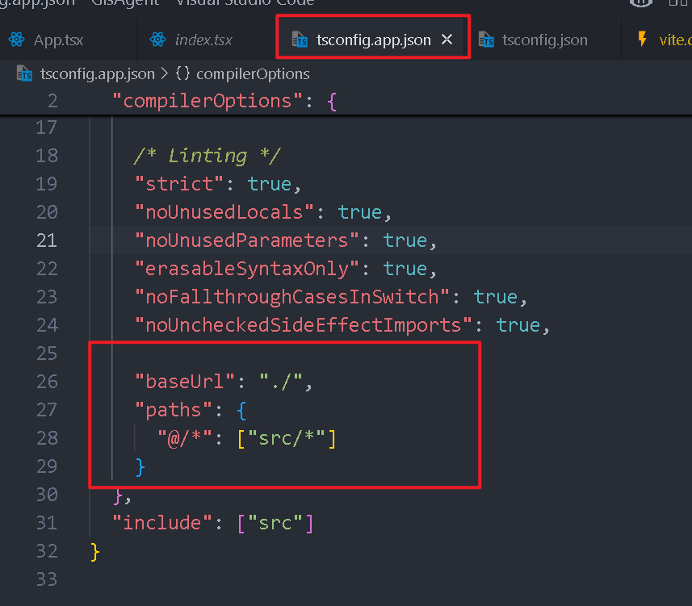
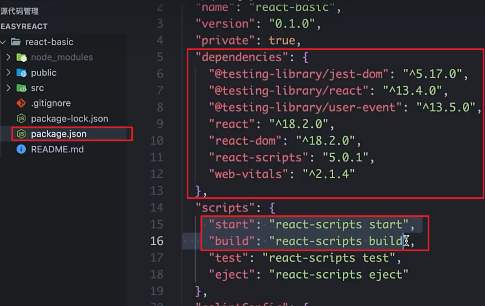
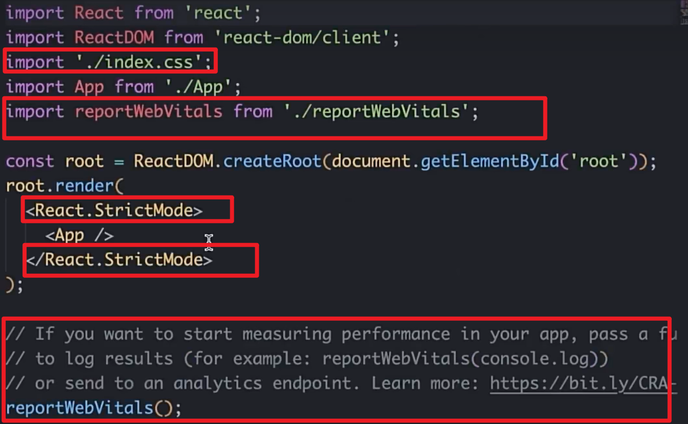
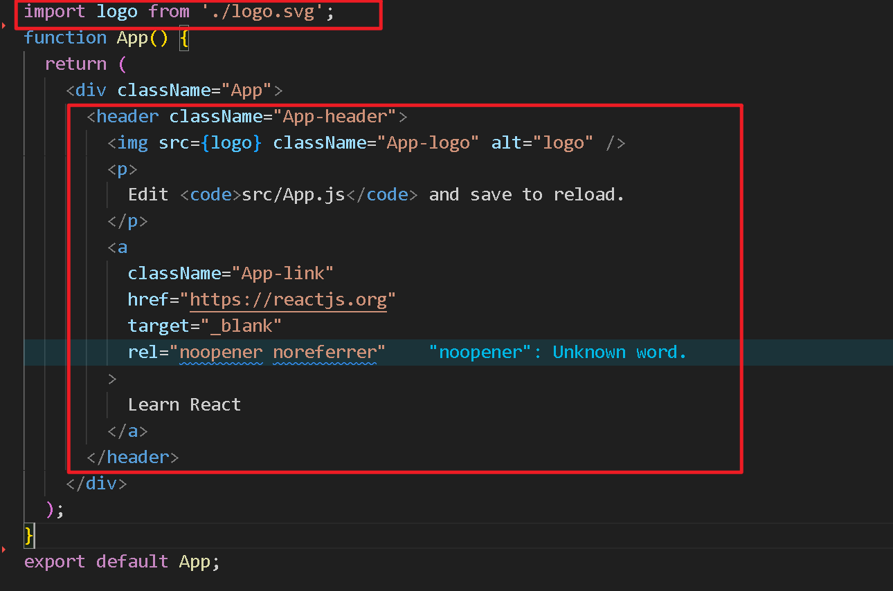
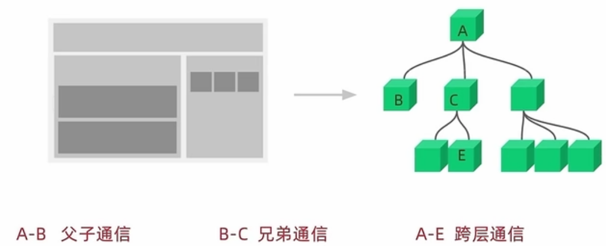
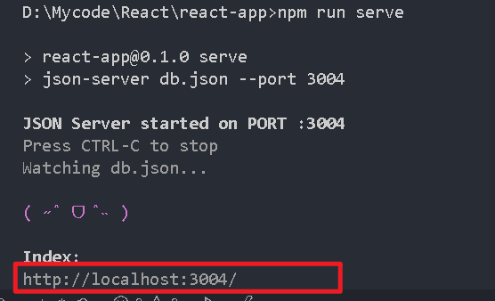
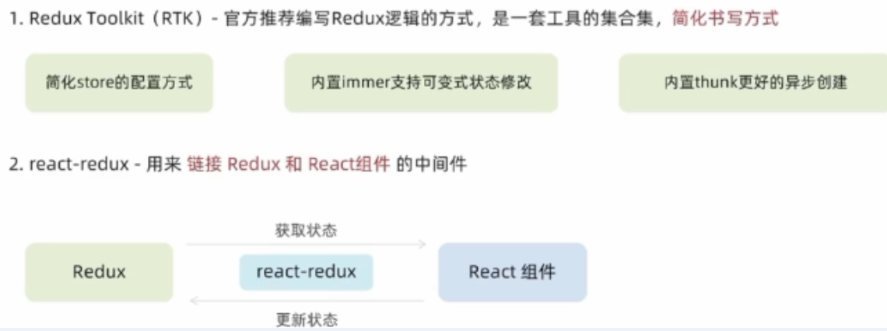
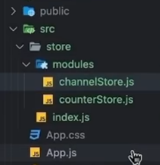
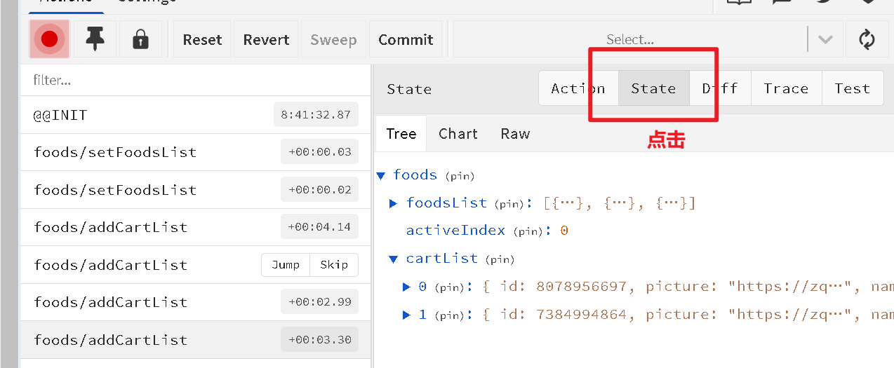
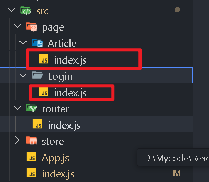

## React介绍

React（或React.js）是由Facebook开发并维护的一个开源JavaScript库，用于构建用户界面（UI），尤其是单页应用（SPA）。它帮助开发者创建交互丰富、响应迅速的网页应用。

## 创建一个react项目

#### 使用**Create React App** 脚手架创建(比较官方的方法)

```
npx create-react-app my-app
cd my-app
npm start
```

[React App](http://localhost:3000/)


#### 使用vite脚手架创建react项目

```
npm create vite@latest my-react-app -- --template react
npm create vite@latest my-react-app -- --template react-ts  #指定ts 
pnpm create vite@latest my-react-app --template react-ts   # 使用pnpm
```

```
cd my-react-app
npm install  # 或 yarn / pnpm install
npm run dev  #启动
```

访问：[Vite + React](http://localhost:5173/)

### 配置eslint和路径



```js
"baseUrl": "./",
    "paths": {
      "@/*": ["src/*"]
    }
```

以上这样配置就不会路径报错，以及点击路径自动跳转

#### 必要的依赖和脚本

react和react-dom是react必要的两个依赖



#### react项目删除没用的文件

在src里只保留app.js和index.js

##### index.js里



##### app.js



#### react项目的渲染流程

index.html是整个项目页面的入口，有一个id为root的根标签，index.js负责将所有开发的组件（app.js里包含的）渲染到那个id为root的标签上。

```tsx
// 合法写法：用 Fragment 包裹
return (
  <>
    <div>...</div>
    <h1>...</h1>
  </>
);

// 或用一个实际的根元素包裹
return (
  <div className="container">
    <div>...</div>
    <h1>...</h1>
  </div>
);
```

- 如果多个元素需要并列返回，优先使用 `<></>`。
- 如果需要一个实际的容器（例如需要添加样式或事件），可以用 `<div>` 或其他标签包裹。

## JSX

**概念：**JSX是JavaScript和XML（HTML）的缩写，表示在JS代码中编写HTML模板结构，它是在React中编写HTML模版结构的方式

**优势：**

1. HTML的声明式模板写法
2. JS的可编译能力

### jsx识别渲染JavaScript表达式

注意下面代码的注释写法

```javascript
const print = () => {
  return "这是react"
}
const color = "red"
function App() {
  const name = "React";
  const count = 10;
  return (
    <div className="App">
      <h1>Hello, {name}</h1>  {/* 输出: Hello, React,识别变量 */}
      <p>Count: {count * 2}</p>  {/* 输出: Count: 20，计算表达式 */}
      <p>Random: {Math.random()}</p>  {/* 输出随机数，执行函数 */}
      {print()}
      <div style={{ color: color }}>显示颜色</div> {/* 识别样式变量 */}
    </div>
  );
}
export default App;
```

**注意：** **不能直接使用语句**（如 `if`、`for` 等），但是可以使用**三元运算符**

```javascript
function UserStatus(isOnline) {
  return (
    <div>
      <p>{isOnline ? 'Online' : 'Offline'}</p>
      {isOnline ? (
        <button>Send Message</button>
      ) : (
        <span>Waiting for user...</span>
      )}
    </div>
  );
}
```

#### 渲染列表

使用<列表>.map(item => (

...

))的方法来渲染

```javascript
function App() {
  const users = [
    { id: 1, name: 'Alice', age: 25 },
    { id: 2, name: 'Bob', age: 30 },
    { id: 3, name: 'Charlie', age: 35 }
  ];

  return (
    <div>
      {users.map(user => (
        <ul key={user.id}>
          <li>{user.name}</li>
          <li>Age: {user.age}</li>
        </ul>
      ))}
    </div>
  );
}
```

#### 基于函数的条件渲染

```javascript
function renderMessage() {
  switch (status) {
    case 'logged-in':
      return <p>Welcome back!</p>;
    case 'logged-out':
      return <p>Please log in.</p>;
    case 'pending':
      return <p>Waiting for approval...</p>;
    default:
      return <p>Unknown status.</p>;
  }
}
```

#### 事件绑定

```javascript
function MyButton() {
  function handleClick() {
    alert('Button clicked!');
  }

  return (
    <button onClick={handleClick}>
      Click me
    </button>
  );
}
```

```javascript
function MyButton() {
  function handleClick(id) {
    alert(`Button ${id} clicked!`);
  }

  return (
    <button onClick={() => handleClick(1)}>
      Click me
    </button>
  );
}
```

## 组件

注意，**定义组件要首字母大写**

```javascript
function Button() {
  return <button>点我</button>
}
function App() {
  return (
    <div className='APP'>
      <Button/>{/*自闭和*/}
    </div>
  );
}
```

## useState数据绑定

```javascript
import { useState } from "react"; // 导入
function App() {
  // 从useState里解构出count和setCount
  const [count, setCount] = useState(0)
  // 定义handleClick函数
  function handleClick() {
    setCount(count + 1)
  }
  return (
    <div className='APP'>
    <button onClick={handleClick}>{count}</button>
    </div>
  );
}
```

### 修改状态的规则

在React中，状态被认为是只读的，我们应该始终**替换**（setter方法）而不是**修改**，直接修改状态（类似于count++就不能）不能引发视图更新

### 修改一个对象

```javascript
const [user, setUser] = useState({ name: 'John', age: 30 });

// 更新对象
const updateUser = () => {
  setUser({
    ...user,          // 复制现有属性
    age: 31           // 更新age属性
  });
};
```

### 样式控制

#### 行内样式

```javascript
<div style={{ color: 'red', fontSize: '20px' }}>Hello World</div>
```

#### 样式对象

```javascript
const myStyle = {
  backgroundColor: 'blue',
  color: 'white',
  padding: '10px',
  borderRadius: '5px' {/*驼峰样式*/}
};

function MyComponent() {
  return <div style={myStyle}>Styled Div</div>;
}
```

#### 导入样式

```java
// 导入样式
import './index.css'

function App() {
  return (
    <div>
      {/* 通过class类名控制 */}
      <span className="foo">this is class foo</span>
    </div>
  )
}
```

### React实现表单内容的双向绑定

```javascript
function App() {
  const [value, setValue] = useState('')
  return (
    <div>
      <input
        value={value}
        onChange={(e) => setValue(e.target.value)}
        type="text" />
    </div>
  )
}
```

### 案例，评论列表

```javascript
import { useState } from 'react';
import './CommentList.css';
const CommentList = () => {
  // 评论数据状态
  const [comments, setComments] = useState([
    { id: 1, text: '第一条评论', likes: 0 },
    { id: 2, text: '第二条评论', likes: 2 },
    { id: 3, text: '第三条评论', likes: 5 }
  ]);
  
  /*新评论输入状态*/

  // 绑定到表单获取评论内容
  const [newComment, setNewComment] = useState('');
  const addComment = () => {
    if (newComment.trim() === '') return;
    const comment = { // 表单的一行
      id: Date.now(), 
      text: newComment,
      likes: 0
    };
    setComments([...comments, comment]); // 加到表单数组里
    setNewComment(''); // 输入框置空
  };

  /*删除评论*/
  const deleteComment = (id) => {
    // 过滤掉
    setComments(comments.filter(comment => comment.id !== id));
  };

  /*点赞评论*/
  const likeComment = (id) => {
    // 遍历获取
    setComments(comments.map(comment => 
      comment.id === id  
        ? { ...comment, likes: comment.likes + 1 } 
        : comment
    ));
  };

  return (
    <div className="comment-list">
      <h2>评论列表</h2>
      
      {/* 添加评论的表单 */}
      <div className="comment-form">
        <input
          type="text"
          value={newComment} // 绑定=>通过value和onChange属性
          onChange={(e) => setNewComment(e.target.value)}
          placeholder="写下你的评论..."
        />
        <button onClick={addComment}>添加评论</button>
      </div>
      
      {/* 评论列表 */}
      <ul className="comments">
        {comments.map(comment => (
          <li key={comment.id} className="comment-item">
            <div className="comment-content">
              <p>{comment.text}</p>
              <div className="comment-actions">
                <button 
                  onClick={() => likeComment(comment.id)}
                  className="like-button"
                >
                  👍 {comment.likes}
                </button>
                <button 
                  onClick={() => deleteComment(comment.id)}
                  className="delete-button"
                >
                  删除
                </button>
              </div>
            </div>
          </li>
        ))}
      </ul>
    </div>
  );
};

export default CommentList;
```

## React开发常用依赖

### Lodash 

Lodash 是一个流行的 JavaScript 实用工具库，提供了许多实用的函数来简化数组、数字、对象、字符串等数据类型的操作。在 React 项目中，Lodash 可以帮助开发者编写更简洁、更高效的代码。

#### Lodash的使用

```
npm install lodash
# 或者
yarn add lodash
```

```javascript
import _ from 'lodash';

const handleTabChange = (type) => {
  console.log(type)
  setType(type)
  // 基于数组的排序
  if (type === 'hot') {
    // 根据点赞数量排序
    // lodash
    setCommentList(_._orderBy(commentList, 'like', 'desc'))
  } else {
    // 根据创建时间排序
    setCommentList(_._orderBy(commentList, 'ctime', 'desc'))
  }
}
```

### UUID

```
npm install uuid
# 或
yarn add uuid
```

### 时间格式化

```
npm install dayjs
# 或
yarn add dayjs
```

```javascript
import dayjs from 'dayjs';
import 'dayjs/locale/zh-cn';

function DayjsComponent() {
  dayjs.locale('zh-cn');
  return (
    <div>
      格式化日期: {dayjs().format('YYYY-MM-DD HH:mm:ss')}
    </div>
  );
}
```


## React获取DOM元素

```javascript
import React, { useRef } from 'react';

function MyComponent() {
  const inputRef = useRef(null);

  const handleClick = () => {
    // 访问DOM节点
    console.log(inputRef.current);
    // 获取输入框的值
    console.log(inputRef.current.value);
  };

  return (
    <div>
      <input ref={inputRef} type="text" />
      <button onClick={handleClick}>获取DOM</button>
    </div>
  );
}
```

#### 需要获取dom的场景

1. **集成第三方库或插件**
2. **手动操作DOM（如焦点控制、滚动、测量尺寸）**
3. **动画效果**

## 组件通信



### 1. **父 → 子：Props 传递**

父组件通过 `props` 向子组件传递数据或函数。

```javascript
function Child({ data }) {
  return <div>{data}</div>;
}

function Parent() {
  return <Child data="Hello from parent" />;
}
```

**或者在变量处不使用解构，==这样更加灵活==**

```javascript
function Son (props) {
  // props: 对象里面包含了父组件传过来的所有数据
  console.log(props)
  return <div>this is son {props.name}, age is {props.age}</div>
}

function App () {
  const name = 'this is app name'
  const age = 8
  return (
    <div>
      <Son name={name} age={age}/>
    </div>
  )
}
```

```javascript
function App () {
  const name = 'this is app name'
  return (
    <div>
      <Son
        name={name}
        age={18}
        isTrue={false}
        list={['vue', 'react']}
        obj={{ name: 'jack' }}
        cb={() => console.log(123)}
        child={<span>this is span</span>}
      />
    </div>
  );
}
```

**说明：**子组件只能读取props中的数据，不能直接进行修改，父组件的数据显示只能由父组件修改

### 2. **子 → 父：回调函数**

子组件向父组件传递数据，通常的做法就是父组件传递一个函数（回调函数）给子组件。子组件调用这个函数，并把要传递的数据作为参数传递给父组件。

```javascript
function Parent() {
  const handleData = (childData) => {
    console.log('来自子组件的数据：', childData);
  };

  return <Child sendData={handleData} />;
}

function Child(props) {
  const data = "子组件传来的数据";
  return (
    <button onClick={() => props.sendData(data)}>
      传递数据给父组件
    </button>
  );
}
```

### 3.兄弟组件通信

#### ①. **状态提升（Lifting State Up）**

将共享状态提升到共同的父组件，通过 props 分发。

```javascript
function Parent() {
  const [sharedData, setSharedData] = useState("");
  return (
    <>
      <SiblingA data={sharedData} />
      <SiblingB onUpdate={setSharedData} />
    </>
  );
}
```

#### ②. **通过 Context API**

避免逐层传递 props，适合多层级兄弟组件。

```javascript
const DataContext = createContext();

function Parent() {
  const [data, setData] = useState("");
  return (
    <DataContext.Provider value={{ data, setData }}>
      <SiblingA />
      <SiblingB />
    </DataContext.Provider>
  );
}

function SiblingA() {
  const { data } = useContext(DataContext);
  return <div>{data}</div>;
}

function SiblingB() {
  const { setData } = useContext(DataContext);
  return <button onClick={() => setData("Updated")}>Update</button>;
}
```

## useEffect

`useEffect` 是一个非常核心的 Hook，用于管理副作用（side effects），比如数据获取、订阅、手动 DOM 操作等。

### 常见用途

- **发送网络请求获取数据**：在组件加载时请求数据
- **事件监听**：添加和清除事件监听器
- **定时器**：设置和清除定时任务
- **操作 DOM**：比如动画或焦点控制

### 案例

```javascript
import { useState, useEffect } from 'react';
const CategoryItem = ({ item }) => (
  <div style={{ marginLeft: 20, border: '1px solid #ccc', padding: 10, marginBottom: 10 }}>
    {/* 主题图片和名字 */}
    
    <strong>{item.name}</strong>
    {/* 如果有子项递归渲染 */}
    {item.children && item.children.length > 0 && (
      <div style={{ marginLeft: 20 }}>
        {item.children.map((child) => (
          <CategoryItem key={child.id} item={child} />
        ))}
      </div>
    )}
  </div>
);
function Example() {
  const [count, setCount] = useState(0);
  const [data, setData] = useState([]);

  // 类似 componentDidMount 和 componentDidUpdate
  useEffect(() => {
    document.title = `You clicked ${count} times`;
  }, [count]); // 只在 count 变化时更新

  // 数据获取
  useEffect(() => {
    const getList = async () => {
      const res = await fetch("http://pcapi-xiaotuxian-front-devtest.itheima.net/home/category/head")
      const jsonRes = await res.json()
      console.log(jsonRes.result);
      setData(jsonRes.result)
    } 
    getList()
  }, []); // 空数组表示只在挂载时执行一次

  return (
    <div>
      <button onClick={() => {setCount(count+1)}}>count：{count}</button>
    {data.map((category) => (
      <CategoryItem key={category.id} item={category} />
    ))}
  </div>
  );
}
function App() {
  return <Example/>;
}
export default App;
```

### useEffect里不同的执行方式

#### 1. 每次渲染后都执行

页面只要有变化就会执行，极少使用

```
useEffect(() => {
  // 每次渲染后都会执行
});
```

#### 2. 只在组件挂载时执行（类似 componentDidMount）

**特点：**

- 只在组件挂载时执行一次（类似类组件的 `componentDidMount`）
- 不会在组件更新时重新执行
- 适合执行只需要运行一次的初始化操作

```
useEffect(() => {
  // 只在任何组件挂载时执行一次
}, []);
```

#### 3. 依赖项变化时执行（类似 componentDidUpdate）

```
useEffect(() => {
  // 当 count 变化时执行
}, [count]);
```

#### 4. 清理副作用（类似 componentWillUnmount）

```
useEffect(() => {
  const timer = setInterval(() => {
    // 做一些事情
  }, 1000);
  
  return () => {
    clearInterval(timer); // 组件卸载时清理
  };
}, []);
```

## 自定义Hook

Hook允许你在函数组件中使用状态(state)和其他 React 特性，而无需编写类组件。

```javascript
import { useState } from 'react';

function useCounter(initialValue = 0) {  // 添加默认值0
  const [count, setCount] = useState(initialValue);
  const increment = () => setCount(c => c + 1);
  const decrement = () => setCount(c => c - 1);
  return { count, increment, decrement };
}
function App() {
  const { count, increment, decrement } = useCounter(5); // 传递初始值0
  return (
    <div>
      <button onClick={decrement}>-</button> 
      <span>{count}</span> 
      <button onClick={increment}>+</button>
    </div>
  );
}
export default App;
```

#### **封装自定义 Hook 的关键步骤：**

1. 识别重复逻辑
2. 提取到以 `use` 开头的函数
3. 使用 React 内置 Hook 实现逻辑
4. 设计合理的参数和返回值
5. 处理副作用和清理

#### **使用规则**

1. 只能在组件中或者其他自定义Hook函数中调用
2. 只能在组件的顶层调用，不能嵌套在if、for、其他函数中

#### 自定义 Hook 的使用场景

1. **多个组件共享相同逻辑**（避免重复代码）。
2. **复杂组件拆解**（提高可读性）。
3. **封装副作用或浏览器 API**（如 `localStorage`、事件监听）。
4. **替代传统复用模式**（如 HOC 或 Render Props）。

## json-server搭建模拟接口服务

**先安装依赖**

```
npm i json-server -D
```

**之后在src同路径下新建接口文件：**db.json，然后将json数据复制到文件里。

然后在package.json里的script里添加：

```
"serve": "json-server db.json --port 3004"
```

**运行接口**

```
npm run serve
```




## **Redux**

Redux是React最常用的**集中状态管理工具**，类似于Vue中的Pinia（Vuex），可以**独立于框架运行**。

作用：通过集中管理的方式管理应用状态

### 环境准备

```
npm i @reduxjs/toolkit react-redux
```

1. Redux Toolkit（RTK）- 官方推荐编写Redux逻辑的方式，是一套工具的集合集，简化书写方式
2. react-redux - 用来链接 Redux 和 React组件 的中间件



### 创建相关文件

**在src文件夹下创建store文件夹，store文件夹下创建modules文件夹和index.js文件**



##### counterStore.js文件

```javascript
import { createSlice } from "@reduxjs/toolkit"

const counterStore = createSlice({
  name: 'counter',
  // 初始化state
  initialState: {
    count: 0
  },
  // 修改状态的方法 同步方法 支持直接修改
  reducers: {
    increment (state) {
      state.count++
    },
    decrement (state) {
      state.count--
    }
  }
})

// 构建出来actionCreator函数
const { increment, decrement } = counterStore.actions

// 获取reducer
const reducer = counterStore.reducer

// 以导出需要的方式导出actionCreator
export { increment, decrement }
// 以默认导出方式导出reducer
export default reducer
```

##### index.js文件

```java
import { configureStore } from "@reduxjs/toolkit"
// 导入子模块reducer
import counterReducer from './modules/counterStore'

const store = configureStore({
  reducer: {
    counter: counterReducer
  }
})

export default store
```

##### 在根目录的index.js文件里配置Redux

```jsx
import React from 'react';
import ReactDOM from 'react-dom/client';
import App from './App';
import store from './store'
import { Provider } from 'react-redux'

const root = ReactDOM.createRoot(document.getElementById('root'));
root.render(
    <React.StrictMode>
        <Provider store={store}>
            <App />
        </Provider>
    </React.StrictMode>
);
```

##### 组件里使用Redux

```jsx
import { useDispatch, useSelector } from 'react-redux'

// actionCreator
import { increment, decrement } from './store/modules/counterStore'

function App () {
  const { count } = useSelector(state => state.counter)
  const dispatch = useDispatch()
  return (
    <div className="App">
      <button onClick={() => dispatch(decrement())}>-</button>
      {count}
      <button onClick={() => dispatch(increment())}>+</button>
    </div>
  )
}

export default App
```

### action传参

如果dispatch里调用的函数要传递多个参数，那么可以使用action传参。

**counterStore.js文件里创建相关函数**

```jsx
addToNum (state, action) {
  state.count = action.payload
}
// 之后还要修改导入导入的参数列表。
```

##### 组件里传参

```jsx
<button onClick={() => dispatch(addToNum(20))}>add To 20</button>
```

##### 如果有多个参数

```jsx
import { createSlice } from '@reduxjs/toolkit';

const counterSlice = createSlice({
  name: 'counter',
  initialState: { count: 0 },
  reducers: {
    addMultipleValues: (state, action) => {
      const { num1, num2, num3 } = action.payload;
      state.count += num1 + num2 + num3;
    }
  }
});

export const { addMultipleValues } = counterSlice.actions;
export default counterSlice.reducer;

// 组件中调用
<button onClick={() => dispatch(addMultipleValues({ num1: 10, num2: 20, num3: 30 }))}>
  Add Multiple Values
</button>
```

### 异步请求设置状态的操作<span style="color: red">(模板)</span>

#### store文件夹下

**channelStore.js文件**

```jsx
import { createSlice } from "@reduxjs/toolkit"
import axios from "axios"

const channelStore = createSlice({
  name: 'channel',
  initialState: {
    channelList: []
  },
  reducers: {
    setChannels (state, action) {
      state.channelList = action.payload
    }
  }
})
// 异步请求部分
const { setChannels } = channelStore.actions

const fetchChannelList = () => {
  return async (dispatch) => {
    const res = await axios.get('http://geek.itheima.net/v1_0/channels')
    dispatch(setChannels(res.data.data.channels))
  }
}
const reducer = channelStore.reducer

export { fetchChannelList }
export default reducer
```

**index.js文件**

```jsx
import { configureStore } from "@reduxjs/toolkit"
// 导入子模块reducer
import counterReducer from './modules/counterStore'
import channelStore from './modules/channelStore'
const store = configureStore({
  reducer: {
    counter: counterReducer,
    channel: channelStore
  }
})

export default store
```

#### store文件夹外

##### 在根目录的index.js文件里配置Redux

```jsx
import React from 'react';
import ReactDOM from 'react-dom/client';
import App from './App';
// 主要导入下面的
import store from './store'
import { Provider } from 'react-redux'

const root = ReactDOM.createRoot(document.getElementById('root'));
root.render(
    <React.StrictMode>
        <Provider store={store}>
            <App />
        </Provider>
    </React.StrictMode>
);
```

**组件里使用**

```jsx
import { useEffect } from 'react'
import { useDispatch, useSelector } from 'react-redux'
// 导入ActionCreator

import { fetchChannelList } from './store/modules/channelStore'

function App() {

  const { channelList } = useSelector(state => state.channel) //获取变量
  const dispatch = useDispatch() 
  // 使用useEffect触发异步请求执行
  useEffect(() => {
    dispatch(fetchChannelList()) // 执行操作变量的函数
  }, [dispatch])
  return (
    <div className="App">
      <ul>
        {channelList.map(item => <li key={item.id}>{item.name}</li>)}
      </ul>
    </div>
  )
}

export default App
```

### Redux插件

下载：https://chrome.zzzmh.cn/info/lmhkpmbekcpmknklioeibfkpmmfibljd

使用时默认调整的设置如下：

## ReactRouter路由

### 下载依赖

```
npm install react-router-dom
```

### 一个简单的路由使用实例

在根组件的index.js文件里

```jsx
 
import React from 'react';
import ReactDOM from 'react-dom/client';
// import App from './App';
// import store from './store'
// import { Provider } from 'react-redux'

import { createBrowserRouter, RouterProvider } from 'react-router-dom'

// 1. 创建router实例对象并配置路由对应关系
const router = createBrowserRouter([
  {
    path: '/login',
    element: <div>我是登录页</div>
  },
  {
    path: '/article',
    element: <div>我是文章页</div>
  },
  {
    path: '*',
    element: <div>404 页面未找到</div>
  }
])

const root = ReactDOM.createRoot(document.getElementById('root'))
root.render(
  <React.StrictMode>
    <RouterProvider router={router}/>
  </React.StrictMode>
)
```

### 路由具体实现步骤



#### 1.创建好路由页面

在src下创建page文件夹，然后

#### 2.创建router文件夹，里面配置路由信息

在文件夹里新建index.js文件，里面配置路由表

```jsx
import Login from '../page/Login'

import Article from '../page/Article'

import { createBrowserRouter } from 'react-router-dom'

const router = createBrowserRouter([
  {
    path: '/login',
    element: <Login />,
  },
  {
    path: '/article',
    element: <Article />,
  },
  {
    path: '*',
    element: <div>404 页面未找到</div>
  }
])

export default router
```

#### 3.在根目录的index.js里导入router

```jsx
import React from 'react'
import { createRoot } from 'react-dom/client'
import { RouterProvider } from 'react-router-dom'

// 1. 导入路由router
import router from './router'

const root = createRoot(document.getElementById('root'))
root.render(
  <React.StrictMode>
    {/* 2. 路由绑定 */}
    <RouterProvider router={router} />
  </React.StrictMode>
)
```

### 路由导航

路由系统中的多个路由之间需要进行跳由，并且在跳转的同时可能需要传递参数进行通信。

#### 方式一：声明式导航

```jsx
import { Link } from 'react-router-dom'
const Login = () => {
  return (
    <div>
      我是登录页面
      <Link to="/article">跳转到文章页</Link>
    </div>
  )
}
export default Login
```

#### 方式二：编程式导航

```jsx
import { useNavigate } from 'react-router-dom'
const Login = () => {
  const navigate = useNavigate();
  const handleLogin = () => {
    // 登录逻辑...
    // 登录成功后跳转
    navigate('/article');
  };
  
  return (
    <div>
      我是登录页面
      <button onClick={handleLogin}>登录并跳转</button>
    </div>
  )
}
export default Login
```

#### 路由导航传参

##### 方式一：url参数传参

```
navigate('/article?id=1001&name=jack')
```

接收参数

```jsx
import { useSearchParams } from "react-router-dom"
const Article = () => {
  const [params] = useSearchParams()
  const id = params.get('id')
  return <div>我是文章页{id}</div>
}
export default Article
```

##### 方式二：uri值传参

```
navigate('/article/1001')
```

之后在router路径下的index里设置路由表里的url占位符

```jsx
  {
    path: '/article/:id',
    element: <Article />,
  },
```

最后在目标组件里获取值

```jsx
import { useParams } from "react-router-dom"
const Article = () => {
  const params = useParams()
  let id = params.id
  return <div>我是文章页{id}</div>
}
export default Article
```

### 嵌套路由（子路由）

即在路由表配置

```jsx
 {
    path: '/',
    element: <Layout />,
    children: [
      {
        path: 'board', // 不要带/
        element: <Board />,
      },
      {
        path: 'about',
        element: <About />,
      },
    ],
  },
```

在页面里使用嵌套路由

```jsx
import { Link, Outlet } from "react-router-dom"
const Layout = () => {
  return (
    <div>
      我是布局组件
      <Link to="/board">面板</Link>
      <Link to="/about">关于</Link>
      {/*路由出口*/}
      <Outlet></Outlet>
    </div>
  )
}
export default Layout
```

#### 默认二级路由

```jsx
 children: [
    {
      index: true, // 默认的二级路由
      element: <Board />,
    },
    {
      path: 'about',
      element: <About />,
    },
  ],
```

跳转

```jsx
      <Link to="/">面板</Link>
      <Link to="/about">关于</Link>
```

## **Valtio**状态管理

```bash
pnpm add valtio
```

store/counterStore.ts下


