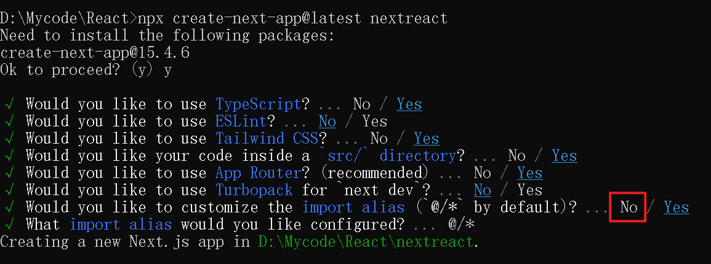
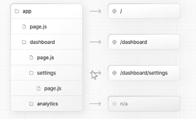
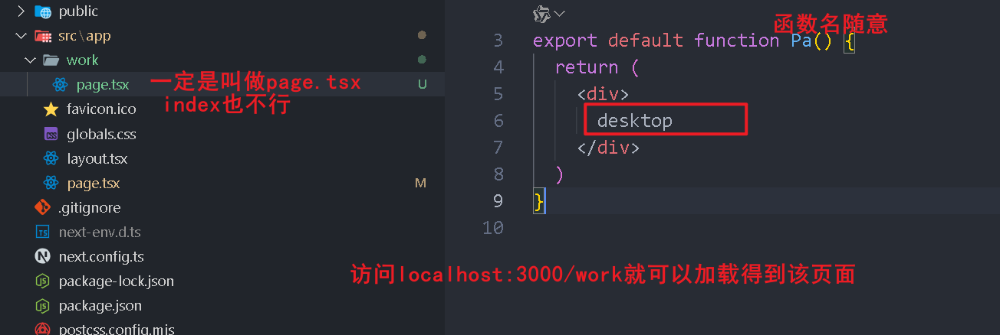
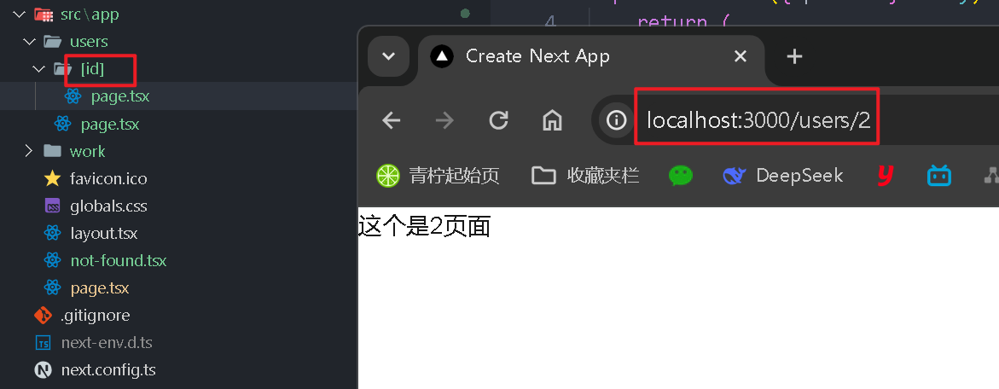
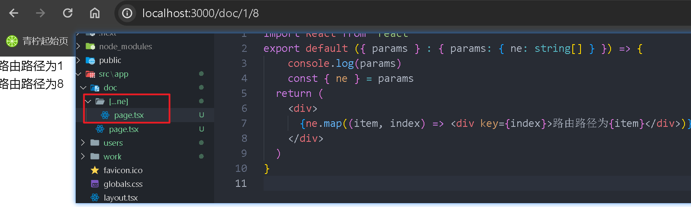

# 基本介绍

### **Next.js 的核心特点**

- **文件系统路由：**Next.js 使用文件系统作为路由机制，开发者只需在 pages 目录下创建组件文件，即可自动生成对应的路由。这种简便的方式大大减少了配置的复杂性。

- **静态生成与服务器端渲染：**Next.js 支持静态生成（SSG）和服务器端渲染（SSR），允许开发者根据需求选择合适的渲染方式，以优化页面加载速度和 SEO 表现。

- **API 路由：**内置的 API 路由功能，可以让开发者直接在 Next.js 应用中创建 API 端点，无需单独搭建后端服务。
- **增量静态生成**：在应用发布后，Next.js 支持对静态内容进行增量静态生成（ISR），允许内容在不重新构建整个应用的情况下进行更新。
- **图片优化：**Next.js 提供的 next/image 组件，自动处理图片的懒加载和优化，确保应用在不同设备和网络条件下都能流畅加载。

# 第一个Next.js

[一文快速掌握前端框架Nextjs_next.js-CSDN博客](https://blog.csdn.net/qq_32799165/article/details/144920728?ops_request_misc=%7B%22request%5Fid%22%3A%222668a5e4b8cf2335052f04c904b8a6e9%22%2C%22scm%22%3A%2220140713.130102334..%22%7D&request_id=2668a5e4b8cf2335052f04c904b8a6e9&biz_id=0&utm_medium=distribute.pc_search_result.none-task-blog-2~all~top_positive~default-1-144920728-null-null.142^v102^pc_search_result_base8&utm_term=nextjs&spm=1018.2226.3001.4187)

### 安装

**npx create-next-app@latest <name>**



# 路由

Next.js 使用基于文件系统的**约定式路由**（也称文件系统路由），这意味着项目的路由结构由 `pages` 或 `app` 目录中的文件结构决定。





这些写react return组件的文件里，可以是匿名函数，形如：export default () => {......}

## 文件系统路由：

| 文件名            | 作用           | 是否必须 | 备注               |
| :---------------- | :------------- | :------- | :----------------- |
| `layout.js`       | 共享布局       | 可选     | 保持状态           |
| `page.js`         | 页面内容       | 必须     | 每个路由都需要     |
| `loading.js`      | 加载状态       | 可选     | 基于 Suspense      |
| `not-found.js`    | 404 页面       | 可选     | 优先级高于全局 404 |
| `error.js`        | 局部错误边界   | 可选     | 需 "use client"    |
| `global-error.js` | 全局错误边界   | 可选     | 需包含 `<html>`    |
| `route.js`        | API 端点       | 可选     | 替代 `pages/api`   |
| `template.js`     | 可重置的布局   | 可选     | 路由切换时重新渲染 |
| `default.js`      | 并行路由备用页 | 可选     | 高级功能           |

## 404页面

```js
// app/blog/[slug]/page.tsx
import { notFound } from 'next/navigation';

export default async function Page({ params }) {
  const post = await fetchPostBySlug(params.slug);
  if (!post) {
    notFound(); // 触发全局的 not-found.js 渲染
  }
  return <div>{post.title}</div>;
}
```

## 基于可变参数的动态路由



```js
export default ({ params } : any) => {
    return (
        <div>
            这个是{params.id}页面
        </div>
    )
}
```



```js
export default ({ params } : { params: { ne: string[] } }) => {
    console.log(params)
    const { ne } = params
  return (
    <div>
      {ne.map((item, index) => <div key={index}>路由路径为{item}</div>)}
    </div>
  )
}
```

## 私有文件（路由不可跳转）

路由文件夹命名的最前面加上“_”，效果类似与： _lib，这样url里访问.../ _lib/ 就不会生效

## 隐藏路由

**如果路由文件夹加了小括号，形如 (auth)，文件夹内部又有其它的路由文件夹（比如login、register等），那么访问login的url为：.../login/，不用将(auth)加入进去。**

# **`use client`和**`use server`命令

**不要在同一个文件中同时使用 `"use client"` 和 `"use server"`。**

## **1. use client - 客户端组件指令**

#### 声明的情况如下：

- **React 状态管理**：`useState`, `useReducer`, `useEffect`, `useMemo` 等
- **浏览器 API**：`window`, `document`, `localStorage`, `navigator` 等
- **事件监听**：`onClick`, `onChange` 等交互逻辑
- **第三方库**：如 `react-query`, `framer-motion`, `react-hook-form` 等

**优先不添加 `"use client"`，最大化利用服务端渲染优势（SEO、性能）。**

## 2.use server-服务端组件指令（默认）

#### 声明情况如下：

- 标记函数为 **服务端操作（Server Action）**，在客户端调用但**实际运行在服务端**。
- 用于安全地处理表单提交、数据库修改等敏感操作。