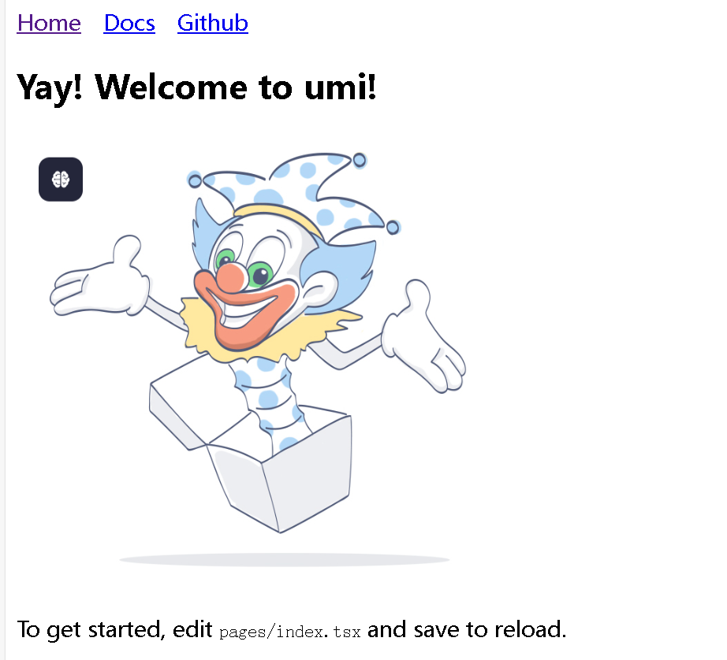
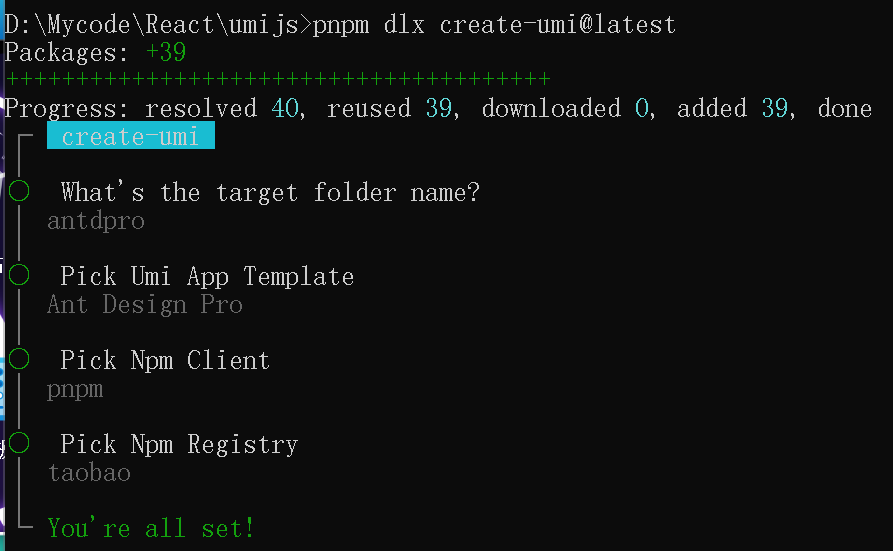
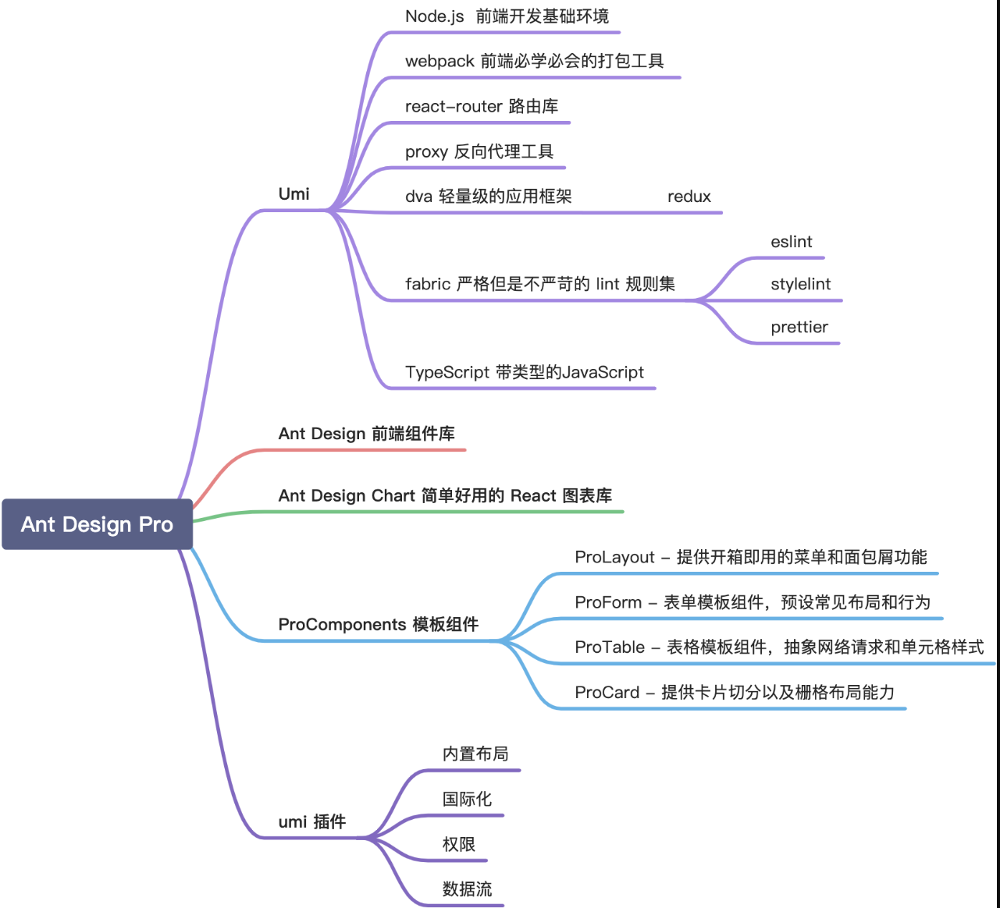
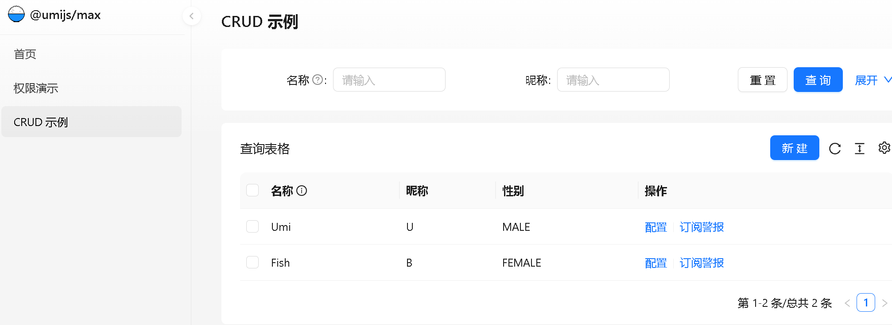
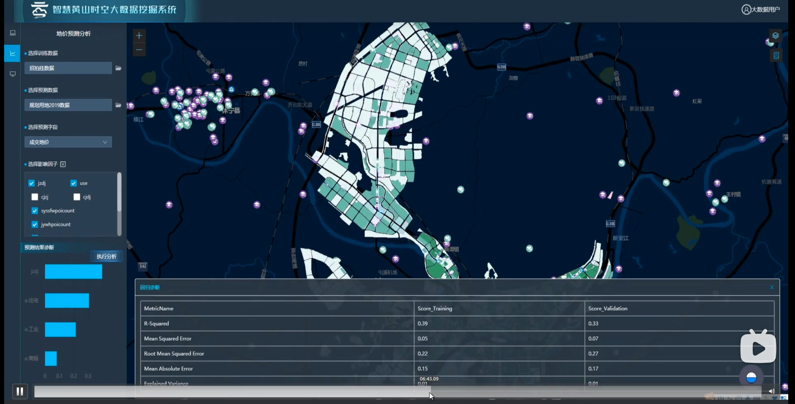

## umijs框架介绍

[Umi 介绍](https://umijs.org/docs/introduce/introduce)

### 特性

- **开箱即用**：内置路由、构建、部署、测试、Lint 等功能，仅需一个 Umi 依赖即可上手开发。
- **企业级**：是蚂蚁集团 10000+ 应用的选择，同时也在阿里、字节、腾讯、网易、美团、快手等公司有大量应用。
- **最佳实践**：内置微前端、数据流、权限、国际化、icons 方案、埋点、antd、请求、CSS 方案、图表等最佳实践。
- **可扩展**：实现了 web 应用开发的完整生命周期，并使之插件化，包括 Umi 内部功能也是全由插件实现。
- **完备路由**：基于 React Router 6，类 Remix，支持嵌套、动态、动态可选、预加载、基于路由的请求优化等。
- **默认快**：MFSU 解 Webpack 编译慢的问题，通过 esbuild 解压缩、配置、测试的性能问题，还有运行时的优化。
- **双构建引擎**：提供 Vite 和 Webpack 两种构建模式供开发者选择，并尽可能保证他们之间功能的一致性。
- **依赖预打包**：针对依赖做了预打包处理，彻底地锁定依赖，定期更新，让框架的每个版本在 10 年后依旧可用。

### 什么时候不用 Umi？

如果你的项目，

1、需要支持 IE 8 或更低版本的浏览器
2、需要支持 React 16.8.0 以下的 React
3、需要跑在 Node 14 以下的环境中
4、有很强的 webpack 自定义需求和主观意愿
5、需要选择不同的路由方案

使用文档：[快速上手](https://umijs.org/docs/guides/getting-started)

## 创建项目

**首先得有 node，并确保 node 版本是 18 或以上**

1. **全局安装pnpm**

```
npm install -g pnpm
```

2. **之后安装umijs的依赖**

```bash
pnpm dlx create-umi@latest
✔ Install the following package: create-umi? (Y/n) · true
✔ Pick Npm Client › pnpm
✔ Pick Npm Registry › taobao
```

3. **启动项目**

```
pnpm dev
```

**启动成功**



如果启动失败往往是因为nodejs的版本问题，下面是nodejs降版本的方法：

先卸载nodejs环境，确保没有nodejs。

[从github上下载nvm依赖](https://github.com/coreybutler/nvm-windows/releases)

[【全网最细！】使用nvm管理node（从node卸载到node安装使用一文搞定）nrm管理npm源_node管理-CSDN博客](https://blog.csdn.net/m0_59415345/article/details/141496413?ops_request_misc=%7B%22request%5Fid%22%3A%222ade333441ee9538af52a2d40a36d14a%22%2C%22scm%22%3A%2220140713.130102334..%22%7D&request_id=2ade333441ee9538af52a2d40a36d14a&biz_id=0&utm_medium=distribute.pc_search_result.none-task-blog-2~blog~top_positive~default-3-141496413-null-null.nonecase&utm_term=nvm&spm=1018.2226.3001.4450)

## 插件

在普通的 Umi 应用中，默认 **不附带任何插件** ，如需使用 Max 的功能（如 数据流、antd 等），需要手动安装插件并开启他们：

```bash
pnpm add -D @umijs/plugins
```

### 目录结构

[目录结构](https://umijs.org/docs/guides/directory-structure)

```
UmiJS 项目目录结构
.
├── config                       # 配置文件目录
│   └── config.ts                # 项目配置文件，用于定义项目运行时的配置
├── dist                         # 构建输出目录，存放构建后的文件
├── public						 # 存放图片静态资源
├── mock                         # Mock 数据目录
│   └── app.ts｜tsx               # Mock 数据文件，用于模拟后端接口数据
├── src                          # 源代码目录
│   ├── .umi                     # 开发时的临时文件目录，不要提交到 git 仓库
│   ├── .umi-production          # 构建时的临时文件目录，不要提交到 git 仓库
│   ├── layouts                  # 布局文件目录有Outlet展示标签
│   │   ├── BasicLayout.tsx       # 基础布局组件，优先加载这个页面
│   │   ├── index.less           # 布局样式文件
│   ├── models                   # 数据模型目录
│   │   ├── global.ts            # 全局模型文件
│   │   └── index.ts             # 模型索引文件
│   ├── pages                    # 页面文件目录，会自动生成路由
│   │   ├── index.less           # 页面样式文件
│   │   └── index.tsx            # 页面组件文件，加载layout之后加载的，相当于嵌套到layout页面
│   ├── utils                    # 工具函数目录，推荐存放工具函数
│   │   └── index.ts             # 工具函数索引文件
│   ├── services                 # 服务目录，推荐存放 API 请求等
│   │   └── api.ts               # API 请求文件
│   ├── app.(ts|tsx)             # 运行时配置文件，用于扩展运行时能力
│   ├── global.ts                # 全局前置脚本文件，程序的入口
│   ├── global.(css|less|sass|scss) # 全局样式文件，已配置好less和scss等
│   ├── overrides.(css|less|sass|scss) # 高优先级全局样式文件，用于覆盖第三方库样式
│   ├── favicon.(ico|gif|png|jpg|jpeg|svg|avif|webp) # 站点 favicon 图标文件
│   └── loading.(tsx|jsx)        # 展示页面切换或加载时的效果，可在谷歌浏览器里选择网络为3G测试
├── node_modules                 # 依赖包目录
│   └── .cache                   # 缓存目录
│       ├── bundler-webpack      # Webpack 缓存
│       ├── mfsu                 # MFSU 缓存
│       └── mfsu-deps            # MFSU 依赖缓存
├── .env                         # 环境变量文件，用于定义环境变量
├── plugin.ts                    # 项目级 Umi 插件文件，用于定制 Umi 功能
├── .umirc.ts                    # 项目配置文件，与 config/config.ts 功能相同，优先级较高
├── package.json                 # 项目依赖和脚本配置文件
├── tsconfig.json                # TypeScript 配置文件
└── typings.d.ts                 # 类型声明文件
```

## 约定式路由和配置式路由介绍

| 特性     | 约定式路由                           | 配置式路由                               |
| -------- | ------------------------------------ | ---------------------------------------- |
| 配置方式 | **自动根据目录结构生成**路由映射关系 | 需要在配置文件中**显式配置路由映射关系** |
| 灵活性   | 适合简单的业务场景，路由关系明确     | 适合复杂的业务场景，路由关系复杂         |
| 开发效率 | 简化配置，适合快速开发               | 需要手动配置，适合复杂业务场景           |
| 动态路由 | 不支持动态路由配置                   | 支持动态路由配置，适合权限管理等场景     |
| 菜单生成 | 不适合动态生成菜单                   | 支持动态生成菜单，适合复杂的菜单管理     |
| 适用场景 | 适合页面结构简单、路由关系明确的项目 | 适合页面结构复杂、路由关系复杂的项目     |

## Ant design

[文档总览 - Ant Design Pro](https://pro.ant.design/zh-CN/docs/overview)

[工作台 - Ant Design Pro 自定义样式](https://preview.pro.antdv.com/dashboard/workplace)

### 通过umi脚手架创建antd pro

同上面创建umijs项目一样，只是要选择Ant Design Pro





**启动项目**

```
pnpm dev
# 或者
npm run dev
```

**进入页面**



Umijs整合Geoscene API



```tsx
import React, { useState } from 'react';
import {Button, Tooltip, Divider, Checkbox, Switch, Radio} from 'antd';
import { UpOutlined, DownOutlined, EyeInvisibleOutlined, EyeOutlined } from '@ant-design/icons';
interface Layer {
    id: string;
    name: string;
    visible?: boolean;
    children?: Layer[];
    childrenModal?: 'switch' | 'checkbox'; // 'checkbox' acts like radio buttons (single select)
}

const LayerController: React.FC = () => {
    // Sample layer data - replace with your actual data source
    const [layers, setLayers] = useState<Layer[]>([
        {
            id: '1',
            name: '基础底图样式',
            childrenModal: 'checkbox',
            children: [
                { id: '1-1', name: '天地图', visible: true },
                { id: '1-2', name: 'arcgis底图', visible: false }
            ]
        },
        {
            id: '2',
            name: '交通要素',
            children: [
                { id: '2-1', name: '路网', visible: true },
                { id: '2-2', name: '地铁线', visible: true },
                { id: '2-3', name: '公交车站', visible: true }
            ]
        },
        {
            id: '3',
            name: '兴趣点',
            children: [
                { id: '3-1', name: '高等教育学院', visible: true },
                { id: '3-2', name: '商场', visible: true },
                { id: '3-3', name: '公园', visible: true },
                { id: '3-4', name: '医院', visible: false }
            ]
        },
    ]);

    const [expandedGroups, setExpandedGroups] = useState<string[]>(
        layers.map(layer => layer.id) // 默认展开全部
    );

    /**
     * 切换所有图层组的展开状态
     * 如果当前所有图层组都已展开，则折叠所有图层组
     * 否则展开所有图层组
     */
    const toggleAllGroups = () => {
        if (expandedGroups.length === layers.length) {
            setExpandedGroups([]);
        } else {
            setExpandedGroups(layers.map(layer => layer.id));
        }
    };

    /**
     * Toggle layer visibility
     * For checkbox mode (single select), it will disable all other children in the same group
     */
    const toggleLayerVisibility = (groupId: string, layerId: string) => {
        setLayers(prevLayers => {
            return prevLayers.map(group => {
                if (group.id === groupId) {
                    const isCheckboxMode = group.childrenModal === 'checkbox';
                    const updatedChildren = group.children?.map(child => {
                        // For checkbox mode, only the selected layer should be visible
                        if (isCheckboxMode) {
                            return {
                                ...child,
                                visible: child.id === layerId
                            };
                        }
                        // For switch mode, just toggle the clicked layer
                        if (child.id === layerId) {
                            return {
                                ...child,
                                visible: !child.visible
                            };
                        }
                        return child;
                    });
                    return {
                        ...group,
                        children: updatedChildren
                    };
                }
                return group;
            });
        });
    };

    /**
     * Hide all layers (except those in checkbox groups where one must remain selected)
     */
    const hideAllLayers = () => {
        setLayers(prevLayers => {
            return prevLayers.map(group => {
                const isCheckboxMode = group.childrenModal === 'checkbox';
                const hasVisibleChild = group.children?.some(child => child.visible);

                const updatedChildren = group.children?.map(child => {
                    // For checkbox groups, keep the currently visible one visible
                    if (isCheckboxMode && child.visible) {
                        return child;
                    }
                    // For other groups or non-visible checkbox children, hide them
                    return {
                        ...child,
                        visible: false
                    };
                });

                return {
                    ...group,
                    children: updatedChildren
                };
            });
        });
    };

    /**
     * Toggle group expansion
     */
    const toggleGroupExpansion = (groupId: string) => {
        setExpandedGroups(prev =>
            prev.includes(groupId)
                ? prev.filter(id => id !== groupId)
                : [...prev, groupId]
        );
    };

    return (
        <div style={{
            display: 'flex',
            flexDirection: 'column',
            height: '100%',
            overflow: 'hidden'
        }}>
            <div style={{
                flex: 1,
                overflowY: 'auto',
                padding: '8px 0'
            }}>
                <div style={{
                    display: 'flex',
                    justifyContent: 'space-between',
                    padding: '0 12px 8px',
                    alignItems: 'center'
                }}>
                    <span style={{ fontWeight: 'bold' }}>图层控制台</span>
                    <Tooltip title={expandedGroups.length === layers.length ? "折叠全部" : "展开全部"}>
                        <Button
                            type="text"
                            size="small"
                            icon={expandedGroups.length === layers.length ? <UpOutlined /> : <DownOutlined />}
                            onClick={toggleAllGroups}
                        />
                    </Tooltip>
                </div>

                {layers.map(group => (
                    <div key={group.id} style={{ marginBottom: 8 }}>
                        <div
                            style={{
                                display: 'flex',
                                justifyContent: 'space-between',
                                padding: '8px 12px',
                                alignItems: 'center',
                                cursor: 'pointer',
                                backgroundColor: expandedGroups.includes(group.id) ? '#f5f5f5' : 'transparent'
                            }}
                            onClick={() => toggleGroupExpansion(group.id)}
                        >
                            <span>{group.name}</span>
                            {expandedGroups.includes(group.id) ? <UpOutlined /> : <DownOutlined />}
                        </div>

                        {expandedGroups.includes(group.id) && (
                            <div style={{ padding: '0 12px 0 24px' }}>
                                {group.children?.map(layer => (
                                    <div
                                        key={layer.id}
                                        style={{
                                            display: 'flex',
                                            justifyContent: 'space-between',
                                            alignItems: 'center',
                                            padding: '4px 0'
                                        }}
                                    >
                                        <span>{layer.name}</span>
                                        {group.childrenModal === 'checkbox' ? (
                                            <Radio
                                                checked={layer.visible}
                                                onChange={() => toggleLayerVisibility(group.id, layer.id)}
                                            />
                                        ) : (
                                            <Switch
                                                checked={!!layer.visible}
                                                onChange={() => toggleLayerVisibility(group.id, layer.id)}
                                            />
                                        )}
                                    </div>
                                ))}
                            </div>
                        )}
                    </div>
                ))}
            </div>

            <Divider style={{ margin: '8px 0' }} />

            <div style={{
                padding: '8px 12px',
                display: 'flex',
                justifyContent: 'space-between'
            }}>
                <Tooltip title="隐藏所有图层">
                    <Button
                        type="text"
                        icon={<EyeInvisibleOutlined />}
                        onClick={hideAllLayers}
                    />
                </Tooltip>
            </div>
        </div>
    );
};
export default LayerController;
```