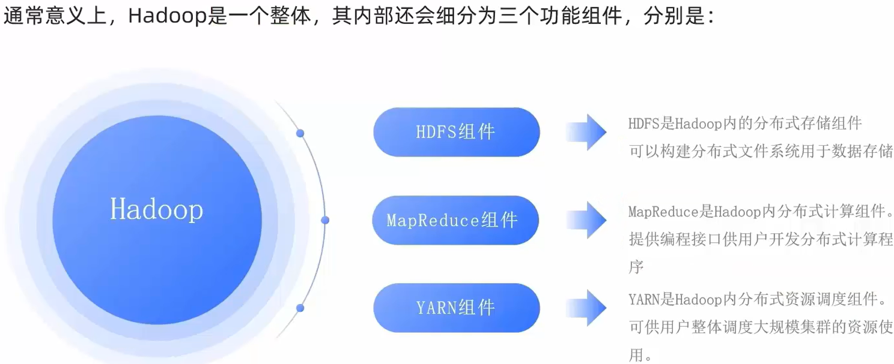
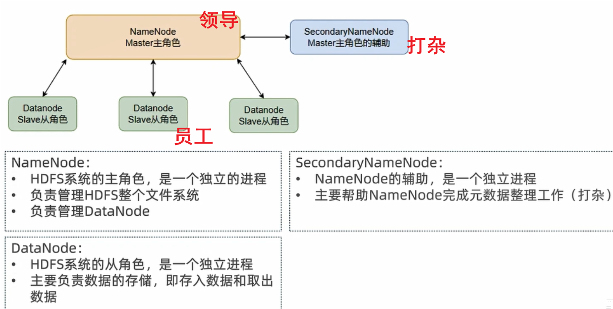
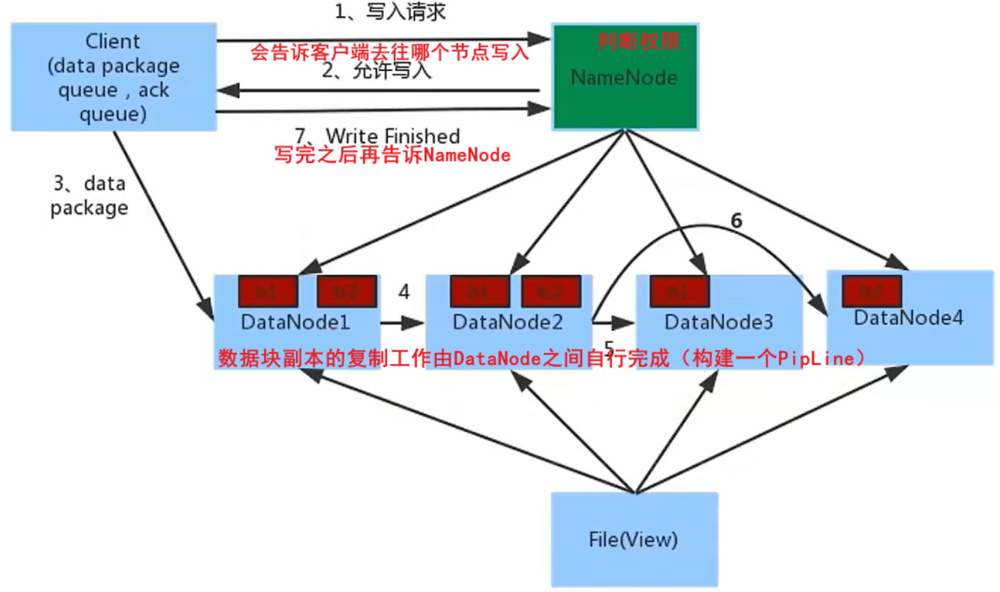
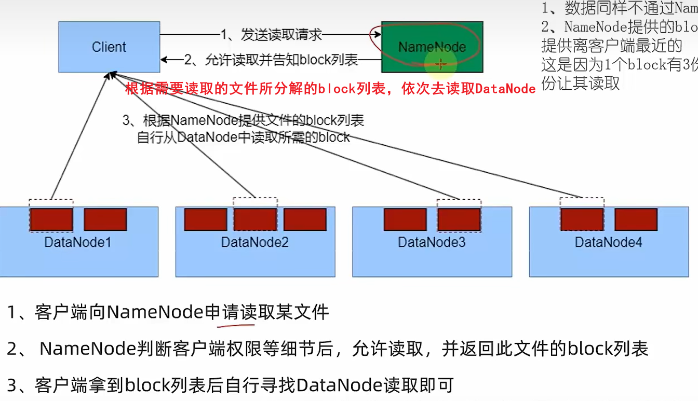
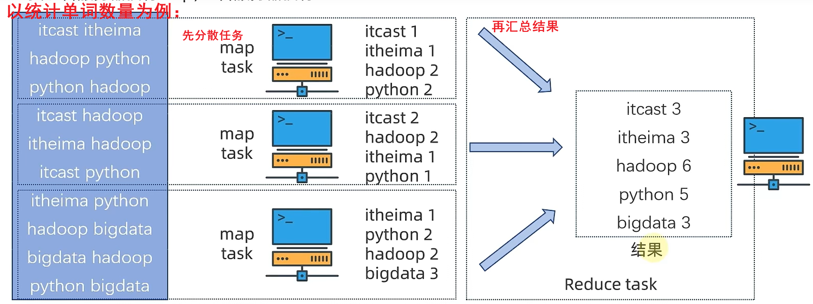
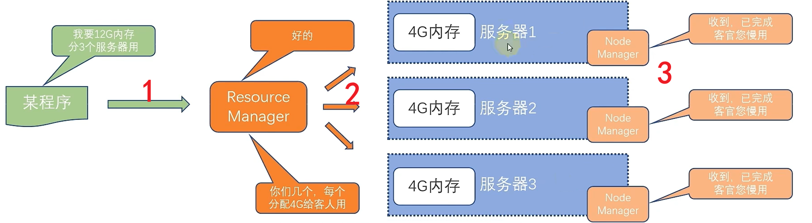
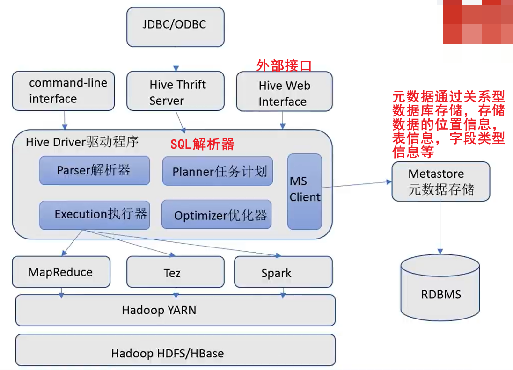
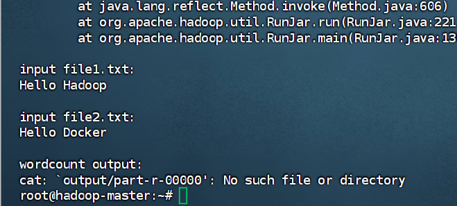

# Hadoop介绍

**Hadoop提供：**

- 分布式数据存储
- 分布式数据计算
- 分布式资源调度



### 为什么要分布式存储

网络的传输效率，磁盘的读写效率会大幅提升。

### 分布式基础架构

在分布式系统里，多个机器一起工作，往往会造成混乱的结果。

#### 主要有两种方式：

##### 去中心化模式

##### 中心化模式（主从模式）

# HDFS组件

### 架构



除以上图里的节点以外，还有备用节点。

HDFS的最小存储单元为block块，每个默认为256MB（可修改）

**NameNode（主节点）不存储实际数据**，它只存储 **元数据（Metadata）**，即关于HDFS文件系统的管理信息。以下是详细说明：

- **文件系统的命名空间**（目录结构、文件名称、权限等）。
- **文件与数据块（Block）的映射关系**（如 `file.txt` 由 `blk_123`、`blk_456` 组成）。
- **数据块所在的 DataNode 列表**（但不存储数据块内容本身）。


# HDFS数据读写流程

### 写流程



### 读流程



关键点：

1. 数据不通过NameNode提供，
2. NameNode提供的block列表，会基于网络距离计算尽量提供离客户端最近的，这是因为1个block有3份，会尽量找离客户端最近的那一份读取

# 分布式计算介绍（MapReduce & Yarn）

分布式计算：多台服务器共同完成一个计算任务，最后将各台服务器的计算结果进行汇总。

#### 分布式计算常见的两种工作模式：

分散=>汇总（类似于人口普查）

中心调度=>步骤执行（大数据体系的Spark、Flink就是这种模式）

## MapReduce

Hive框架的底层，Hive比较流行，但是MapReduce过时了，且被封装为了Hive（写SQL即可）

作为分布式数据处理模型，提供两个接口，可使用Java或python调用：

Map：分散功能

Reduce：汇总功能



## Yarn

MapReduce运行基于Yarn（MapReduce运行受Yarn的约束，MapReduce运行时要请求Yarn要运行资源），Yarn作用为分布式资源调度，调度整个服务器集群资源的统一管理。

#### Yarn的架构

1. **ResourceManager**: 整个集群的资源调度者，负责协调调度各个程序所需的资源。
2. **NodeManager**: 单个服务器的资源调度者，负责调度单个服务器上的资源提供给应用程序使用。



#### 如何实现各节点服务器上精准分配硬件资源？

使用容器（虚拟出来的资源），**一个容器有指定的大小，且被限制了CPU和内存等计算资源**。

#### JobHistoryServer

**JobHistoryServer**（作业历史服务器）是MapReduce框架的一个**独立守护进程**，专门用于**集中存储和管理已完成的MapReduce作业的历史信息**

#### ProxyServer 

就是一个**“安全代理”**或**“认证网关”**。

**统一 API 入口**

# Hive—分布式SQL计算平台

Hive就是使用户写的是SQL，然后底层跑的是MapReduce。

**使用Hive处理数据的好处**

- 操作接口采用类SQL语法，提供快速开发的能力（简单、容易上手）
- 底层执行MapReduce，可以完成分布式海量数据的SQL处理

### Hive的架构



# 使用云虚拟机搭建hadoop集群环境

安装jdk17

### 配置docker网络

```bash
docker network create --subnet=172.18.0.0/16 hadoop  
```

- **172.18.0.0**：这是子网的网络地址，也就是这个网络的起始地址。
- **/16**：这是子网掩码（Network Mask），表示前 16 位是网络部分，后 16 位是主机部分。

结合起来，`172.18.0.0/16` 表示：

- 网络范围从 `172.18.0.0` 到 `172.18.255.255`
- 可以在这个范围内为容器分配 IP 地址

查看

```bath
 docker network ls
```

#### 网桥bridge的作用

- **隔离与连接：** 一个 `bridge` 网络可以让容器在其内部相互通信，同时与宿主机分隔。
- **`bridge`** 是一种虚拟的网络驱动，允许多个容器共享同一个虚拟网络，就像连接到一个虚拟的交换机（交换机常用的网络桥）一样。

## 拉取hadoop镜像

```bath
sudo docker pull kiwenlau/hadoop:1.0
```

拉取hadoop-cluster-docker

```
git clone https://github.com/kiwenlau/hadoop-cluster-docker
```

之后：cd hadoop-cluster-docker（**进入hadoop-cluster-docker目录**）

## 启动三节点容器：

```bath
./start-container.sh  # 默认启动1个master + 2个slave
```

```
docker start hadoop-master hadoop-slave1 hadoop-slave2  # 同时启动三个容器
```

然后进入到hadoop-master节点里

```
docker exec -it hadoop-master /bin/bash
```

之后执行

```
./start-hadoop.sh  # 初始化并启动HDFS/YARN服务
```

然后执行

```bath
./run-wordcount.sh  # 运行WordCount测试任务
```

最后运行成功显示：



验证：进入**Web管理界面**

- **HDFS（NameNode）**：`http://<云服务器公网IP>:50070`
- **YARN（ResourceManager）**：`http://<云服务器公网IP>:8088`

[通过 docker-compose 快速部署 Hadoop 集群极简教程](https://mp.weixin.qq.com/s?__biz=MzI3MDM5NjgwNg==&mid=2247487227&idx=1&sn=093a5d42a61d661195c1bd25f7f5c477&chksm=ead0f212dda77b041b42105a254825a4f7436ed6e9087d4c5cea3e7bf198c9a9a4f5bc3fe624&scene=21#wechat_redirect)
