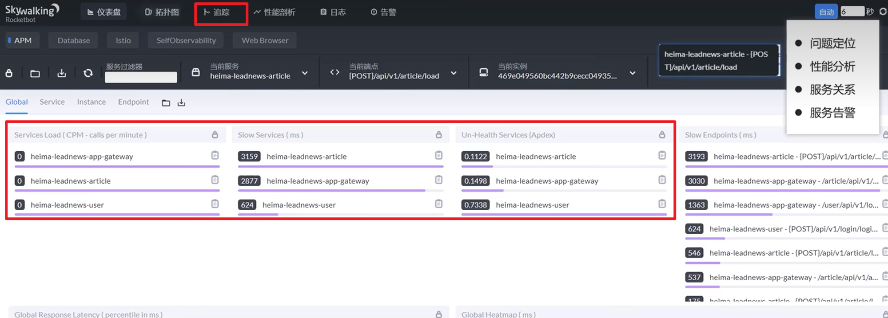
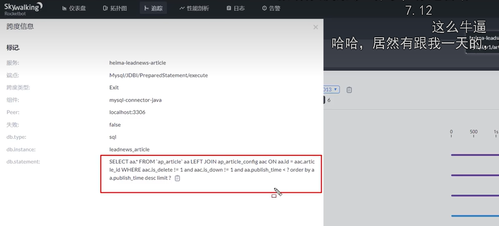

## springcloud五大组件

- Eureka/nacos ：注册中心
- Ribbon ：负载均衡
- Feign ：远程调用
- Hystrix ：服务熔断
- Zuul/Gateway ：网关

## CAP和BASE理论

**一致性**：用户访问分布式系统中的任意节点，得到的数据必须一致（需要数据同步的步骤）

**可用性**：在集群中一部分节点故障后, 集群整体还是可以响应给客户端。

**分区容错性**：指的是分布式系统在遇到==网络分区（节点间通信中断）时==（P），系统仍然能够继续提供服务的能力。

#### 结论： 

◆ 分布式系统节点之间肯定是需要网络连接的，分区（P）是必然存在的 

◆ 如果保证访问的高可用性（A），可以持续对外提供服务，但不能保证数据的强一致性--> AP 

◆ 如果保证访问的数据强一致性（C），就要放弃高可用性--> CP

#### base理论

BASE理论是对CAP的一种解决思路，包含三个思想： 

- Basically Available（==基本可用==）：分布式系统在出现故障时，**允许部分可用性，即保证核心可用**。  
- Soft State（==软状态==）：在一定时间内，**允许出现中间状态，比如响应时的不一致状态**。 
- Eventually Consistent（==最终一致性==）：虽然无法保证强一致性，但是**在软状态结束后，最终达到数据一致**。

## 服务注册和发现以及监控

**服务注册**：服务提供者需要把自己的信息注册到**nacos**，由nacos来保存这些信息，比如服务名称、ip、端口等
**服务发现**：消费者向nacos拉取服务列表信息，==**如果服务提供者有集群，则消费者会利用负载均衡算法**==，选择一个发起调用
 **服务监控**：服务提供者会每隔30秒向nacos发送心跳，报告健康状态，如果nacos服务90秒没有收到心跳，从**nacos**中删除

### nacos和eureka的区别

| **对比项**     | **Eureka**                             | **Nacos**                          |
| :------------- | :------------------------------------- | :--------------------------------- |
| **CAP模式**    | 更注重可用性和分区容错性，牺牲了一致性 | 可选择可用性和一致性               |
| **健康检查**   | 心跳检测（30s）                        | 心跳（5s）+ nacos注册中心主动探测  |
| **服务发现**   | 拉取（30s）                            | 推送 + 长连接                      |
| **功能**       | 仅服务注册发现                         | 服务注册发现 + 配置管理 + 流量控制 |
| **自我保护**   | 全局阈值（85%）                        | 服务级阈值                         |
| **适用场景**   | 简单微服务                             | 复杂微服务 + 动态配置              |
| **数据热更新** | 不支持                                 | 支持                               |

## Ribbon负载均衡

Ribbon主要用于**微服务之间的直接调用**（微服务间直接调用时（如通过Feign或RestTemplate）的负载均衡）

**Spring Cloud Gateway** 是API网关层面的负载均衡，适用于所有经过网关的请求转发场景

### 有哪些负载均衡策略

- RoundRobinRule：轮询
- WeightedResponseTimeRule：按照权重来选择服务端，响应时间越长，权重越小
- RandomRule：随机选择一个可用的服务端

- 自定义：
  - 创建类实现IRule接口，可以指定负载均衡策略（全局）
  - 在客户端的配置文件中，可以配置某个服务调用的负载均衡策略（局部）

## 服务雪崩、熔断降级

雪崩：一个服务宕机，调用这个服务的另一个服务不断重试调用，最后造成整条链上服务失败，由于服务间相互调用，最终导致接近所有的服务都失败。

**Hystrix降级**：就是一个备用的方法来兜底，通常是自定义的一个回调函数，确保服务不崩溃，同时返回相关提示。

**Hystrix服务熔断**：如果检测到10秒内请求的失败率超过50%，就会触发熔断机制。==**暂时切断对故障服务的调用，如果还有请求那么采取Hystrix降级策略，调用自定义的回调方法返回相关提示**==，之后每隔5秒，熔断器会进入半开启状态。在这个状态下，熔断器会允许一定数量（3个）的请求通过，以试探依赖服务是否已经恢复。如果微服务不能响应，继续走熔断机制。如果微服务可以响应，关闭熔断机制，恢复正常请求。

## 微服务监控

#### 为什么要监控：

问题定位
性能分析
服务关系
服务告警

#### 监控平台：SkyWalking 

SkyWalking 是一个开源的==**链路追踪**==可观察性平台，主要用于==**分布式系统的性能监控、追踪和诊断。**==

SkyWalking界面，还可以查看具体的sql语句。

## 限流

限流的目的：防止突发流量和恶意刷接口

#### 限流的方法

- Tomcat：可以设置最大连结数 

- Nginx，漏桶算法 

- 网关，令牌桶算法 

- 自定义拦截器

#### spring cloud里的限流：

yaml文件里加局部过滤器**RequestRateLimiter**

### 漏桶算法和令牌桶算法

**漏桶算法**：一种速率限制的算法，它强制保持恒定的输出速率，无论输入流量如何波动。

##### 工作原理

1. 请求进入漏桶（可以看作是队列）
2. 漏桶以固定的速率处理请求（漏水）
3. 如果桶满了（队列满了），新的请求会被丢弃或拒绝

**令牌桶算法**：流量控制算法，它允许一定程度的突发流量。

##### 工作原理

1. 系统以恒定速率向桶中添加令牌

2. 每个请求需要获取一个令牌才能被处理

3. 如果桶中有足够的令牌，请求被处理并消耗令牌

4. 如果桶中没有令牌，请求被拒绝或排队

   

- key-resolver：定义限流对象（ip、路径、参数），需代码实现，使用spel表达式获取 

- replenishRate：令牌桶每秒填充平均速率 

- urstCapacity：令牌桶总容量

## 分布式事务的解决

### seate框架

- TC (Transaction Coordinator) - 事务协调者：**维护全局和分支事务的状态**，协调全局事务提交或回滚。  
- TM (Transaction Manager) - 事务管理器：**定义全局事务的范围**、开始全局事务、提交或回滚全局事务。  
- RM (Resource Manager) - 资源管理器：**管理分支事务**，与TC交谈以注册分支事务和报告分支事务的状态，并驱动分支事务提交或回滚。

#### 基于seate的分布式事务解决方案

1. seata的XA模式，CP，需要互相等待各个分支事务提交，可以保证强一致性，性能差 银行业务
2. seata的AT模式，AP，底层使用undo log 实现，性能好互联网业务
3. seata的TCC模式，AP，性能较好，不过需要人工编码实现 银行业务

### MQ分布式事务解决方法

MQ模式实现分布式事务，在A服务写数据的时候，需要在同一个事务内发送消息到另外一个事务，异步，性能最好，但有延迟，只能保证数据的最终一致性。

## 接口幂等性

#### 需要考虑幂等的场景

- 用户重复点击(网络波动)
- MQ消息重复
- 应用使用失败或超时重试机制

#### 解决方法

一、token标识+redis：客户端在调用接口前先获取一个唯一标识（Token），且redis也存储该token（key包含用户id，value包含token），调用时携带该标识，重复请求时，第一次请求判断redis里有token，那么移除token，第二次请求判断redis里没token，那么请求失败。

二、分布式锁：获取到锁就去请求，没获取锁立即抛异常失败。

三、数据库的唯一索引