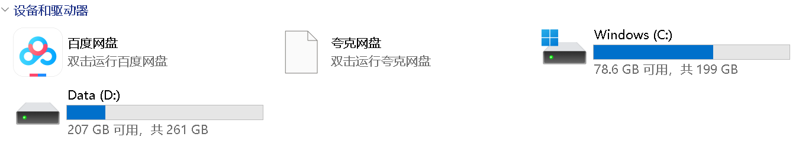

# WSL介绍

[11-Windows配置WSL(Ubuntu)环境_哔哩哔哩_bilibili](https://www.bilibili.com/video/BV1h1VbzHER2?spm_id_from=333.788.videopod.episodes&vd_source=3c46a0d84476a55380be0c2ddd012af1&p=12)

用户：lwq

密码：123456

chown root:root /etc/sudo.conf
chown root:root /etc/sudoers
chmod 440 /etc/sudoers