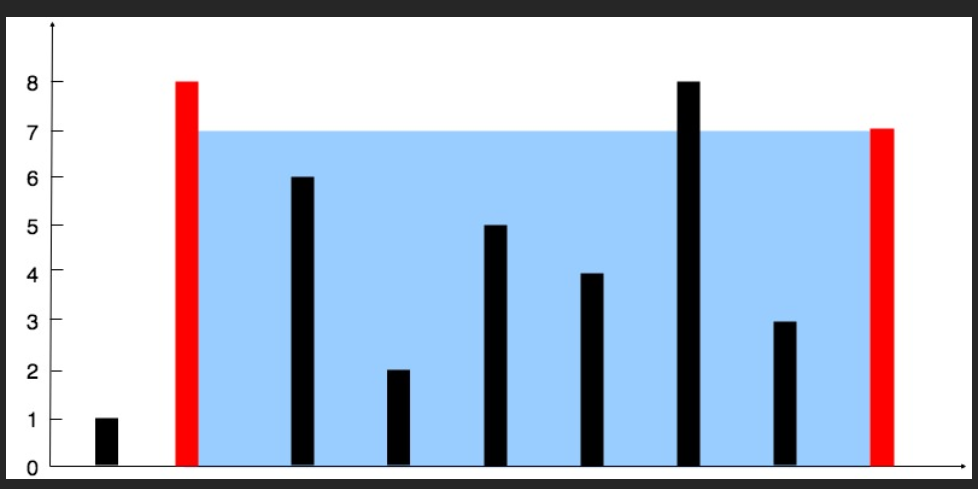
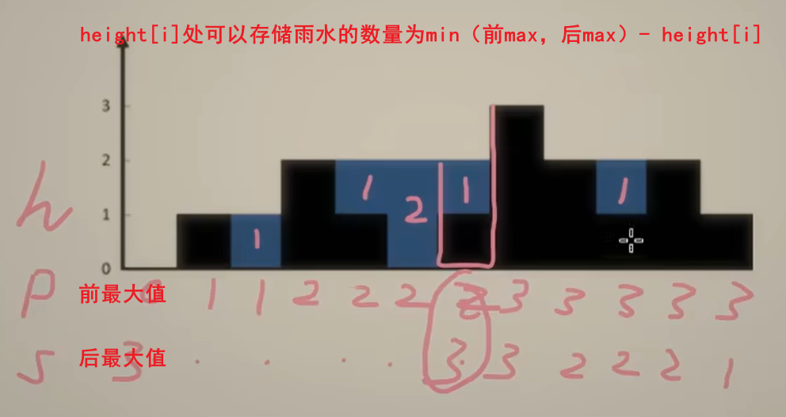
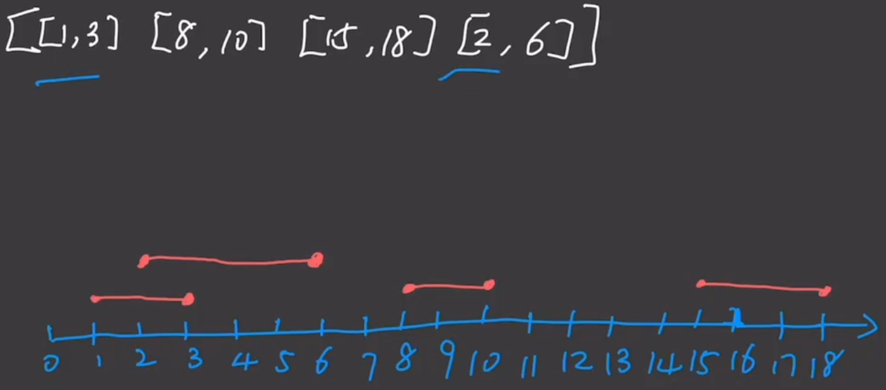
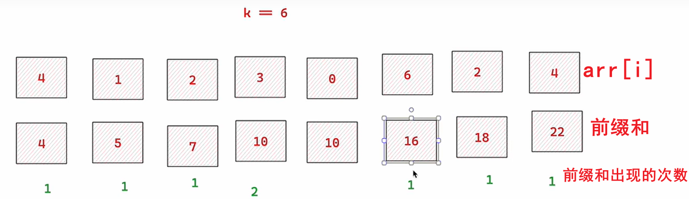

## 最大子数组和

https://www.bilibili.com/video/BV1EUocYEEx3/?spm_id_from=333.1007.top_right_bar_window_custom_collection.content.click

```java
class Solution {
    public int maxSubArray(int[] nums) {
        // cur是以当前遍历到的数作为最大子数组最末尾的数，那么最大子数组和要么为遍历到的数本身，要么就是遍历到的数和前一个cur之和。
        int res = nums[0], cur = nums[0];
        for(int i = 1; i < nums.length; i++){
            cur = Math.max(nums[i], nums[i] + cur);
            res = Math.max(cur, res);
        }
        return res;
    }
}
```

## 盛最多水的容器



**思路（贪心+双指针）：**

- 如果要盛最多水的话，那么双指针间的距离尽量大，所以初始的时候分别位于最左和最右。
- 每一次求得res,和(r - l) * a最大值，确保移动了反而还更小返回的是原来最大值
- **哪一边更小，那么哪一边移动就更可能会找到最大值。**

```java
class Solution {
    public int maxArea(int[] height) {
        int l = 0, r = height.length - 1;
        int res = 0;
        while (l < r) {
            int a = Math.min(height[l], height[r]);
            res = Math.max(res, (r - l) * a); // 每一次求得最大值，确保移动了反而还更小返回的是原来最大值
            if(height[l] <= height[r]){ // 哪一边更小，那么哪一边移动就更可能会找到最大值。
                l++;
            }else{
                r--;
            }
        }
        return res;
    }
}
```

## 环形链表

```java
/**
 * Definition for singly-linked list.
 * class ListNode {
 *     int val;
 *     ListNode next;
 *     ListNode(int x) {
 *         val = x;
 *         next = null;
 *     }
 * }
 */

// 解法一
public class Solution {
    public boolean hasCycle(ListNode head) {
        if(head == null){
            return false;
        }
        ListNode show = head, fast = head.next;
        while(fast != null && show != null){
            show = show.next;
            if(fast.next != null){
                fast = fast.next.next;
            }else{
                return false;
            }
            if(fast == show){
                return true;
            }
        }
        return false;
    }
}

// 解法二
public class Solution {
    public boolean hasCycle(ListNode head) {
        Set<ListNode> seen = new HashSet<ListNode>();
        while (head != null) {
            if (!seen.add(head)) {
                return true;
            }
            head = head.next;
        }
        return false;
    }
}
```

## 环形链表II

**方法一：快慢指针**


```java
/**
 * Definition for singly-linked list.
 * class ListNode {
 *     int val;
 *     ListNode next;
 *     ListNode(int x) {
 *         val = x;
 *         next = null;
 *     }
 * }
 */
public class Solution {
    public ListNode detectCycle(ListNode head) {
        if (head == null || head.next == head) {
            return head;
        }
        if (head.next == null) {
            return null;
        }
        ListNode slow = head, fast = head;
        slow = slow.next;
        if (fast.next == null || fast.next.next == null) {
            return null;
        }
        fast = fast.next.next;
        while (slow != fast) {
            slow = slow.next;
            if (fast.next == null || fast.next.next == null) {
                return null;
            }
            fast = fast.next.next;
        }
        fast = head;
        while (fast != slow) {
            fast = fast.next;
            slow = slow.next;
        }
        return slow;
    }
}
```

**方法二：hashset**

```java
public class Solution {
    public ListNode detectCycle(ListNode head) {
        Set<ListNode> set = new HashSet();
        ListNode cur = head;
        while(cur != null){
            if(!set.add(cur)){
                return cur;
            }
            cur = cur.next;
        }
        return null;
    }
}
```


## 接雨水

[盛最多水的容器 接雨水【基础算法精讲 02】_哔哩哔哩_bilibili](https://www.bilibili.com/video/BV1Qg411q7ia?spm_id_from=333.788.recommend_more_video.1&vd_source=3c46a0d84476a55380be0c2ddd012af1)

#### 方法一



```java
class Solution {
    public int trap(int[] height) {
        // 初始化两个数组，表示前缀最大值和后缀最大值
        int len = height.length;
        int[] front = new int[len];
        front[0] = height[0];
        int[] back = new int[len];
        back[len - 1] = height[len - 1];
        for(int i = 1; i < len; i++){
            front[i] = Math.max(height[i], front[i -1]);
            back[len - 1- i] = Math.max(height[len - 1 - i], back[len - i]);
        }
        int res = 0;
        for(int i = 0; i < len; i++){
            res += (Math.min(front[i], back[i]) - height[i]);
        }
        return res;
    }
}
```

#### 方法二

```java
class Solution {
    public int trap(int[] height) {
        int res = 0;
        int len = height.length;
        int l = 0, r = len - 1,lmax = 0, rmax = 0;
        while(l < r){
           if(height[l] > lmax){
            lmax = height[l]; // 左最大值
           }
           if(height[r] > rmax){
            rmax = height[r]; // 右最大值
           }
           if(lmax > rmax){ // 如果l右移，那么lmax只会更大
            res += (rmax - height[r]); // 求出了height[r]处可以存储水的数量
            r--;
           }else{
            res += (lmax - height[l]);// 求出height[l]处可以存储水的数量
            l++;
           }
        }
        return res;
    }
}
```

## 反转链表

**正常解法**

```java
 public ListNode reverseList(ListNode head) {
        ListNode newHead = null;
        while(head != null){
            ListNode p = newHead;
            newHead = head;
            head = head.next;
            newHead.next = p;
        }
        return newHead;
    }
```

**递归方法**

```java
public ListNode reverseList(ListNode head) {
        if (head == null || head.next == null) {
            return head; // 如果链表为空或只有一个节点，直接返回
        }
        // 递归反转链表的剩余部分
        ListNode newHead = reverseList(head.next);
        // 将当前节点的下一个节点的`next`指针指向当前节点
        head.next.next = head;
        // 将当前节点的`next`指针设为`null`
        head.next = null;
        // 返回新的头节点
        return newHead;
    }
```


## 回文链表

[力扣 Leetcode｜234 回文链表Palindrome｜快慢指针_哔哩哔哩_bilibili](https://www.bilibili.com/video/BV1VZ4y1e7aR/?spm_id_from=333.337.search-card.all.click&vd_source=3c46a0d84476a55380be0c2ddd012af1)

```java
public boolean isPalindrome(ListNode head) {
        if (head == null || head.next == null) {
            return true; // 空链表或只有一个节点的链表是回文
        }

        // 找到链表的中点
        ListNode slow = head, fast = head;
        while (fast != null && fast.next != null) {
            slow = slow.next;
            fast = fast.next.next;
        }

        // 反转链表的后半部分
        ListNode prev = null, p = null;
        while (slow != null) {
            p = prev;
            prev = slow;
            slow = slow.next;
            prev.next = p;
        }

        // 比较前半部分和反转后的后半部分
        ListNode left = head;
        ListNode right = prev; // 反转后的后半部分的头节点
        while (right != null) { // 右半部分可能比左半部分短
            if (left.val != right.val) {
                return false;
            }
            left = left.next;
            right = right.next;
        }

        return true;
    }
```

## 只出现一次的数字

```java
class Solution {
    public int singleNumber(int[] nums) {
        int sin = 0;
        for(int x : nums){
            sin ^= x;
        }
        return sin;
    }
}
```

**关于^按位异或运算符**

```java
int a = 5; // 二进制表示为 0101
int b = 3; // 二进制表示为 0011
int result = a ^ b; // 逐位异或操作
// 0101
// 0011
// ----   有相等则为0，不相等就为1
// 0110
// result 的值为 6
```

**在算法题里的应用**

```c
0^x = x
0^x^x = 0
x^x = 0
// 按位异或运算（^）满足交换律
```

## 合并区间

[【大厂程序员带你刷力扣】【LeetCode 56】合并区间｜排序_哔哩哔哩_bilibili](https://www.bilibili.com/video/BV1nVHXehEBC/?spm_id_from=333.337.search-card.all.click&vd_source=3c46a0d84476a55380be0c2ddd012af1)



```java
class Solution {
    public int[][] merge(int[][] intervals) {
        int len = intervals.length;
        if (len == 1 || len == 0) {
            return intervals;
        }
        Arrays.sort(intervals, (o1, o2) -> o1[0] - o2[0]); // 排序
        // 临时区间
        int tempMin = intervals[0][0];
        int tempMax = intervals[0][1];
        List<int[]> res = new ArrayList();
        for (int i = 1; i < len; i++) {
            if (intervals[i][0] <= tempMax && intervals[i][1] > tempMax) {
                tempMax = intervals[i][1];
            }
            if (intervals[i][0] > tempMax) {
                int[] arr = {tempMin, tempMax};
                res.add(arr);
                tempMin = intervals[i][0];
                tempMax = intervals[i][1];
            }
        }
        // 二维List列表转为二维数组没有现成的方法，但是一维List列表和一位数组的相互转换有方法
        res.add(new int[]{tempMin, tempMax});
        return res.toArray(new int[res.size()][]);
    }
}
```

> #### **总结**
>
> 遇到列表的题优先考虑排序会不会简化
>
> Arrays.sort(arr, (o1, o2) -> o1[0] - o2[0]); //根据o1[0]的属性进行排序
>
> Collections.sort(list, (o1, o2) -> o2 - o1); // 倒序

## 和为k的子数组

[算法面试实录-和为 k 的子数组_哔哩哔哩_bilibili](https://www.bilibili.com/video/BV1gN411E7Zx/?spm_id_from=333.337.search-card.all.click&vd_source=3c46a0d84476a55380be0c2ddd012af1)



```java
class Solution {
    public int subarraySum(int[] nums, int k) {
        int len = nums.length;
        int sum = 0;
        int res = 0;
        Map<Integer, Integer> map = new HashMap();
        map.put(0, 1);
        for (int i = 0; i < len; i++) {
            sum += nums[i];
            if (map.containsKey(sum - k)) { // 如果之前前缀和里出现了sum - k,那么就要加res
                res+=map.get(sum - k);
            }
            map.put(sum, map.getOrDefault(sum, 0) + 1); // getOrDefault表示没有就为0
        }
        return res;
    }
}
```

## 轮转数组

[189. 轮转数组 - 力扣（LeetCode）](https://leetcode.cn/problems/rotate-array/solutions/551039/xuan-zhuan-shu-zu-by-leetcode-solution-nipk/?envType=study-plan-v2&envId=top-100-liked)

```java
class Solution {
    public void rotate(int[] nums, int k) {
        int len = nums.length;
        int[] arr = new int[len];
        for(int i = 0; i < len; i++){
            arr[(i + k) % len] = nums[i];
        }
        for(int i = 0; i < len; i++){
            nums[i] = arr[i];
        }
    }
}
```

## 合并两个有序链表

[21. 合并两个有序链表 - 力扣（LeetCode）](https://leetcode.cn/problems/merge-two-sorted-lists/solutions/226408/he-bing-liang-ge-you-xu-lian-biao-by-leetcode-solu/?envType=study-plan-v2&envId=top-100-liked)**(看题解)**

```java

class Solution {
    public ListNode mergeTwoLists(ListNode list1, ListNode list2) {
        ListNode res = new ListNode(0, null);
        ListNode cur = res;
        while (list1 != null && list2 != null) {
            if (list1.val < list2.val) {
                cur.next = list1;
                list1 = list1.next;
            } else {
                cur.next = list2;
                list2 = list2.next;
            }
            cur = cur.next;
        }
        cur.next = list1 == null ? list2 : list1;
        return res.next;
    }
}
```

**递归实现**

```java
class Solution {
    public ListNode mergeTwoLists(ListNode list1, ListNode list2) {
        if(list1 == null){
            return list2;
        }else if(list2 == null){
            return list1;
        }
        if(list1.val < list2.val){
            list1.next = mergeTwoLists(list1.next, list2);
            return list1;
        }else{
            list2.next = mergeTwoLists(list2.next, list1);
            return list2;
        }
    }
}
```

