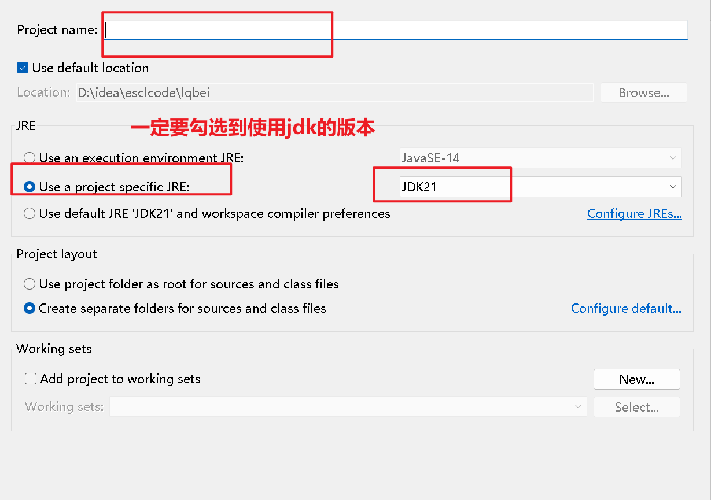
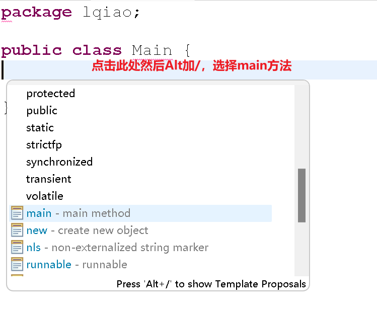
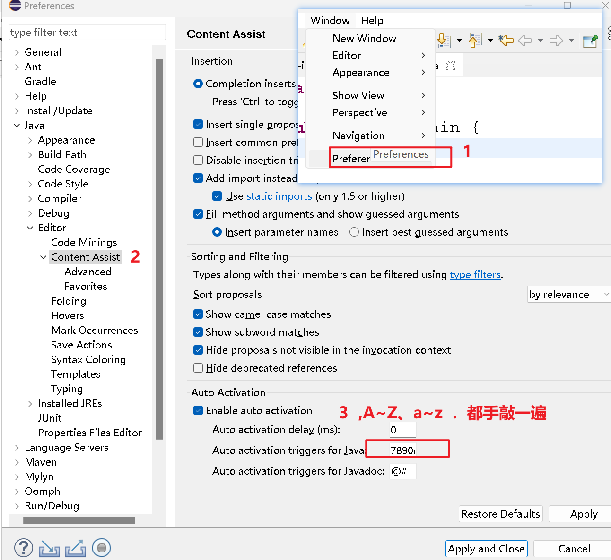
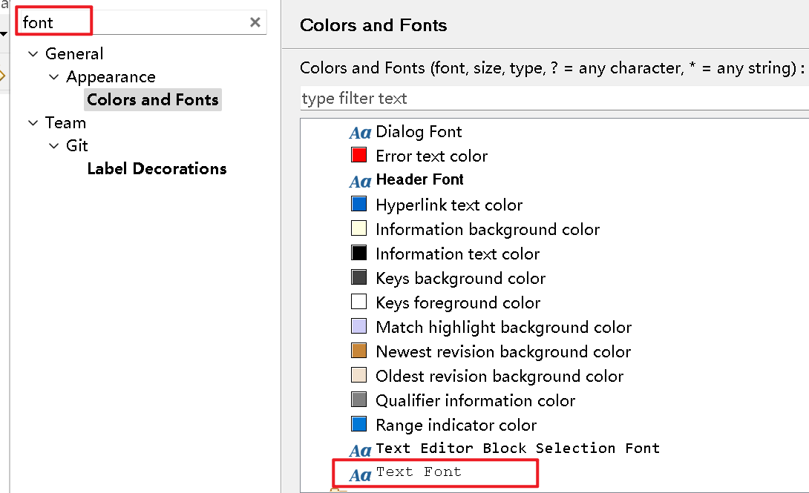
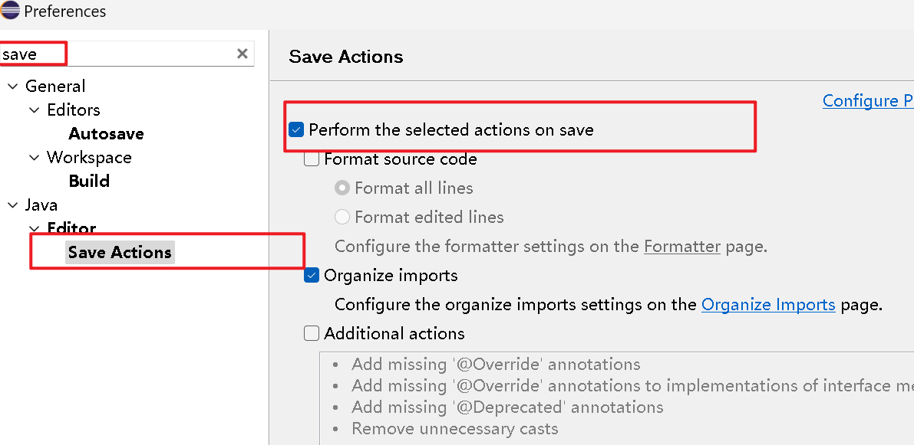

# 蓝桥杯细节
## 创建项目
1. **首先创建一个空的文件夹，然后使用eclipse设置工作空间为这个空的文件夹，之后在这个文件夹里创建Java项目。之后在src文件夹下创建包和Main.java**

2. **然后设置代码自动补全（搜索Content Assist）,看到trigger for java设置a~z...**

3. **设置字体（搜索font）**

4. 配置自动导包（save -> on save）导包尽量像import java.util.*;这样导入

**设置完再点击应用并关闭 
5. 最后输出hello world验证**
6. 提交代码：注意不要提交package，类名一定为**Main**
