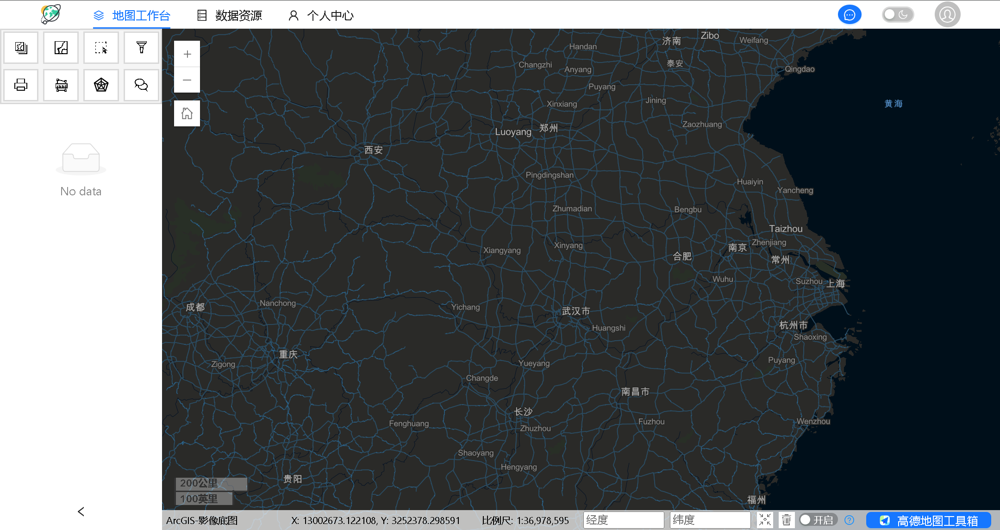
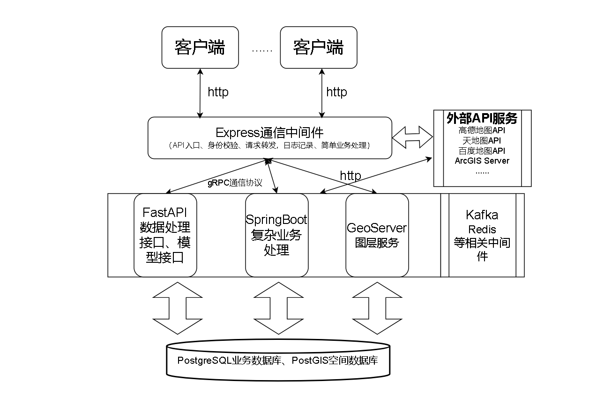

## 2025-4-12
蓝桥杯比完，只要题目提交没问题，拿奖没问题😋
还有就是不要过过过于在乎结果🙃，可能有奖也就那样，当然最好肯定是有奖。
接下来把代驾的项目敲完，然后总结好技术点。


## 2025-4-19

今天编写了个git自动提交的bash脚本

```bash
#!/bin/bash

# 提示用户输入提交信息
echo "请输入提交信息（commit message）："
read commit_message

# 检查提交信息是否为空
if [ -z "$commit_message" ]; then
    echo "提交信息不能为空，请重新运行脚本并输入提交信息。"
    exit 1
fi

# 添加所有更改到暂存区
git add .

# 提交更改，使用用户输入的信息
git commit -m "$commit_message"

# 检查git commit是否成功
if [ $? -ne 0 ]; then
    echo "git commit 命令执行失败，请检查你的提交信息。"
    exit 1
fi

# 强制推送到远程仓库
git push -u origin main --force
```

### 2025-4-27

SSE通信＋RabbitMQ的搞了两天才清楚了

今天顺便把路径规划的api演示了

今天把github代码给gitee覆盖了，结果gitee直接同步到一个月前😭幸好搞过来了。

## 2025-5-6

画一个系统架构图

## 2025-7-31

成都实习了一个月了，做的都是前端。

所以还是觉得GIS本科就业的话还得是前端，之后就业还是以前端为主。

之后了解学习一下：

	1. React使用细节
	1. vite
	1. TS和JavaScript详情
	1. webpack
	1. Three.js
	1. 高级一点的脚手架
	1. Cesium三维GIS
	1. 空间大数据（Spark）
	1. python空间数据处理
	1. Langchain
	1. 数据分析、机器学习、深度学习

## 2025-8-24

MapAgent项目




