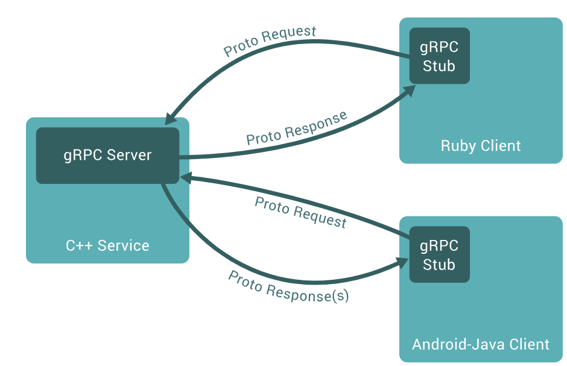
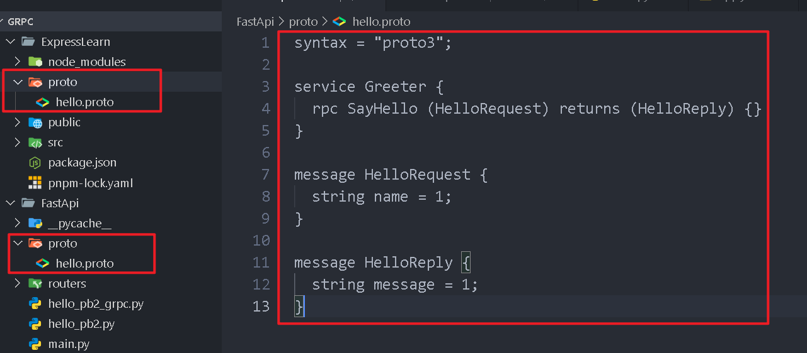

# gRPC介绍



# 案例：Express作为客户端，FastApi作为服务端



客户端和服务端项目里都要有./proto/hello.proto这个文件

叫做：**Protocol Buffers（protobuf）协议定义文件**，它是 gRPC 通信的核心配置文件，用于**定义服务接口和数据结构**。

```pro
syntax = "proto3"; // 指定使用 Protocol Buffers 的版本 3

// 接收：HelloRequest 类型的请求。
// 返回：HelloReply 类型的响应。
service Greeter { //定义一个名为 Greeter 的 gRPC 服务。
  rpc SayHello (HelloRequest) returns (HelloReply) {}
}

message HelloRequest {
  string name = 1; // 字段类型为字符串，字段编号为1
}

message HelloReply {
  string message = 1; // 字段类型为字符串，字段编号为1
}
```

### FastApi里的配置

```py
from fastapi import FastAPI
import uvicorn
import grpc
from concurrent import futures
import hello_pb2
import hello_pb2_grpc
import logging
#hello_pb2_grpc和hello_pb2在执行 
#python -m grpc_tools.protoc -I./proto --python_out=. --grpc_python_out=. proto/hello.proto
# 之后生成

class Greeter(hello_pb2_grpc.GreeterServicer):
    def SayHello(self, request, context):
        # 当客户端调用 SayHello 时，返回 Hello World 消息, request.name获取参数
        return hello_pb2.HelloReply(message=f"(来自FastAPI gRPC的服务)：{request.name}")

# 2. 启动 gRPC 服务器
def serve_grpc():
    # 创建一个 gRPC 服务器对象。使用 线程池最多同时处理 10 个请求
    server = grpc.server(futures.ThreadPoolExecutor(max_workers=10)) 
    # 注册服务
    hello_pb2_grpc.add_GreeterServicer_to_server(Greeter(), server)
    # 绑定监听端口[::]: 监听所有可用的 IPv6 和 IPv4 地址，监听 50051 端口
    server.add_insecure_port('[::]:50051') 
    # 启动服务器（和fastapi 不是一个端口）
    server.start()
    logging.info("✅ gRPC server started on port 50051")
    server.wait_for_termination()  # 防止程序退出


app = FastAPI()
@app.on_event("startup") # 启动时执行此函数
async def startup_event():
    import threading
# 创建一个线程，目标函数是 serve_grpc()（即你的 gRPC 服务启动函数）。
# daemon=True 表示这是守护线程：
# 主进程退出时，该线程会自动终止。
# 避免 gRPC 服务阻塞 FastAPI 的正常退出。
    grpc_thread = threading.Thread(target=serve_grpc, daemon=True) # 多线程运行 gRPC 服务
    grpc_thread.start() # 运行
    
    
# 优雅关闭 gRPC 服务，可添加 @app.on_event("shutdown")：
@app.on_event("shutdown")
def shutdown_event():
    server.stop(grace=5)  # 5秒内优雅停止


if __name__ == "__main__":
    uvicorn.run("main:app", reload=True, host="0.0.0.0", port=8000)

```

最后还要运行下面命令（注意路径）产生hello_pb2_grpc和hello_pb2

```
python -m grpc_tools.protoc -I./proto --python_out=. --grpc_python_out=. proto/hello.proto
```

### Express里的配置

```js
// 1. 加载 proto 文件
const PROTO_PATH = './proto/hello.proto';
const packageDefinition = protoLoader.loadSync(PROTO_PATH, {
    keepCase: true,      // 保持字段大小写（默认可能转为驼峰）
    longs: String,       // 将 int64/uint64 转换为字符串（避免 JavaScript 数字精度丢失）
    enums: String,       // 将枚举值转为字符串
    defaults: true,      // 设置默认值（对于未提供的字段）
    oneofs: true         // 支持 protobuf 的 oneof 特性
});
const hello_proto = grpc.loadPackageDefinition(packageDefinition).Greeter;

// 2. 创建 gRPC 客户端
const client = new hello_proto(
    'localhost:50051',  // 连接到 FastAPI 的 gRPC 服务
    grpc.credentials.createInsecure()
);

// RPC调用
app.get('/rpc', (req, res) => { 
  // 调用 gRPC 的 SayHello 方法
    const message = { name: 'Express 发送的' };
    client.SayHello(message, (error, response) => {
        if (error) {
            console.error(error);
            return res.status(500).send('Error calling gRPC service');
        }
        res.send(`Response from gRPC server: ${response.message}`);
    });
});
```

