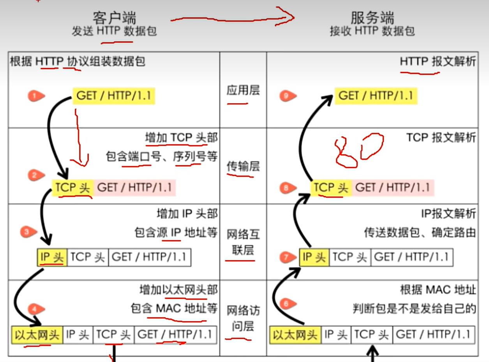
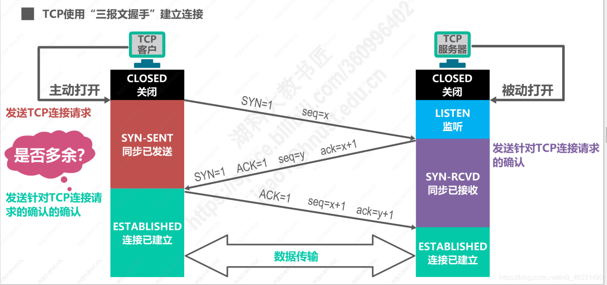
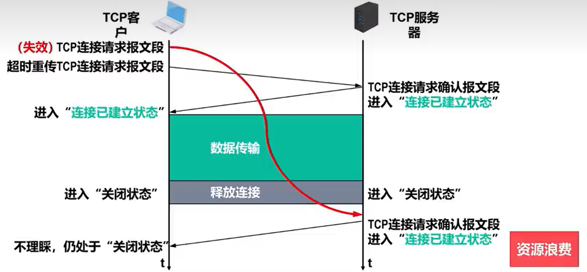
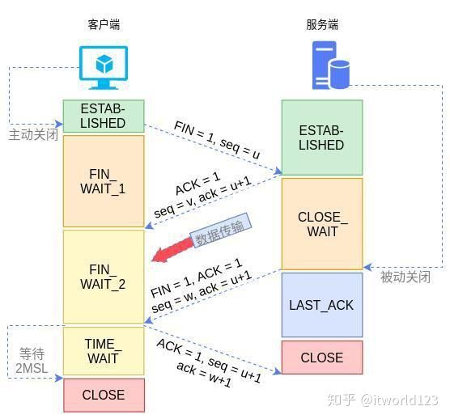

## 网络分层架构

**各层独立的好处：** 
1. **各层独立**：限制了依赖关系的范围，各层之间使用标准化的接口，各层不需要知道上下层是什么如何工作的，增加或修改者一个应用层协议不会影响传输层协议。
2. **灵活性更好**：比如路由器不需要应用层和传输层协议层。
3. **易于测试和维护**：
提高了可测试性，可以独立测试特定层，某一层有了更好的实现可以整体替换掉。
## 三报文握手，四报文挥手
### TCP连接的三个阶段
1. 通过 “三次握手” 来建立TCP连接。
2. 基于已建立的TCP连接进行**可靠的数据传输**。
3. 在数据传输结束后，还需要通过 “四次挥手” 来终止TCP连接。

#### 一、三报文握手（建立连接）

目的：同步双方的初始序列号（ISN），确认通信双方的收发能力正常。
流程：
1. **SYN=1, seq=x（客户端 → 服务端）** 
客户端发送SYN报文（SYN=1），携带随机初始序列号x，进入SYN-SENT状态。
1. **SYN=1, ACK=1, seq=y, ack=x+1（服务端 → 客户端）** 
服务端收到SYN后，回复SYN+ACK报文（SYN=1, ACK=1），携带自己的初始序列号y，并确认客户端的序列号x+1，进入SYN-RCVD状态。
1. **ACK=1, seq=x+1, ack=y+1（客户端 → 服务端）** 
客户端确认服务端的序列号y+1，发送ACK报文（ACK=1）。此时双方进入ESTABLISHED状态，连接建立。 

**关键点：**
- 前两次握手（SYN报文）不能携带数据，但会消耗序列号；第三次握手可携带数据。
- 初始序列号是随机的，防止历史连接冲突。
#### 为什么是三次握手，不是两次四次?
**如果两报文握手**

当客户端发送的连接请求报文段在网络里出现延迟时，客户端长时间没接收服务器的确认报文段，会再次发送请求报文段，如果再次发送成功建立连接且数据传输完毕通过四报文挥手关闭连接通道之后服务器接收到客户端第一次发送的延迟报文段，会再次发送确认报文段建立了错误的连接，而这时会浪费资源。 
**如果四报文握手** 
服务器收到客户端的确认后再回复一个确认报文，这样虽然看起来更可靠，但实际上增加了通信的开销。而且在三次握手的情况下，**客户端发送的第三个报文（ACK）已经可以确认客户端和服务器之间的通信是正常的，再增加一次握手并没有实际意义，反而会降低通信效率。**
#### 二、四报文挥手（释放连接）
 
目的：双方安全关闭连接，确保数据完整传输。
1. **FIN=1, seq=u（客户端 → 服务端）** 
客户端发送FIN报文（FIN=1），进入FIN-WAIT-1状态，表示不再发送数据。
2. **ACK=1, ack=u+1（服务端 → 客户端）** 
服务端收到FIN后，回复ACK确认u+1，进入CLOSE-WAIT状态。**此时服务端可能还有数据要发送,于是就全发送出去**。客户端收到ACK后进入FIN-WAIT-2状态。
3. **FIN=1, ACK=1, seq=v, ack=u+1（服务端 → 客户端）** 
服务端发送FIN+ACK报文（FIN=1），**表示数据已发送完毕**，进入LAST-ACK状态。
4. **ACK=1, seq=u+1, ack=v+1（客户端 → 服务端）** 
客户端收到FIN后，回复ACK确认v+1，进入TIME-WAIT状态（等待2MSL，确保服务端收到ACK）。服务端收到ACK后立即关闭连接；客户端等待2MSL后关闭。 

**为什么是四次，不是三次**
- TCP连接是全双工的，即数据可以同时在两个方向上独立传输。因此，每个方向（客户端→服务端、服务端→客户端）必须单独关闭。**所以客户端关闭了数据传输之后要和服务端的之间通过两次报文传输来来告诉服务端已关闭同时通知服务端也开始关闭，服务端关闭了数据传输也要通过两次报文传输来告诉客户端已关闭。**
- 如果是四次以上会浪费网络资源。

